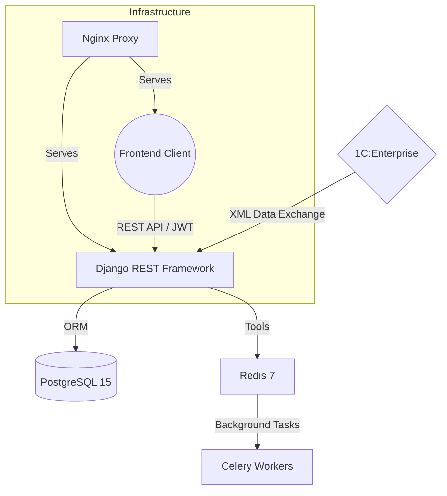

# 🏆 FREESPORT Platform
> **Enterprise-grade B2B/B2C E-commerce Ecosystem**

[](https://www.python.org/)
[](https://www.djangoproject.com/)
[](https://nextjs.org/)
[](https://www.typescriptlang.org/)
[](https://www.docker.com/)

FREESPORT — это современная, высокопроизводительная платформа электронной коммерции, объединяющая несколько спортивных брендов в единую экосистему. Спроектированная для работы в условиях высоких нагрузок, платформа автоматизирует сложные бизнес-процессы B2B-продаж, обеспечивая бесшовную интеграцию с 1С и гибкое управление ролевым ценообразованием.

---

## ⚡ Ключевые Возможности (Feature Highlights)

### 📈 Профессиональный B2B Движок
*   **Многоуровневое ценообразование:** Полная поддержка ролевой модели (Retail, Wholesale L1-L3, Trainer, Federation Rep) с пересчетом цен "на лету" в зависимости от статуса клиента.
*   **Умная Корзина:** Унифицированная логика для гостевых сессией и авторизованных пользователей с сохранением состояния между устройствами.
*   **B2B Личный Кабинет:** Инструменты управления заказами, адресами доставки и специализированными прайс-листами.

### 🔄 Промышленная Интеграция с 1С
*   **Атомарный Импорт:** Транзакционная обработка каталогов (50,000+ SKU) из XML-пакетов данных 1С:Предприятие.
*   **Асинхронность:** Использование Celery для фоновой обработки данных, что гарантирует стабильность API даже во время тяжелых обновлений каталога.

### 🔍 Продвинутый Поиск и UX
*   **Full-Text Search:** Высокоскоростной поиск на базе PostgreSQL Full-Text Search.
*   **Smart Filtering:** Гибкая система фильтрации, адаптирующаяся под спецификации различных категорий товаров.
*   **SEO-Ready:** Server-Side Rendering (SSR) на базе Next.js для идеальной индексации поисковыми системами.

---

## 🏗 Архитектура Системы



---

## 🛠 Технологический Стек

| Слой | Технологии |
| :--- | :--- |
| **Backend** | Python 3.11, Django 5.0, Django REST Framework, Celery |
| **Frontend** | React 18, Next.js 14 (App Router), TypeScript, Tailwind CSS |
| **Хранилища** | PostgreSQL 15, Redis 7 (Cache & Broker) |
| **Инфраструктура** | Docker, Docker Compose, Nginx, GitHub Actions |
| **Качество кода** | Pytest, Jest, Black, Flake8, MyPy |

---

## 🚀 Быстрый Старт

Платформа полностью контейнеризирована, что обеспечивает идентичность среды разработки и продакшена.

```bash
# 1. Клонирование репозитория
git clone https://github.com/AlexMobiCraft/FREESPORT.git
cd FREESPORT

# 2. Запуск всей экосистемы (Backend, Frontend, DB, Redis)
make up

# 3. Сборка статики и миграции (автоматизировано)
make migrate
```

*После запуска:*
- **Backend API:** `http://localhost:8001/api/v1`
- **Frontend SPA:** `http://localhost:3000`
- **Документация API:** `http://localhost:8001/api/v1/docs/`

---

## 📖 Культура Разработки (DX)

Мы придерживаемся строгих стандартов качества (Senior Developer Experience):
*   **Automated Documentation:** Кастомная система валидации структуры документации и кросс-ссылок (`scripts/docs_validator.py`).
*   **API-First Approach:** Проектирование начинается с OpenAPI спецификации (доступна в `docs/api-spec.yaml`).
*   **Clean Code:** Применение Black, Isort и MyPy для обеспечения единообразия и типобезопасности кодовой базы.

---

## 📞 Контактная Информация

**Project Lead:** Александр Ткаченко  
**Team:** FREESPORT Dev Team  

---
*Developed with focus on performance, scalability and business reliability.*
