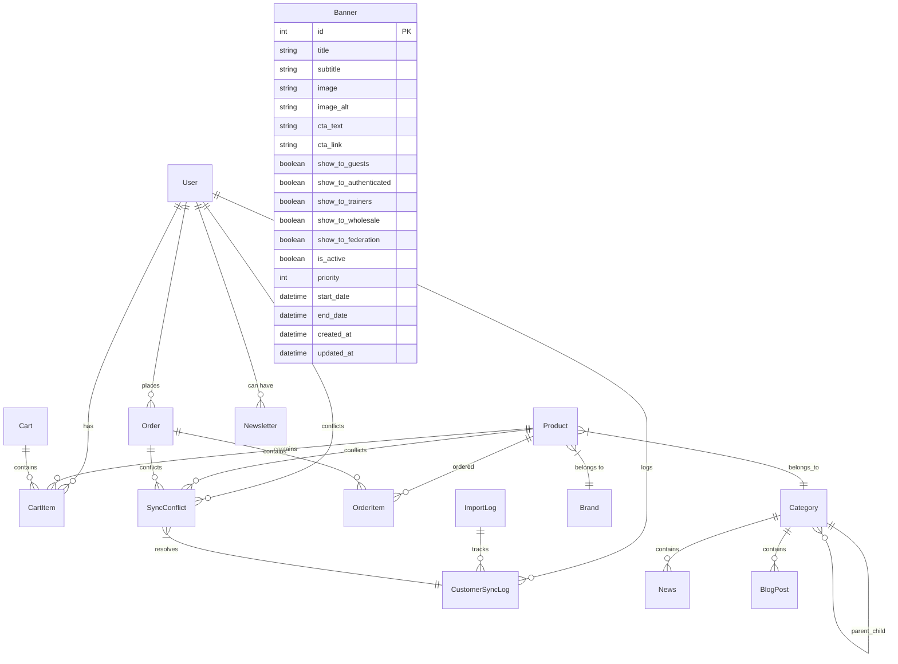
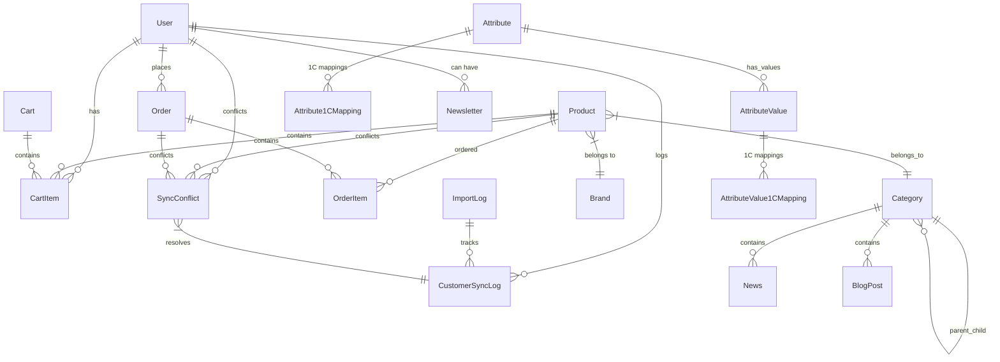

# 2. Модели Данных

## Основные связи сущностей



### user-model

- *Модели управления пользователями*

> [!NOTE]
> Эта документация синхронизирована с `apps/users/models.py` (2025-12-12)

```python
class User(AbstractUser):
    """
    Расширенная модель пользователя с поддержкой B2B/B2C и интеграции с 1С
    """
    # Основные поля
    email = models.EmailField(unique=True)  # Primary identifier, USERNAME_FIELD
    phone = models.CharField(max_length=255, blank=True)  # Формат: +79001234567
    
    # B2B поля (базовые, расширенные данные в модели Company)
    company_name = models.CharField(max_length=200, blank=True)
    tax_id = models.CharField(max_length=12, blank=True)  # ИНН
    
    # Статус и верификация
    is_verified = models.BooleanField(
        default=False,
        help_text="B2B пользователи требуют верификации администратором"
    )
    verification_status = models.CharField(
        max_length=20,
        choices=[
            ('unverified', 'Не верифицирован'),  # default для новых пользователей
            ('verified', 'Верифицирован'),
            ('pending', 'Ожидает верификации'),  # для B2B регистраций
        ],
        default='unverified'
    )
    
    # Интеграция с 1С
    onec_id = models.CharField(max_length=100, blank=True, unique=True, null=True)
    onec_guid = models.UUIDField(blank=True, null=True, unique=True)
    created_in_1c = models.BooleanField(default=False)
    last_sync_from_1c = models.DateTimeField(blank=True, null=True)
    last_sync_at = models.DateTimeField(blank=True, null=True)  # Последняя синхронизация
    sync_status = models.CharField(
        max_length=20,
        choices=[('pending', 'Ожидает'), ('synced', 'Синхронизирован'), ('error', 'Ошибка'), ('conflict', 'Конфликт')],
        default='pending'
    )
    sync_error_message = models.TextField(blank=True)
    needs_1c_export = models.BooleanField(default=False)
    
    # Роль пользователя (7 ролей)
    role = models.CharField(
        max_length=20,
        choices=[
            ('retail', 'Розничный покупатель'),
            ('wholesale_level1', 'Оптовик уровень 1'),
            ('wholesale_level2', 'Оптовик уровень 2'),
            ('wholesale_level3', 'Оптовик уровень 3'),
            ('trainer', 'Тренер/Фитнес-клуб'),
            ('federation_rep', 'Представитель федерации'),
            ('admin', 'Администратор'),
        ],
        default='retail'
    )
    
    created_at = models.DateTimeField(auto_now_add=True)
    updated_at = models.DateTimeField(auto_now=True)
    
    # Computed properties
    @property
    def is_b2b_user(self) -> bool:
        """Является ли пользователь B2B клиентом"""
        return self.role in ['wholesale_level1', 'wholesale_level2', 'wholesale_level3', 'trainer', 'federation_rep']
```

### Company Model

> [!NOTE]
> Модель Company хранит расширенные реквизиты юр.лица для B2B пользователей

```python
class Company(models.Model):
    """
    Модель компании для B2B пользователей
    Содержит юридические и банковские реквизиты
    """
    user = models.OneToOneField(
        User, on_delete=models.CASCADE, related_name="company"
    )
    
    # Юридические данные
    legal_name = models.CharField("Юридическое название", max_length=255, blank=True)
    tax_id = models.CharField("ИНН", max_length=12, blank=True)
    kpp = models.CharField("КПП", max_length=9, blank=True)
    legal_address = models.TextField("Юридический адрес", blank=True)
    
    # Банковские реквизиты
    bank_name = models.CharField("Название банка", max_length=200, blank=True)
    bank_bik = models.CharField("БИК банка", max_length=9, blank=True)
    account_number = models.CharField("Расчетный счет", max_length=20, blank=True)
    
    created_at = models.DateTimeField(auto_now_add=True)
    updated_at = models.DateTimeField(auto_now=True)
```

**Связь User ↔ Company:**

- OneToOne связь через `user.company`
- Company создаётся автоматически при первом обращении к API `/users/company/`
- Данные `company_name` и `tax_id` в User синхронизируются с Company.legal_name/tax_id

### Модели каталога товаров

```python
class Category(models.Model):
    """
    Иерархические категории товаров с поддержкой интеграции 1С
    """
    name = models.CharField(max_length=255)
    slug = models.SlugField(max_length=255, unique=True)
    parent = models.ForeignKey('self', on_delete=models.CASCADE, null=True, blank=True)
    description = models.TextField(blank=True)
    is_active = models.BooleanField(default=True)
    
    # Интеграция с 1С
    onec_id = models.CharField(max_length=50, blank=True, unique=True, null=True)
    last_sync_from_1c = models.DateTimeField(blank=True, null=True)

class Product(models.Model):
    """
    Единая модель товара, агрегирующая данные из goods.xml и offers.xml.
    Каждая запись представляет собой уникальное торговое предложение (SKU).
    """
    # Основная информация
    name = models.CharField(max_length=255) # Наименование из offers.xml
    slug = models.SlugField(max_length=255, unique=True)
    sku = models.CharField(max_length=100, unique=True) # Артикул из offers.xml
    description = models.TextField(blank=True) # Описание из goods.xml
    specifications = models.JSONField(default=dict)  # Характеристики из offers.xml
    
    # Категории и бренды
    category = models.ForeignKey(Category, on_delete=models.PROTECT)
    brand = models.ForeignKey(Brand, on_delete=models.PROTECT)
    
    # Ценообразование (розничные и оптовые цены)
    retail_price = models.DecimalField(max_digits=10, decimal_places=2)
    opt1_price = models.DecimalField(max_digits=10, decimal_places=2, null=True, blank=True)
    opt2_price = models.DecimalField(max_digits=10, decimal_places=2, null=True, blank=True)
    opt3_price = models.DecimalField(max_digits=10, decimal_places=2, null=True, blank=True)
    trainer_price = models.DecimalField(max_digits=10, decimal_places=2, null=True, blank=True)
    federation_price = models.DecimalField(max_digits=10, decimal_places=2, null=True, blank=True)
    
    # Складские остатки
    stock_quantity = models.PositiveIntegerField(default=0)  # Общее количество на складе
    reserved_quantity = models.PositiveIntegerField(default=0) # Количество в корзинах и незавершенных заказах
    
    # Статусы
    is_active = models.BooleanField(default=True)
    
    # Интеграция с 1С
    onec_id = models.CharField(max_length=100, blank=True, unique=True, null=True) # ID из offers.xml
    parent_onec_id = models.CharField(max_length=50, blank=True, null=True) # ID из goods.xml для связи
    last_sync_from_1c = models.DateTimeField(blank=True, null=True)
    
    # Системные поля
    created_at = models.DateTimeField(auto_now_add=True)
    updated_at = models.DateTimeField(auto_now=True)

    def get_price_for_user(self, user):
        # ... логика получения цены ...
        pass
```

### Модели заказов и корзины

```python
class Cart(models.Model):
    """
    Корзина покупок для авторизованных и гостевых пользователей
    """
    user = models.OneToOneField(User, on_delete=models.CASCADE, null=True, blank=True)
    session_key = models.CharField(max_length=40, null=True, blank=True)  # Для гостей
    created_at = models.DateTimeField(auto_now_add=True)
    updated_at = models.DateTimeField(auto_now=True)

class CartItem(models.Model):
    """
    Товары в корзине. При создании/удалении изменяет `reserved_quantity` у товара.
    """
    cart = models.ForeignKey(Cart, on_delete=models.CASCADE, related_name='items')
    product = models.ForeignKey(Product, on_delete=models.CASCADE)
    quantity = models.PositiveIntegerField(default=1)
    created_at = models.DateTimeField(auto_now_add=True)

class Order(models.Model):
    """
    Заказы с поддержкой B2B/B2C и интеграции с 1С
    """
    # Основная информация
    order_number = models.CharField(max_length=50, unique=True)
    user = models.ForeignKey(User, on_delete=models.PROTECT)
    
    # Статусы заказа
    status = models.CharField(
        max_length=20,
        choices=[
            ('draft', 'Черновик'),        ('pending', 'Ожидает обработки'),        ('processing', 'В обработке'),        ('shipped', 'Отгружен'),        ('delivered', 'Доставлен'),        ('cancelled', 'Отменен'),        ('returned', 'Возвращен'),
        ],
        default='pending'
    )
    
    # Суммы заказа
    subtotal = models.DecimalField(max_digits=12, decimal_places=2)
    tax_amount = models.DecimalField(max_digits=10, decimal_places=2, default=0)
    shipping_cost = models.DecimalField(max_digits=10, decimal_places=2, default=0)
    discount_amount = models.DecimalField(max_digits=10, decimal_places=2, default=0)
    total_amount = models.DecimalField(max_digits=12, decimal_places=2)
    
    # Адреса доставки и платежная информация
    shipping_address = models.JSONField()  # Полный адрес доставки
    billing_address = models.JSONField(blank=True, null=True)  # Адрес плательщика
    payment_method = models.CharField(max_length=50)
    payment_status = models.CharField(
        max_length=20,
        choices=[
            ('pending', 'Ожидает оплаты'),        ('paid', 'Оплачен'),        ('failed', 'Ошибка оплаты'),        ('refunded', 'Возвращен'),
        ],
        default='pending'
    )
    
    # Интеграция с 1С
    onec_id = models.CharField(max_length=50, blank=True, unique=True, null=True)
    exported_to_1c = models.BooleanField(default=False)
    export_to_1c_at = models.DateTimeField(blank=True, null=True)
    last_sync_from_1c = models.DateTimeField(blank=True, null=True)
    
    # Системные поля
    created_at = models.DateTimeField(auto_now_add=True)
    updated_at = models.DateTimeField(auto_now=True)

### Логика резервирования товаров

Для предотвращения перепродаж (overselling) в системе реализован механизм атомарного резервирования товаров. Это гарантирует, что товар, добавленный в корзину, не может быть куплен другим пользователем до истечения сессии или оформления заказа.

**Ключевые принципы:**

1.  **Источник правды:**
    - `stock_quantity`: Общее физическое количество товара на складе.
    - `reserved_quantity`: Количество товара, находящееся в активных корзинах пользователей.
    - `available_quantity`: Расчетное свойство в модели `Product` (`stock_quantity - reserved_quantity`), показывающее, сколько единиц товара доступно для добавления в корзину.

2.  **Реализация через сигналы Django:**
    - Логика инкапсулирована не в методах модели, а в сигналах `pre_save` и `post_delete` для модели `CartItem`. Этот подход гарантирует срабатывание логики даже при массовых операциях (`bulk_create`, `bulk_update`).
    - **`pre_save` на `CartItem`**: При добавлении или изменении количества товара в корзине, сигнал атомарно обновляет поле `product.reserved_quantity`.
    - **`post_delete` на `CartItem`**: При удалении товара из корзины (включая очистку корзины после создания заказа), сигнал атомарно уменьшает `product.reserved_quantity`.

3.  **Жизненный цикл резерва:**
    - **Резерв создается:** Пользователь добавляет товар в корзину.
    - **Резерв освобождается:**
        - Пользователь удаляет товар из корзины.
        - Заказ успешно оформлен (элементы `CartItem` удаляются).
        - Истекает время жизни сессии/корзины (требуется фоновая задача для очистки "зависших" резервов).

Этот механизм обеспечивает целостность данных об остатках на всех этапах до оформления заказа.

Подробное обоснование и детали реализации описаны в соответствующем архитектурном решении:
- **ADR:** [Логика резервирования товаров при добавлении в корзину](../decisions/story-3.x-product-reservation-logic.md)

class OrderItem(models.Model):
    """
    Товары в заказе со снимком данных на момент заказа
    """
    order = models.ForeignKey(Order, on_delete=models.CASCADE, related_name='items')
    product = models.ForeignKey(Product, on_delete=models.PROTECT)
    
    # Снимок данных товара на момент заказа
    product_name = models.CharField(max_length=255)
    product_article = models.CharField(max_length=100)
    product_specifications = models.JSONField(default=dict)
    
    # Количество и цены
    unit_price = models.DecimalField(max_digits=10, decimal_places=2)
    # Интеграция с 1С
    onec_product_id = models.CharField(max_length=50, blank=True)

### Banner Model

```python
class Banner(models.Model):
    """
    Модель баннера для Hero-секции главной страницы.
    Поддерживает таргетинг по группам пользователей.
    """
    # Контент
    title = models.CharField("Заголовок", max_length=200)
    subtitle = models.CharField("Подзаголовок", max_length=500, blank=True)
    image = models.ImageField("Изображение", upload_to="promos/%Y/%m/")
    image_alt = models.CharField("Alt-текст", max_length=255, blank=True)
    cta_text = models.CharField("Текст кнопки", max_length=50)
    cta_link = models.CharField("Ссылка кнопки", max_length=200)
    
    # Таргетинг по группам
    show_to_guests = models.BooleanField("Показывать гостям", default=False)
    show_to_authenticated = models.BooleanField("Показывать авторизованным", default=False)
    show_to_trainers = models.BooleanField("Показывать тренерам", default=False)
    show_to_wholesale = models.BooleanField("Показывать оптовикам", default=False)
    show_to_federation = models.BooleanField("Показывать федералам", default=False)
    
    # Управление
    is_active = models.BooleanField("Активен", default=True)
    priority = models.IntegerField("Приоритет", default=0)
    start_date = models.DateTimeField("Дата начала показа", null=True, blank=True)
    end_date = models.DateTimeField("Дата окончания показа", null=True, blank=True)
    
    # Метаданные
    created_at = models.DateTimeField("Дата создания", auto_now_add=True)
    updated_at = models.DateTimeField("Дата обновления", auto_now=True)
    
    class Meta:
        db_table = "banners"
        ordering = ["-priority", "-created_at"]
```

```

### Модели атрибутов и дедупликации (Story 14.3)

```python
class Attribute(models.Model):
    """
    Атрибут товара (цвет, размер и т.д.) с поддержкой дедупликации
    """
    name = models.CharField(max_length=255)
    slug = models.SlugField(max_length=255, unique=True)
    normalized_name = models.CharField(max_length=255, unique=True, db_index=True)
    is_active = models.BooleanField(default=False)  # По умолчанию неактивен
    created_at = models.DateTimeField(auto_now_add=True)
    
    def save(self, *args, **kwargs):
        # Автоматическое вычисление normalized_name
        from apps.products.utils import normalize_attribute_name
        self.normalized_name = normalize_attribute_name(self.name)
        super().save(*args, **kwargs)

class AttributeValue(models.Model):
    """
    Значение атрибута с дедупликацией
    """
    attribute = models.ForeignKey(Attribute, on_delete=models.CASCADE, related_name='values')
    value = models.CharField(max_length=255)
    slug = models.SlugField(max_length=255)
    normalized_value = models.CharField(max_length=255, db_index=True)
    created_at = models.DateTimeField(auto_now_add=True)
    
    class Meta:
        constraints = [
            models.UniqueConstraint(
                fields=['attribute', 'normalized_value'],
                name='unique_attribute_normalized_value'
            )
        ]

class Attribute1CMapping(models.Model):
    """
    Маппинг атрибутов на ID из 1С для дедупликации
    """
    attribute = models.ForeignKey(Attribute, on_delete=models.CASCADE, related_name='onec_mappings')
    onec_id = models.CharField(max_length=255, unique=True, db_index=True)
    onec_name = models.CharField(max_length=255)  # Оригинальное название из 1С
    source = models.CharField(max_length=10, choices=[('goods', 'Goods'), ('offers', 'Offers')])
    created_at = models.DateTimeField(auto_now_add=True)
    
    class Meta:
        db_table = 'product_attribute_1c_mappings'
        verbose_name = 'Маппинг атрибута 1С'

class AttributeValue1CMapping(models.Model):
    """
    Маппинг значений атрибутов на ID из 1С
    """
    attribute_value = models.ForeignKey(AttributeValue, on_delete=models.CASCADE, related_name='onec_mappings')
    onec_id = models.CharField(max_length=255, unique=True, db_index=True)
    onec_value = models.CharField(max_length=255)  # Оригинальное значение из 1С
    source = models.CharField(max_length=10, choices=[('goods', 'Goods'), ('offers', 'Offers')])
    created_at = models.DateTimeField(auto_now_add=True)
```

**Архитектурные особенности дедупликации:**

- **Master Attribute**: Единый атрибут на платформе = одно уникальное `normalized_name`
- **1C ID Mapping**: Множество ID из 1С (из разных источников goods/offers) связаны с одним master-атрибутом
- **Флаг активности**: `is_active=False` по умолчанию, требует ручной активации через Django Admin
- **Нормализация**: lowercase + удаление пробелов и спецсимволов для определения "одинаковости"

### Модели интеграции с 1С

```python
class CustomerSyncLog(models.Model):
    """
    Лог синхронизации покупателей с 1С
    """
    operation_type = models.CharField(
        max_length=20,
        choices=[
            ('import_from_1c', 'Импорт из 1С'),        ('export_to_1c', 'Экспорт в 1С'),        ('sync_changes', 'Синхронизация изменений'),
        ]
    )
    customer = models.ForeignKey(User, on_delete=models.CASCADE, related_name='sync_logs')
    
    # Статус операции
    status = models.CharField(
        max_length=10,
        choices=[
            ('success', 'Успешно'),        ('error', 'Ошибка'),        ('skipped', 'Пропущено'),        ('conflict', 'Конфликт данных'),
        ]
    )
    
    # Детали операции
    details = models.JSONField(default=dict)  # Детали синхронизации
    changes_made = models.JSONField(default=dict)  # Какие изменения были внесены
    conflict_resolution = models.JSONField(default=dict)  # Как был разрешен конфликт
    error_message = models.TextField(blank=True)
    
    # Системные поля
    created_at = models.DateTimeField(auto_now_add=True)
    processed_by = models.CharField(max_length=100)  # Management command или пользователь

class ImportLog(models.Model):
    """
    Общий лог импорта данных из 1С
    """
    import_type = models.CharField(
        max_length=20,
        choices=[
            ('products', 'Товары'),        ('customers', 'Покупатели'),        ('orders', 'Заказы'),        ('stock', 'Остатки'),        ('prices', 'Цены'),
        ]
    )
    
    # Статистика импорта
    total_records = models.PositiveIntegerField(default=0)
    processed_records = models.PositiveIntegerField(default=0)
    successful_records = models.PositiveIntegerField(default=0)
    failed_records = models.PositiveIntegerField(default=0)
    skipped_records = models.PositiveIntegerField(default=0)
    
    # Статус импорта
    status = models.CharField(
        max_length=20,
        choices=[
            ('running', 'Выполняется'),        ('completed', 'Завершен'),        ('failed', 'Ошибка'),        ('cancelled', 'Отменен'),
        ],
        default='running'
    )
    
    # Детали импорта
    file_path = models.CharField(max_length=500, blank=True)  # Путь к обрабатываемому файлу
    error_details = models.JSONField(default=dict)
    summary_report = models.JSONField(default=dict)  # Итоговый отчет
    
    # Системные поля
    started_at = models.DateTimeField(auto_now_add=True)
    finished_at = models.DateTimeField(blank=True, null=True)
    initiated_by = models.CharField(max_length=100)  # Management command или пользователь

class SyncConflict(models.Model):
    """
    Модель для управления конфликтами синхронизации
    """
    conflict_type = models.CharField(
        max_length=20,
        choices=[
            ('customer_data', 'Данные покупателя'),        ('product_data', 'Данные товара'),        ('order_status', 'Статус заказа'),        ('pricing', 'Ценообразование'),
        ]
    )
    
    # Связанные объекты
    customer = models.ForeignKey(User, on_delete=models.CASCADE, null=True, blank=True)
    product = models.ForeignKey(Product, on_delete=models.CASCADE, null=True, blank=True)
    order = models.ForeignKey(Order, on_delete=models.CASCADE, null=True, blank=True)
    
    # Данные конфликта
    platform_data = models.JSONField()  # Данные в платформе
    onec_data = models.JSONField()       # Данные в 1С
    conflicting_fields = models.JSONField()  # Список конфликтующих полей
    
    # Управление конфликтом
    resolution_strategy = models.CharField(
        max_length=20,
        choices=[
            ('manual', 'Ручное разрешение'),        ('platform_wins', 'Приоритет платформы'),
            ('onec_wins', 'Приоритет 1С'),        ('merge', 'Объединение данных'),
        ],
        default='manual'
    )
    
    is_resolved = models.BooleanField(default=False)
    resolution_details = models.JSONField(default=dict)
    resolved_at = models.DateTimeField(blank=True, null=True)
    resolved_by = models.CharField(max_length=100, blank=True)
    
    # Системные поля
    created_at = models.DateTimeField(auto_now_add=True)
    updated_at = models.DateTimeField(auto_now=True)
```

### Модели контента (News, Blog, Newsletter)

#### Категории контента
```python
class Category(models.Model):
    name = models.CharField("Название", max_length=100, unique=True)
    slug = models.SlugField("URL-идентификатор", max_length=100, unique=True)
    description = models.TextField("Описание", blank=True)
    parent = models.ForeignKey("self", on_delete=models.CASCADE, null=True, blank=True)
    is_active = models.BooleanField("Активна", default=True)
```

#### Подписка на рассылку
```python
class Newsletter(models.Model):
    email = models.EmailField("Email", unique=True)
    is_active = models.BooleanField("Активна", default=True)
    subscribed_at = models.DateTimeField("Дата подписки", auto_now_add=True)
    unsubscribed_at = models.DateTimeField("Дата отписки", null=True, blank=True)
    user = models.ForeignKey(User, on_delete=models.SET_NULL, null=True, blank=True)
```

#### Новости
```python
class News(models.Model):
    title = models.CharField("Заголовок", max_length=200)
    slug = models.SlugField("URL-идентификатор", max_length=200, unique=True)
    excerpt = models.TextField("Краткое описание", blank=True)
    content = models.TextField("Содержание")
    image = models.ImageField("Изображение", upload_to="news/images/%Y/%m/%d/", blank=True, null=True)
    author = models.CharField("Автор", max_length=100, blank=True)
    category = models.ForeignKey(Category, on_delete=models.CASCADE, related_name="news", null=True, blank=True)
    is_published = models.BooleanField("Опубликовано", default=False)
    published_at = models.DateTimeField("Дата публикации", null=True, blank=True)
```

#### Блог
```python
class BlogPost(models.Model):
    title = models.CharField("Заголовок", max_length=200)
    slug = models.SlugField("URL-идентификатор", max_length=200, unique=True)
    subtitle = models.CharField("Подзаголовок", max_length=200, blank=True)
    excerpt = models.TextField("Краткое описание", blank=True)
    content = models.TextField("Содержание")
    image = models.ImageField("Изображение", upload_to="blog/images/%Y/%m/%d/", blank=True, null=True)
    author = models.CharField("Автор", max_length=100, blank=True)
    category = models.ForeignKey(Category, on_delete=models.SET_NULL, related_name="blog_posts", null=True, blank=True)
    is_published = models.BooleanField("Опубликовано", default=False)
    published_at = models.DateTimeField("Дата публикации", null=True, blank=True)
    meta_title = models.CharField("SEO заголовок", max_length=200, blank=True)
    meta_description = models.TextField("SEO описание", blank=True)
```

#### Получатели уведомлений
```python
class NotificationRecipient(TimeStampedModel):
    """
    Получатель email-уведомлений системы.
    Позволяет гибко управлять списком получателей различных типов уведомлений
    через Django Admin без необходимости менять settings.ADMINS.
    """
    email = models.EmailField("Email", unique=True)
    name = models.CharField("Имя", max_length=100, blank=True)
    is_active = models.BooleanField("Активен", default=True)
    
    # Типы уведомлений
    notify_new_orders = models.BooleanField("Новые заказы", default=False)
    notify_order_cancelled = models.BooleanField("Отмена заказов", default=False)
    notify_user_verification = models.BooleanField("Верификация B2B", default=False)
    notify_pending_queue = models.BooleanField("Alert очереди", default=False)
    notify_low_stock = models.BooleanField("Малый остаток", default=False)
    notify_daily_summary = models.BooleanField("Ежедневный отчёт", default=False)
```

**Использование:**
- Заменяет жёстко заданный `settings.ADMINS` для уведомлений
- Получатели настраиваются через Django Admin
- Каждый получатель может подписаться на разные типы уведомлений

### Обновленная диаграмма связей

Диаграмма связей обновлена для включения новых моделей интеграции с 1С и дедупликации атрибутов:


