# 6. Высокоуровневая Архитектура

### Диаграмма развертывания инфраструктуры


### Схема сетевого взаимодействия

```mermaid
graph LR
    subgraph "DMZ Zone"
        NGINX[Nginx<br/>:443, :80]
        FIREWALL[Firewall<br/>Rules]
    end
    
    subgraph "Application Zone"
        NEXT[Next.js<br/>:3000]
        DJANGO[Django<br/>:8000]
        CELERY[Celery Workers<br/>Background]
    end
    
    subgraph "Data Zone"
        POSTGRES[PostgreSQL<br/>:5432]
        REDIS[Redis<br/>:6379]
        FILES[File Storage<br/>Local/S3]
    end
    
    subgraph "External Zone"
        ONEC[1C ERP<br/>Various]
        PAYMENTS[YuKassa<br/>:443]
        DELIVERY[Delivery APIs<br/>:443]
    end
    
    Internet -->|TCP:443| FIREWALL
    FIREWALL -->|HTTP/HTTPS| NGINX
    
    NGINX -->|Proxy| NEXT
    NGINX -->|Proxy /api/| DJANGO
    NGINX -->|Static files| FILES
    
    NEXT -->|Internal API| DJANGO
    
    DJANGO -->|SQL| POSTGRES
    DJANGO -->|Cache| REDIS
    CELERY -->|Queue| REDIS
    CELERY -->|Data| POSTGRES
    
    DJANGO -.->|Scheduled sync| ONEC
    DJANGO -.->|Webhooks| PAYMENTS
    DJANGO -.->|Rate limited| DELIVERY
```



### Диаграмма компонентов с портами и интерфейсами


### Обзор системной архитектуры


### Разграничение ответственности по слоям

#### Nginx Gateway Layer:
- **SSL Termination**: Let's Encrypt сертификаты
- **Базовое Rate Limiting**: 1000 запросов/минуту с IP
- **Static Files**: Раздача медиа файлов и статики
- **Load Balancing**: Распределение между инстансами Django
- **DDoS Protection**: Базовая защита от атак

#### Next.js BFF Layer:
- **JWT Authentication**: Валидация токенов и refresh logic
- **Интеллектуальное Rate Limiting**: 
  - 5 попыток логина/минуту для пользователя
  - 10 заказов/день для розничных клиентов
  - Разные лимиты для B2B пользователей
- **Role-Based Access Control**: Проверка ролей и прав доступа
- **Data Aggregation**: Объединение данных от нескольких API endpoints
- **Request/Response трансформация**: Адаптация под frontend нужды

#### Django API Layer:
- **Business Logic**: Основная логика приложения
- **Data Management**: CRUD операции с БД
- **External Integrations**: 1C, платежи, доставка
- **Admin Interface**: Django Admin для контент-менеджмента

### Стратегия админ-панели (гибридный подход)

```
┌─────────────────────────────────────────────────────────┐
│                    ADMIN STRATEGY                       │
├─────────────────────┬───────────────────────────────────┤
│    Django Admin     │      Next.js Custom Admin        │
├─────────────────────┼───────────────────────────────────┤
│ • CRUD товары       │ • Дашборды продаж                │
│ • CRUD категории    │ • Аналитика клиентов              │
│ • Модерация заказов │ • Управление ценами/акциями       │
│ • Управление юзерами│ • Отчеты и визуализация           │
│ • Системные         │ • Мониторинг интеграций           │
│   настройки         │ • UX-критичные операции           │
├─────────────────────┼───────────────────────────────────┤
│ Быстрая разработка  │ Качественный UX                   │
│ Готовые компоненты  │ Кастомная бизнес-логика           │
└─────────────────────┴───────────────────────────────────┘
```

**Обоснование решения:**
- Django Admin для рутинных операций и быстрого прототипирования
- Custom Admin для критичного UX и сложной бизнес-логики
- Единое API, разные интерфейсы

### Механизмы отказоустойчивости

**1С Integration Resilience:**
- **Circuit Breaker Pattern**: Автоматическое переключение на файловый обмен
- **File-based Fallback**: Экспорт заказов в XML/JSON для ручной обработки
- **Retry Logic**: Экспоненциальная задержка для повторных попыток

**Payment Gateway Resilience:**
- **Webhook Validation**: Криптографическая подпись YuKassa
- **Idempotency Keys**: Предотвращение дублирования платежей
- **Status Reconciliation**: Периодическая сверка статусов

**Database Resilience:**
- **Connection Pooling**: pgBouncer для оптимизации подключений
- **Read Replicas**: Масштабирование чтения каталога товаров
- **Backup Strategy**: Ежедневные инкрементальные бэкапы + WAL

### Масштабируемость

**Горизонтальное масштабирование:**
- Django API servers (stateless)
- Celery workers (по типам задач)  
- Read-only replicas PostgreSQL
- Redis Cluster для сессий и кэша

**Вертикальное масштабирование:**
- CPU для обработки изображений
- RAM для кэширования товаров
- Storage для медиа файлов

---

