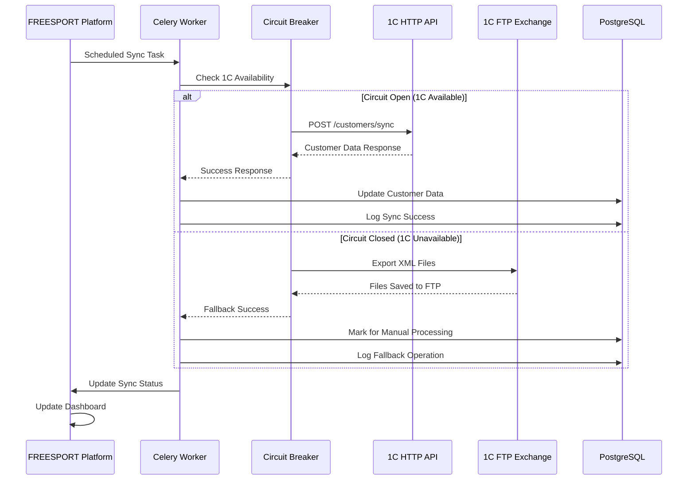
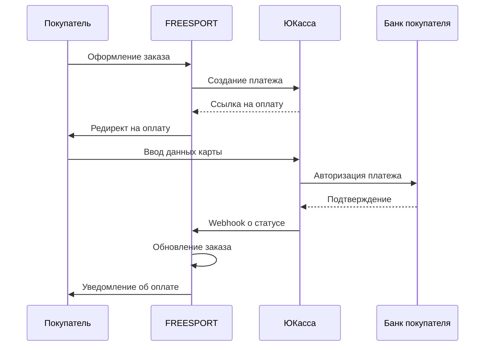

# 7. Внешние Интеграции

## Обзор интеграций

FREESPORT платформа интегрируется с несколькими внешними системами для обеспечения полного цикла электронной коммерции:

1. **1С:Управление торговлей** - ERP система для управления товарами, заказами и клиентами
2. **ЮКасса** - платежная система для онлайн-оплаты
3. **СДЭК/Boxberry** - службы доставки
4. **Email/SMS сервисы** - уведомления и маркетинг

---

## 1. Интеграция с 1С:Управление торговлей

### 1.1. Архитектурный обзор ([подробности](./20-1c-integration.md))

Двусторонняя интеграция с системой учета для синхронизации:
- **Товары и цены** (из 1С → в платформу)
- **Остатки товаров** (из 1С → в платформу)  
- **Покупатели** (двусторонняя синхронизация)
- **Заказы** (из платформы → в 1С)
- **Статусы заказов** (из 1С → в платформу)

### 1.2. Архитектура с Circuit Breaker Pattern



### 1.3. Реализация Circuit Breaker

```python
from typing import Optional, Dict, Any
import logging
from datetime import datetime, timedelta
from django.core.cache import cache
from django.conf import settings

class OneCCircuitBreaker:
    """
    Circuit Breaker для интеграции с 1С
    Паттерн для обеспечения отказоустойчивости
    """
    
    def __init__(self):
        self.failure_threshold = settings.ONEC_FAILURE_THRESHOLD  # 5 ошибок
        self.recovery_timeout = settings.ONEC_RECOVERY_TIMEOUT    # 30 минут
        self.timeout = settings.ONEC_REQUEST_TIMEOUT             # 30 секунд
        
    def call_1c_api(self, endpoint: str, data: Dict[str, Any]) -> Optional[Dict]:
        """
        Вызов API 1С через Circuit Breaker
        """
        circuit_key = f"1c_circuit_breaker_{endpoint}"
        failure_count = cache.get(f"{circuit_key}_failures", 0)
        last_failure = cache.get(f"{circuit_key}_last_failure")
        
        # Проверяем состояние Circuit Breaker
        if self._is_circuit_open(failure_count, last_failure):
            logging.warning(f"Circuit breaker OPEN for 1C {endpoint}")
            return self._fallback_to_file_exchange(endpoint, data)
            
        try:
            # Попытка HTTP запроса к 1С
            response = self._make_http_request(endpoint, data)
            self._on_success(circuit_key)
            return response
            
        except (ConnectionError, TimeoutError, Exception) as e:
            logging.error(f"1C API call failed: {e}")
            self._on_failure(circuit_key)
            return self._fallback_to_file_exchange(endpoint, data)
    
    def _is_circuit_open(self, failures: int, last_failure: Optional[datetime]) -> bool:
        """Проверка состояния Circuit Breaker"""
        if failures >= self.failure_threshold:
            if last_failure and datetime.now() - last_failure < timedelta(minutes=self.recovery_timeout):
                return True
        return False
        
    def _fallback_to_file_exchange(self, endpoint: str, data: Dict[str, Any]) -> Dict:
        """
        Fallback стратегия: файловый обмен
        """
        try:
            from .services import OneCFileExchangeService
            file_service = OneCFileExchangeService()
            result = file_service.export_to_xml(endpoint, data)
            logging.info(f"Fallback to file exchange successful for {endpoint}")
            return {"status": "fallback_success", "method": "file", "result": result}
        except Exception as e:
            logging.error(f"Fallback failed: {e}")
            return {"status": "error", "message": str(e)}
```

### 1.4. Типы синхронизации

#### 1.4.1. Синхронизация покупателей

**Направления синхронизации:**
- **1С → Платформа**: Импорт существующих B2B клиентов
- **Платформа → 1С**: Экспорт новых регистраций B2B
- **Двусторонняя**: Синхронизация изменений профилей

**Алгоритм разрешения конфликтов:**
```python
class CustomerSyncConflictResolver:
    """
    Разрешение конфликтов при синхронизации покупателей
    """
    
    RESOLUTION_STRATEGIES = [
        'platform_wins',    # Приоритет данных платформы
        'onec_wins',        # Приоритет данных 1С
        'merge_smart',      # Умное объединение данных
        'manual_review'     # Ручная проверка администратором
    ]
    
    def resolve_conflict(self, platform_data: dict, onec_data: dict) -> dict:
        """
        Основной алгоритм разрешения конфликтов
        """
        conflicts = self._detect_conflicts(platform_data, onec_data)
        
        if not conflicts:
            return self._merge_without_conflicts(platform_data, onec_data)
            
        strategy = self._determine_strategy(conflicts)
        
        if strategy == 'manual_review':
            return self._create_conflict_record(platform_data, onec_data, conflicts)
        else:
            return self._auto_resolve(platform_data, onec_data, strategy)
    
    def _detect_conflicts(self, platform_data: dict, onec_data: dict) -> list:
        """Обнаружение конфликтующих полей"""
        conflicts = []
        critical_fields = ['email', 'tax_id', 'phone', 'company_name']
        
        for field in critical_fields:
            platform_value = platform_data.get(field)
            onec_value = onec_data.get(field)
            
            if platform_value and onec_value and platform_value != onec_value:
                conflicts.append({
                    'field': field,
                    'platform_value': platform_value,
                    'onec_value': onec_value,
                    'severity': 'high' if field in ['email', 'tax_id'] else 'medium'
                })
        
        return conflicts
```

#### 1.4.2. Синхронизация товаров

**Основные операции:**
- **Импорт каталога** - полная синхронизация товаров из 1С
- **Обновление цен** - синхронизация изменений цен
- **Обновление остатков** - актуализация складских остатков
- **Импорт новых товаров** - добавление новых позиций

**Структура данных товара из 1С:**
```python
class OneCProductData:
    """
    Структура данных товара из 1С
    """
    
    def __init__(self, xml_data: dict):
        self.onec_id = xml_data.get('Ид')
        self.name = xml_data.get('Наименование')
        self.article = xml_data.get('Артикул')
        self.description = xml_data.get('Описание')
        
        # Цены по типам
        self.prices = self._parse_prices(xml_data.get('Цены', []))
        
        # Остатки
        self.stock_quantity = int(xml_data.get('Количество', 0))
        
        # Характеристики
        self.specifications = self._parse_specifications(xml_data.get('ЗначенияСвойств', []))
        
    def _parse_prices(self, price_data: list) -> dict:
        """Парсинг цен из XML"""
        prices = {}
        price_mapping = {
            'Розничная': 'retail_price',
            'Оптовая1': 'wholesale_level1_price',
            'Оптовая2': 'wholesale_level2_price', 
            'Оптовая3': 'wholesale_level3_price',
            'Тренерская': 'trainer_price',
            'Федерация': 'federation_price'
        }
        
        for price_item in price_data:
            price_type = price_item.get('ТипЦены')
            if price_type in price_mapping:
                prices[price_mapping[price_type]] = float(price_item.get('Цена', 0))
                
        return prices
```

### 1.5. Обработка ошибок и мониторинг

#### 1.5.1. Стратегии обработки ошибок

```python
class OneCErrorHandler:
    """
    Централизованная обработка ошибок интеграции с 1С
    """
    
    ERROR_TYPES = {
        'connection_timeout': 'Превышено время ожидания подключения',
        'authentication_failed': 'Ошибка аутентификации в 1С',
        'data_format_error': 'Некорректный формат данных',
        'business_logic_error': 'Ошибка бизнес-логики',
        'system_unavailable': 'Система 1С недоступна'
    }
    
    def handle_error(self, error: Exception, context: dict) -> dict:
        """
        Универсальный обработчик ошибок
        """
        error_type = self._classify_error(error)
        
        # Логирование ошибки
        self._log_error(error, error_type, context)
        
        # Определение стратегии восстановления
        recovery_action = self._determine_recovery_action(error_type)
        
        # Уведомление администраторов при критических ошибках
        if error_type in ['system_unavailable', 'authentication_failed']:
            self._notify_administrators(error, context)
        
        return {
            'error_type': error_type,
            'message': self.ERROR_TYPES.get(error_type, str(error)),
            'recovery_action': recovery_action,
            'timestamp': datetime.now().isoformat()
        }
```

#### 1.5.2. Мониторинг и метрики

**Ключевые метрики:**
- Время ответа API 1С
- Процент успешных синхронизаций
- Количество конфликтов данных
- Частота переключений Circuit Breaker
- Объем данных передаваемых за период

**Dashboard метрики:**
```python
class OneCMetricsCollector:
    """
    Сбор метрик для мониторинга интеграции с 1С
    """
    
    def collect_sync_metrics(self) -> dict:
        """Сбор метрик синхронизации"""
        last_24h = datetime.now() - timedelta(hours=24)
        
        return {
            'total_sync_operations': ImportLog.objects.filter(
                created_at__gte=last_24h
            ).count(),
            
            'successful_syncs': ImportLog.objects.filter(
                created_at__gte=last_24h, 
                status='completed'
            ).count(),
            
            'failed_syncs': ImportLog.objects.filter(
                created_at__gte=last_24h, 
                status='failed'
            ).count(),
            
            'unresolved_conflicts': SyncConflict.objects.filter(
                is_resolved=False
            ).count(),
            
            'circuit_breaker_trips': cache.get('1c_circuit_trips_24h', 0),
            
            'avg_response_time': self._calculate_avg_response_time(),
            
            'data_volume': self._calculate_data_volume_24h()
        }
```

---

## 2. Интеграция с платежными системами

### 2.1. ЮКасса (YooKassa)

**Основные операции:**
- Создание платежа
- Подтверждение платежа  
- Возврат средств
- Webhook уведомления о статусе

**Безопасность:**
- HTTPS для всех запросов
- Подпись webhook уведомлений
- Валидация сумм и валют
- Логирование всех операций

### 2.2. Архитектура платежной интеграции



---

## 3. Интеграция с службами доставки

### 3.1. СДЭК

**Функциональность:**
- Расчет стоимости доставки
- Создание заказа на доставку
- Отслеживание статуса
- Печать этикеток

### 3.2. Boxberry

**Функциональность:**
- Пункты выдачи заказов (ПВЗ)
- Расчет стоимости до ПВЗ
- Статусы доставки
- Управление возвратами

---

## 4. Email и SMS интеграции

### 4.1. Transactional Email (SendGrid/Mailgun)

**Типы уведомлений:**
- Подтверждение регистрации
- Уведомления о заказах
- Статусы доставки
- Маркетинговые рассылки

### 4.2. SMS уведомления

**Сценарии использования:**
- Подтверждение телефона при регистрации
- Уведомления о готовности заказа к получению
- Коды подтверждения для важных операций

---

## 5. Общие принципы интеграций

### 5.1. Отказоустойчивость

- **Retry механизмы** с exponential backoff
- **Circuit Breaker** для критических интеграций
- **Graceful degradation** при недоступности сервисов
- **Fallback стратегии** для каждой интеграции

### 5.2. Мониторинг и логирование

- **Структурированные логи** всех API вызовов
- **Метрики производительности** интеграций
- **Alerting** при критических ошибках
- **Dashboard** для операционного мониторинга

### 5.3. Безопасность

- **API ключи** и токены в защищенном хранилище
- **HTTPS** для всех внешних вызовов
- **Валидация** входящих webhook данных
- **Rate limiting** для защиты от DDoS

### 5.4. Тестирование интеграций

- **Mock серверы** для разработки
- **Integration тесты** с реальными API
- **Contract тесты** для проверки совместимости
- **Load тесты** критических интеграций

---

## 6. Детальная архитектура 1С интеграции

Для полной информации об архитектуре интеграции с 1С см. [20. Архитектура интеграции с 1С](./20-1c-integration.md), включающая:

- Синхронизацию покупателей
- Разрешение конфликтов данных  
- Management команды
- Детальные workflow процессы
- Техническое задание для программиста 1С
