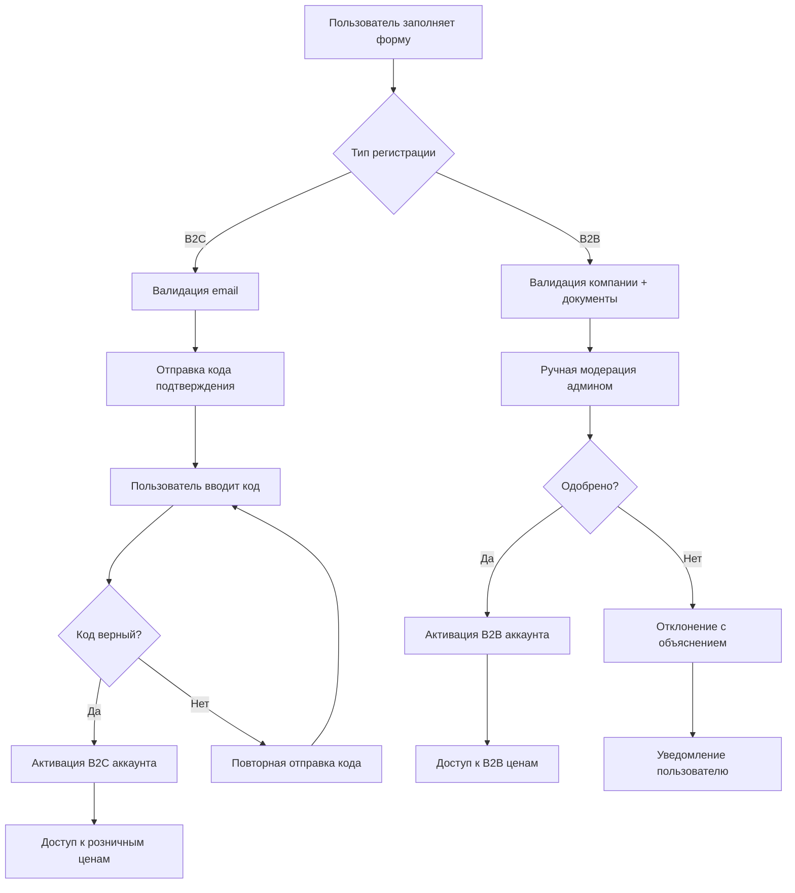
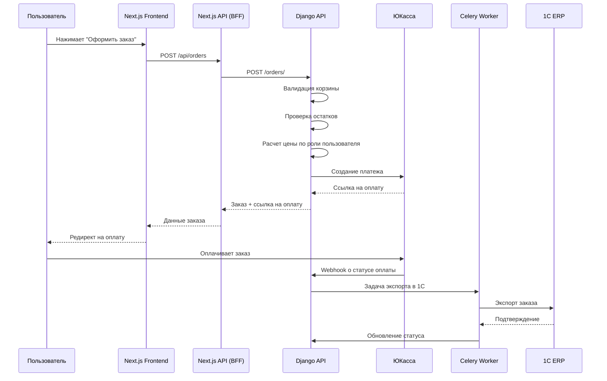
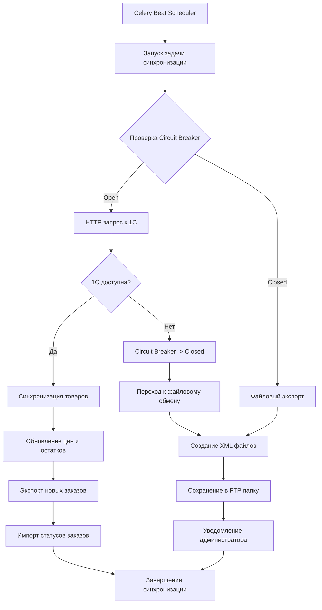
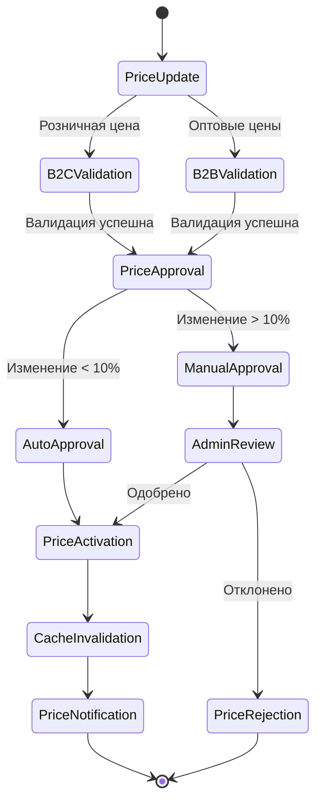
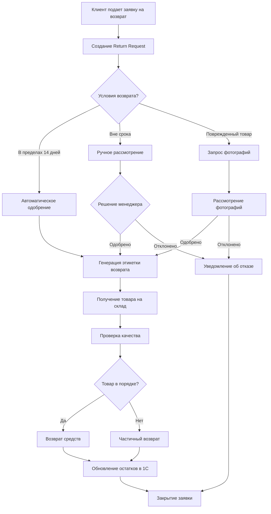
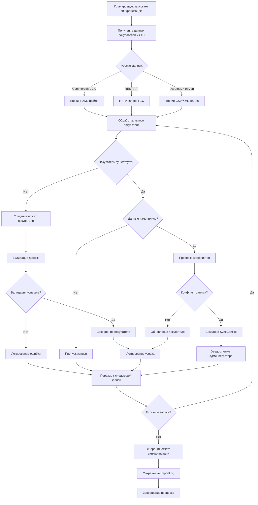
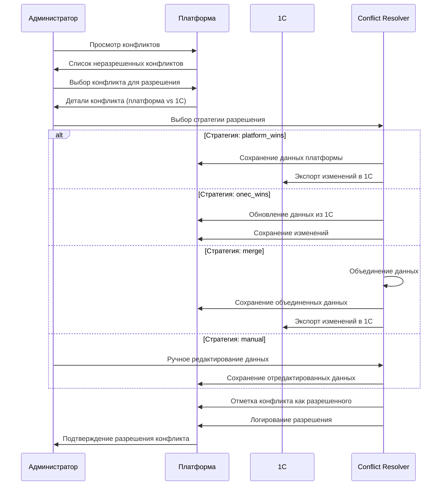
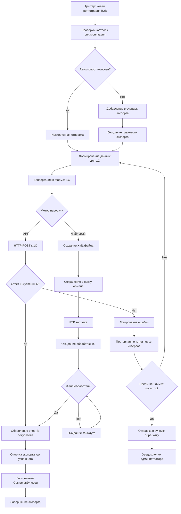
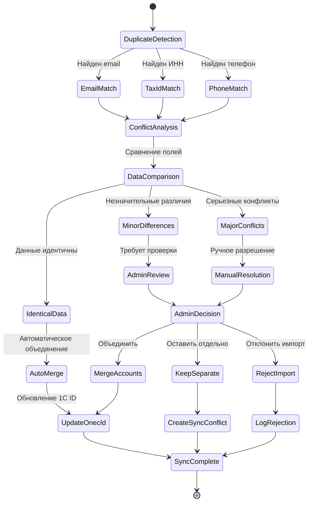
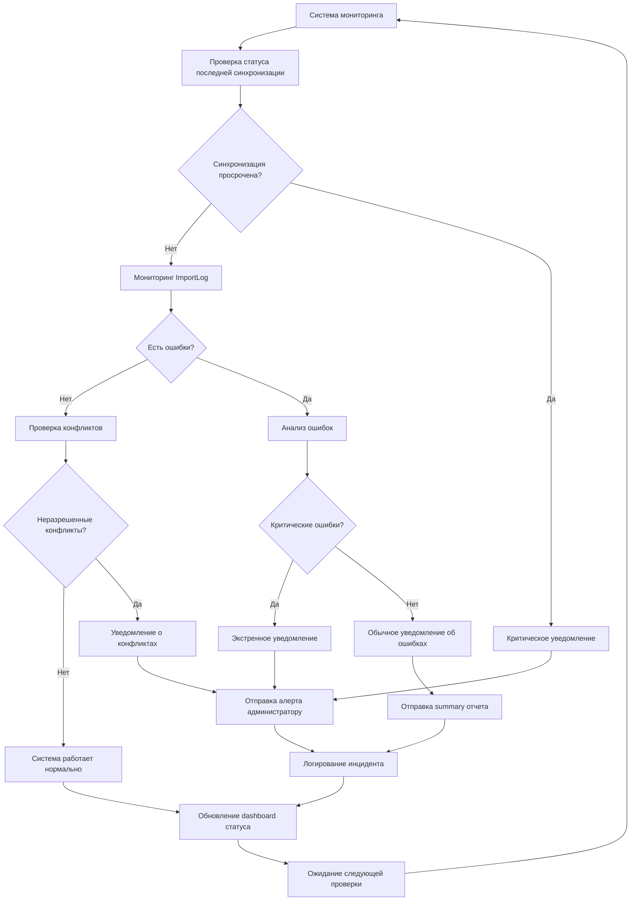

# 8. Основные Рабочие Процессы

### Процесс регистрации пользователя

### Процесс создания заказа

### Процесс синхронизации с 1С

### Workflow управления ценами

### Процесс обработки возвратов

### Процесс синхронизации покупателей с 1С

### Процесс разрешения конфликтов синхронизации

### Процесс экспорта покупателей в 1С

### Процесс обработки дублирующихся покупателей

### Workflow мониторинга синхронизации

---

