# FREESPORT База Данных ER-Диаграмма

## Диаграмма Связей Сущностей

```mermaid
erDiagram
    %% Управление пользователями
    User {
        id bigint PK
        email varchar(254) UK "USERNAME_FIELD"
        first_name varchar(150)
        last_name varchar(150)
        password varchar(128)
        phone varchar(12) "формат +79001234567"
        is_active boolean
        date_joined timestamp
        role varchar(20) "retail, wholesale_level1, wholesale_level2, wholesale_level3, trainer, federation_rep, admin"
        company_name varchar(200) "для B2B пользователей"
        tax_id varchar(12) "ИНН для B2B"
        is_verified boolean "B2B верификация"
        is_staff boolean
        is_superuser boolean
        last_login timestamp
        created_at timestamp
        updated_at timestamp
        onec_id varchar(50) UK "ID в системе 1С"
        onec_guid uuid UK "GUID в системе 1С"
        last_sync_from_1c timestamp "Время последней синхронизации из 1С"
        last_sync_to_1c timestamp "Время последней синхронизации в 1С"
        sync_conflicts jsonb "Конфликты синхронизации"
    }

    Company {
        id bigint PK
        user_id bigint FK "OneToOne связь"
        legal_name varchar(255)
        tax_id varchar(12) UK
        kpp varchar(9)
        legal_address text
        bank_name varchar(200)
        bank_bik varchar(9)
        account_number varchar(20)
        created_at timestamp
        updated_at timestamp
    }

    Address {
        id bigint PK
        user_id bigint FK
        address_type varchar(10) "shipping, legal"
        full_name varchar(100)
        phone varchar(12)
        city varchar(100)
        street varchar(200)
        building varchar(10)
        apartment varchar(10)
        postal_code varchar(6)
        is_default boolean
        created_at timestamp
        updated_at timestamp
    }

    %% Управление товарами
    Brand {
        id bigint PK
        name varchar(100) UK
        slug varchar(100) UK
        logo varchar(255)
        description text
        website varchar(200)
        is_active boolean
        created_at timestamp
        updated_at timestamp
    }

    Category {
        id bigint PK
        name varchar(200)
        slug varchar(200) UK
        parent_id bigint FK
        description text
        image varchar(255)
        is_active boolean
        sort_order integer
        seo_title varchar(200)
        seo_description text
        created_at timestamp
        updated_at timestamp
        onec_id varchar(50) UK "ID в системе 1С"
        last_sync_from_1c timestamp "Время последней синхронизации из 1С"
    }

    Product {
        id bigint PK
        name varchar(300)
        slug varchar(200) UK
        brand_id bigint FK
        category_id bigint FK
        description text
        short_description varchar(500)
        retail_price decimal "Розничная цена"
        opt1_price decimal "Оптовая цена уровень 1"
        opt2_price decimal "Оптовая цена уровень 2"
        opt3_price decimal "Оптовая цена уровень 3"
        trainer_price decimal "Цена для тренера"
        federation_price decimal "Цена для представителя федерации"
        recommended_retail_price decimal "Рекомендованная розничная цена (RRP)"
        max_suggested_retail_price decimal "Максимальная рекомендованная цена (MSRP)"
        sku varchar(100) UK
        stock_quantity integer
        min_order_quantity integer
        main_image varchar(255)
        gallery_images jsonb
        weight decimal
        dimensions jsonb
        specifications jsonb
        is_active boolean
        seo_title varchar(200)
        seo_description text
        created_at timestamp
        updated_at timestamp
        onec_id varchar(50) UK "ID в системе 1С"
        onec_guid uuid UK "GUID в системе 1С"
        last_sync_from_1c timestamp "Время последней синхронизации из 1С"
    }

    %% Управление заказами
    Order {
        id bigint PK
        order_number varchar(50) UK
        user_id bigint FK "null для гостевых заказов"
        customer_name varchar(200) "для гостевых заказов"
        customer_email varchar(254) "для гостевых заказов"
        customer_phone varchar(20) "для гостевых заказов"
        status varchar(50) "pending, confirmed, processing, shipped, delivered, cancelled, refunded"
        total_amount decimal
        discount_amount decimal
        delivery_cost decimal
        delivery_address text
        delivery_method varchar(50)
        delivery_date date
        payment_method varchar(50)
        payment_status varchar(20)
        notes text
        created_at timestamp
        updated_at timestamp
        onec_id varchar(50) UK "ID в системе 1С"
        exported_to_1c boolean "Экспортирован в 1С"
        export_to_1c_at timestamp "Время экспорта в 1С"
        last_sync_from_1c timestamp "Время последней синхронизации из 1С"
    }

    OrderItem {
        id bigint PK
        order_id bigint FK
        product_id bigint FK
        quantity integer
        unit_price decimal "Цена по роли пользователя"
        total_price decimal
        product_name varchar(300) "Снимок данных на момент заказа"
        product_sku varchar(100) "Снимок данных на момент заказа"
        created_at timestamp
        updated_at timestamp
        onec_product_id varchar(50) "ID товара в 1С"
    }

    %% Управление корзиной
    Cart {
        id bigint PK
        user_id bigint FK "null для гостевых пользователей"
        session_key varchar(100) "для гостевых пользователей"
        created_at timestamp
        updated_at timestamp
    }

    CartItem {
        id bigint PK
        cart_id bigint FK
        product_id bigint FK
        quantity integer
        added_at timestamp
        updated_at timestamp
    }


    %% Аудиторский журнал
    AuditLog {
        id bigint PK
        user_id bigint FK
        action varchar(100)
        resource_type varchar(50)
        resource_id varchar(100)
        changes jsonb
        ip_address inet
        user_agent text
        timestamp timestamp
    }

    %% Журнал синхронизации с 1С (Расширенный)
    CustomerSyncLog {
        id bigint PK
        operation_type varchar(20) "import_from_1c, export_to_1c, sync_changes"
        customer_id bigint FK "Ссылка на User"
        status varchar(10) "success, error, skipped, conflict"
        details jsonb "Детали синхронизации"
        changes_made jsonb "Внесенные изменения"
        conflict_resolution jsonb "Разрешение конфликтов"
        error_message text
        created_at timestamp
        processed_by varchar(100) "Management command или пользователь"
    }

    ImportLog {
        id bigint PK
        import_type varchar(20) "products, customers, orders, stock, prices"
        total_records integer
        processed_records integer
        successful_records integer
        failed_records integer
        skipped_records integer
        status varchar(20) "running, completed, failed, cancelled"
        file_path varchar(500) "Путь к обрабатываемому файлу"
        error_details jsonb
        summary_report jsonb "Итоговый отчет"
        started_at timestamp
        finished_at timestamp
        initiated_by varchar(100) "Management command или пользователь"
    }

    SyncConflict {
        id bigint PK
        conflict_type varchar(20) "customer_data, product_data, order_status, pricing"
        customer_id bigint FK "null если конфликт не связан с покупателем"
        product_id bigint FK "null если конфликт не связан с товаром"
        order_id bigint FK "null если конфликт не связан с заказом"
        platform_data jsonb "Данные в платформе"
        onec_data jsonb "Данные в 1С"
        conflicting_fields jsonb "Список конфликтующих полей"
        resolution_strategy varchar(20) "manual, platform_wins, onec_wins, merge"
        is_resolved boolean
        resolution_details jsonb
        resolved_at timestamp
        resolved_by varchar(100)
        created_at timestamp
        updated_at timestamp
    }

    %% Журнал синхронизации с 1С (Совместимость)
    SyncLog {
        id bigint PK
        sync_type varchar(50) "products, stocks, orders, prices"
        status varchar(20) "started, completed, failed"
        records_processed integer
        errors_count integer
        error_details jsonb
        started_at timestamp
        completed_at timestamp
    }

    %% Связи
    User ||--o| Company : "имеет компанию (OneToOne)"
    User ||--o{ Address : "имеет адреса (1:N)"
    
    Category ||--o{ Category : "имеет подкатегории"
    Brand ||--o{ Product : "производит товары"
    Category ||--o{ Product : "содержит товары"
    
    User ||--o| Cart : "имеет корзину"
    Cart ||--o{ CartItem : "содержит товары"
    Product ||--o{ CartItem : "в корзинах"
    
    User ||--o{ Order : "размещает заказы"
    Order ||--o{ OrderItem : "содержит товары"
    Product ||--o{ OrderItem : "заказанные товары"
    
    User ||--o{ AuditLog : "действия пользователя"
    
    %% Связи для интеграции с 1С
    User ||--o{ CustomerSyncLog : "логи синхронизации покупателя"
    User ||--o{ SyncConflict : "конфликты синхронизации покупателя"
    Product ||--o{ SyncConflict : "конфликты синхронизации товара"
    Order ||--o{ SyncConflict : "конфликты синхронизации заказа"
    ImportLog ||--o{ CustomerSyncLog : "трекинг импорта"
```

## Бизнес-Правила

### Роли пользователей и ценообразование
- **retail**: Розничный покупатель - retail_price
- **wholesale_level1**: Оптовик уровень 1 - opt1_price
- **wholesale_level2**: Оптовик уровень 2 - opt2_price  
- **wholesale_level3**: Оптовик уровень 3 - opt3_price
- **trainer**: Тренер - trainer_price
- **federation_rep**: Представитель федерации - federation_price
- **admin**: Администратор - полный доступ

### Информационные цены (только для отображения B2B пользователям)
- **recommended_retail_price**: Рекомендованная розничная цена (RRP)
- **max_suggested_retail_price**: Максимальная рекомендованная цена (MSRP)

### Статусы заказов
- **pending**: Ожидает обработки
- **confirmed**: Подтвержден
- **processing**: В обработке
- **shipped**: Отправлен
- **delivered**: Доставлен
- **cancelled**: Отменен
- **refunded**: Возвращен

### Типы адресов
- **shipping**: Адрес доставки
- **legal**: Юридический адрес

### Способы доставки
- **pickup**: Самовывоз
- **courier**: Курьерская доставка
- **post**: Почтовая доставка
- **transport**: Транспортная компания

### Типы синхронизации с 1С
- **products**: Товары
- **customers**: Покупатели  
- **stocks**: Остатки
- **orders**: Заказы
- **prices**: Цены

### Статусы синхронизации
- **started**: Начата
- **completed**: Завершена
- **failed**: Ошибка
- **running**: Выполняется
- **cancelled**: Отменена

### Операции синхронизации покупателей
- **import_from_1c**: Импорт из 1С
- **export_to_1c**: Экспорт в 1С
- **sync_changes**: Синхронизация изменений

### Статусы операций синхронизации
- **success**: Успешно
- **error**: Ошибка
- **skipped**: Пропущено
- **conflict**: Конфликт данных

### Типы конфликтов синхронизации
- **customer_data**: Данные покупателя
- **product_data**: Данные товара
- **order_status**: Статус заказа
- **pricing**: Ценообразование

### Стратегии разрешения конфликтов
- **manual**: Ручное разрешение
- **platform_wins**: Приоритет платформы
- **onec_wins**: Приоритет 1С
- **merge**: Объединение данных

### Уникальные ограничения Cart и Orders
- Уникальная комбинация (cart, product) для CartItem - предотвращает дублирование товаров в корзине
- Уникальная комбинация (order, product) для OrderItem - предотвращает дублирование товаров в заказе, количество увеличивается в существующей позиции

## Ограничения и Валидации

### Ограничения на уровне базы данных
1. **Положительные значения**: Все цены, количества, суммы > 0
2. **Уникальные ограничения**: email, username, sku, order_number
3. **Ограничения внешних ключей**: Все связи должны существовать
4. **Check ограничения**: 
   - stock_quantity >= 0
   - total заказа = sum(order_items)
   - валидный формат email
   - валидный формат телефона

### Валидации бизнес-логики
1. **Управление складом**: quantity <= stock_quantity
2. **Правила ценообразования**: Правильная цена по роли пользователя
3. **Минимальные заказы**: quantity >= min_order_quantity
4. **Разрешения ролей**: Доступ к функциям по ролям
5. **Валидация компании**: B2B пользователи должны иметь company_id

## Соображения производительности

### Критические индексы
1. **Поиск товаров**: GIN индекс на название (полнотекстовый поиск)
2. **Фильтрация по категории**: (category_id, retail_price)
3. **Заказы пользователя**: (user_id, created_at DESC)
4. **Запросы по складу**: (sku, stock_quantity)
5. **Активные товары**: (is_active, category_id)

### Оптимизация запросов
- Используем select_related/prefetch_related для оптимизации JOIN
- Партицирование больших таблиц по дате
- Кеширование часто запрашиваемых данных
- Индексы для поддержки пользовательских ролей и ценообразования