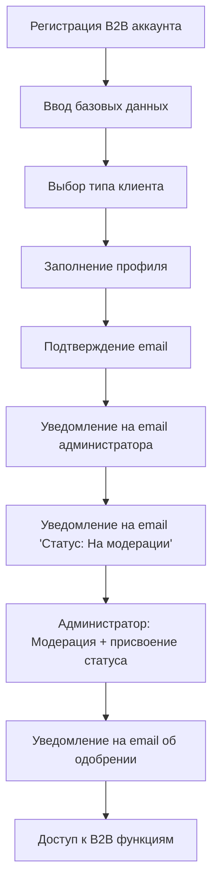
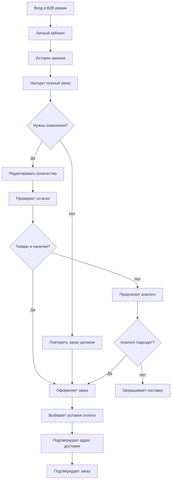

# Спецификация UI/UX FREESPORT

Данный документ определяет цели пользовательского опыта, информационную архитектуру, пользовательские потоки и спецификации визуального дизайна для пользовательского интерфейса FREESPORT. Он служит основой для визуального дизайна и frontend-разработки, обеспечивая целостный и ориентированный на пользователя опыт.

## Общие цели и принципы UX

На основе анализа конкурентов (prime-sport.ru, newarmor.ru) и специфики B2B платформы FREESPORT определены следующие цели и принципы UX:

### Целевые персоны

**Оптовый покупатель (3 уровня):**

- Уровень 1: Небольшие магазины, минимальные заказы 30,000₽
- Уровень 2: Средние сети, регулярные объемные закупки
- Уровень 3: Крупные ритейлеры, максимальные скидки и приоритет

**Тренер (Фитнес-клуб):**

- Руководители спортивных секций и фитнес-клубов
- Нужда в качественной экипировке для групповых занятий
- Фокус на соотношении цена-качество и долговечности

**Представитель федерации:**

- Закупщики для спортивных федераций
- Требования к сертификации и соответствию стандартам
- Особые условия и эксклюзивные предложения

### Цели удобства использования

- **Быстрота доступа к ценам**: Авторизованные пользователи видят персональные цены сразу
- **Прозрачность условий**: Четкое понимание системы скидок и уровней лояльности
- **Минимизация времени повторных заказов**: Быстрое оформление на основе истории

### Принципы дизайна

#### Правило использования цветов (обязательно)

При разработке пользовательского интерфейса FREESPORT необходимо **ВСЕГДА** использовать **CSS переменные / Tailwind-токены дизайн-системы** и **никогда** не использовать **hardcoded HEX цвета** (например, `bg-[#0060FF]`).

Источник и правила маппинга цветов:

- `docs/frontend/css-variables-mapping.md` (mapping HEX → CSS variables / Tailwind классы)
- `docs/frontend/design-system.json` (официальные токены дизайн-системы)

1. **Абсолютный приоритет удобству и быстроте выбора товара**
2. **Оптика легкости**: много белого пространства, мягкие тени, отсутствие визуального шума
3. **Чистая модульность**: все блоки строятся на 8-пиксельной сетке
4. **Единая визуальная иерархия**: яркие синие акценты, голубые вторичные тона и мягкие нейтральные подложки
5. **Обязательная адаптивность**: desktop-first, но без потери читаемости на tablet/mobile
6. **Интерактивные состояния выражаются цветом и лёгкой анимацией**
7. **CTA с мягкими радиусами и воздушными подложками**
8. **Карточки передают организованность**: крупные фото, разнесённые блоки данных, чёткие подписи

### Журнал изменений

| Date | Version   | Description                                                                                    | Author       |
|------|-----------|------------------------------------------------------------------------------------------------|--------------|
| 2025-08-12 | 1.1 | Финальная доработка B2B спецификации с исправлениями                                           |  (UX Expert) |
| 2025-08-16 | 1.2 | Добавлены критические компоненты: сортировка товаров, верификация B2B, административная панель |  (UX Expert) |
| 2025-11-19 | 2.0 | Полное обновление дизайн-системы: новая цветовая палитра, типографика, компоненты UI           |  (UX Expert) |
| 2025-11-25 | 2.1 | Синхронизация документации с сине-голубой палитрой (Story 14.4)                                | John (PM)    |

## Информационная архитектура (IA)

### Карта сайта / перечень экранов

```text
🏠 Главная B2B
├── 📦 Каталог товаров
│   ├── 🏃 СПОРТ
│   │   ├── 🥾 Туризм
│   │   │   ├── Палки для скандинавской ходьбы
│   │   │   └── Инвентарь для туризма и отдыха на природе
│   │   ├── 💪 Фитнес и атлетика
│   │   │   ├── 🏋️ Тяжелая атлетика
│   │   │   │   ├── Грифы
│   │   │   │   ├── Гантели
│   │   │   │   ├── Гири
│   │   │   │   ├── Бандажи
│   │   │   │   ├── Бинты
│   │   │   │   └── Пояса для тяжелой атлетики
│   │   │   ├── 💪 Фитнес
│   │   │   │   ├── Мячи для фитнеса
│   │   │   │   ├── Обручи
│   │   │   │   ├── Ролики для пресса
│   │   │   │   ├── Скакалки
│   │   │   │   ├── Степплатформы, бодибары и твистеры
│   │   │   │   ├── Эспандеры
│   │   │   │   ├── Утяжелители
│   │   │   │   └── Коврики, кариматы и маты
│   │   │   ├── 🏃 Легкая атлетика
│   │   │   ├── 🏆 Турники, брусья, упоры для отжимания
│   │   │   └── 🎒 Аксессуары для фитнеса и атлетики
│   │   │       ├── Перчатки
│   │   │       ├── Пояса для похудения
│   │   │       ├── Одежда для похудения
│   │   │       ├── Сумки и рюкзаки
│   │   │       ├── Шейкеры и бутылочки для питья
│   │   │       └── Прочее
│   │   ├── 🏊 Плавание
│   │   │   ├── Купальники для плавания
│   │   │   ├── Плавки для плавания
│   │   │   ├── Ласты
│   │   │   ├── Очки для плавания
│   │   │   ├── Шапочки для плавания
│   │   │   └── Бассейны, пляж, аксессуары
│   │   │       └── Бассейны
│   │   ├── ⚽ Спортивные игры
│   │   │   ├── 🏀 Баскетбол
│   │   │   │   ├── Мячи баскетбольные
│   │   │   │   └── Оборудование баскетбольное
│   │   │   ├── 🏓 Настольный теннис
│   │   │   │   ├── Мячи для настольного тенниса
│   │   │   │   ├── Ракетки
│   │   │   │   └── Сетки
│   │   │   ├── 🏐 Волейбол
│   │   │   │   ├── Мячи волейбольные
│   │   │   │   └── Защита волейбольная
│   │   │   ├── ⚽ Футбол
│   │   │   │   ├── Мячи футбольные (№3, №4, №5)
│   │   │   │   ├── Бутсы
│   │   │   │   ├── Гетры футбольные
│   │   │   │   ├── Защита для футбола
│   │   │   │   ├── Форма футбольная
│   │   │   │   └── Судейская атрибутика
│   │   │   ├── 🏸 Бадминтон и большой теннис
│   │   │   ├── 🤾 Гандбол
│   │   │   ├── 🎯 Дартс
│   │   │   ├── Классические настольные
│   │   │   └── Аксессуары
│   │   ├── 🥊 Единоборства
│   │   │   ├── 👘 Одежда для единоборств
│   │   │   │   ├── Кимоно
│   │   │   │   ├── Пояса для единоборств
│   │   │   │   ├── Форма боксерская
│   │   │   │   ├── Форма для борьбы
│   │   │   │   ├── Форма для кикбоксинга и тайского бокса
│   │   │   │   └── Форма для смешанных единоборств
│   │   │   ├── 👟 Обувь для единоборств
│   │   │   │   ├── Обувь для бокса
│   │   │   │   ├── Обувь для борьбы
│   │   │   │   └── Обувь для тхеквондо, кикбоксинга, рукопашного боя, самбо
│   │   │   ├── 🥊 Перчатки и накладки на руки
│   │   │   │   ├── Боксерские
│   │   │   │   ├── Для карате
│   │   │   │   ├── Для ММА
│   │   │   │   ├── Для рукопашного боя
│   │   │   │   ├── Для тхэквондо
│   │   │   │   └── Снарядные, тренировочные
│   │   │   ├── 🛡️ Защита для единоборств
│   │   │   │   ├── Бинты боксёрские
│   │   │   │   ├── Защита корпуса
│   │   │   │   ├── Защита ног
│   │   │   │   ├── Капы
│   │   │   │   ├── Шлема
│   │   │   │   └── Специальная защита
│   │   │   └── 🥅 Снаряжение
│   │   │       ├── Лапы и макивары
│   │   │       └── Мешки, груши, манекены
│   │   ├── 🤸 Гимнастика и танцы
│   │   │   ├── Одежда для гимнастики
│   │   │   │   └── Купальники
│   │   │   ├── Обувь для гимнастики и танцев
│   │   │   ├── Предметы для гимнастики
│   │   │   └── Наколенники гимнастические
│   │   └── 👕 Одежда спортивная
│   ├── 🚲 ДЕТСКИЙ ТРАНСПОРТ
│   │   ├── 🚲 Велосипеды
│   │   ├── ⛸️ Ролики
│   │   ├── 🛴 Самокаты
│   │   │   ├── Самокаты детские
│   │   │   ├── Самокаты городские
│   │   │   └── Трюковые самокаты
│   │   ├── 🛹 Скейты
│   │   └── 🛡️ Защита и аксессуары
│   ├── 🏋️ ОБОРУДОВАНИЕ
│   │   ├── 🏟️ Для спортивных залов
│   │   └── 🏗️ Спортивные комплексы и батуты
│   │       └── Аксессуары к детским комплексам
│   ├── 🎁 СУВЕНИРНАЯ ПРОДУКЦИЯ
│   └── 🔍 Поиск и фильтры
├── 👤 Личный кабинет B2B
│   ├── 📊 История заказов
│   ├── 🛒 Корзина
│   │   ├── 📋 Оформление заказа
│   │   ├── ✅ Подтверждение заказа
│   │   └── 📧 Уведомление менеджера
│   ├── 🏢 Профиль компании
│   ├── 📋 Выгрузки PDF/Excel
│   ├── 💰 Персональные цены
│   └── 🔄 Повторные заказы
├── ℹ️ О компании
├── 📞 Контакты
├── 🔧 Административная панель (только для админов)
│   ├── 📊 Дашборд и аналитика
│   ├── 👥 Управление пользователями
│   │   ├── Модерация B2B заявок
│   │   ├── Присвоение статусов
│   │   └── Управление ролями
│   ├── 📦 Управление заказами
│   │   ├── Обработка заказов
│   │   ├── Изменение статусов
│   │   └── История операций
│   ├── 🔄 Интеграция с 1С
│   │   ├── Статус синхронизации
│   │   ├── Логи операций
│   │   ├── Ручной экспорт/импорт
│   │   └── Мониторинг Circuit Breaker
│   ├── 📈 Аналитика и отчеты
│   │   ├── Статистика продаж
│   │   ├── Отчеты по клиентам
│   │   └── Финансовые отчеты
│   └── ⚙️ Системные настройки
│       ├── Управление контентом
│       ├── Настройки цен
│       └── Конфигурация системы
└── 📝 Заявка на доступ (для неавторизованных)
```

### Структура навигации

**Главная навигация (Header):**

- Логотип FREESPORT
- Каталог (мега-меню по видам спорта)
- Личный кабинет / Войти
- Корзина с индикатором количества
- Контакты менеджера

**Вторичная навигация (для авторизованных):**

- Навигационные цепочки (Breadcrumbs) для каталога
- Фильтры в боковой панели (Бренд, Размер, Цвет, Цена, Наличие)
- Быстрые ссылки в ЛК: "Повторить последний заказ", "Выгрузить прайс"

### Стратегия навигационных цепочек (Breadcrumbs)

- Главная > Вид спорта > Категория > Товар
- Личный кабинет > Раздел
- Поддержка возврата на любой уровень

## UX Рекомендации для B2B FREESPORT

### 2. Система навигации

- **Каталог по категориям**: Виды спорта → Подкатегории → SKU
  - **Фильтры**: Бренд, Размер, Цвет, Цена, Наличие на складе
- **Бизнес-инструменты**:
  - История заказов
  - Выгрузка заказа в PDF

### Ключевые функциональные блоки

**Регистрация и онбординг:**

- **Типизация клиентов**:
  - Оптовый покупатель (Уровень 1, 2, 3 - по объемам закупок)
  - Тренер (Фитнес-клуб или студия)
  - Представитель федерации
- **Верификация**: ИНН, ОГРН проверка

**Каталог и поиск:**

- SKU товаров
- Остатки на складе в реальном времени
- Bulk операции: массовое добавление по списку артикулов
- Прайс-листы с экспортом в Excel/PDF

**Корзина и заказ:**

- Калькулятор финальной стоимости с учетом скидок
- Быстрое оформление повторного заказа

**Персонализированный SSR (Server-Side Rendering):**

- Для авторизованных B2B пользователей цены (РРЦ, МРЦ) отображаются сразу при первой загрузке страницы.
- Используется механизм проброса авторизационных кук (`sessionid`) в запросы к API на стороне сервера.
- Обеспечивает мгновенный доступ к коммерческим условиям без "мигания" интерфейса (hydration mismatch).

### 💎 **Уникальные UX решения для MVP**

**1. Ролевая система баннеров:**

- Динамическое содержимое главной страницы
- Персонализированные предложения по типу клиента
- Адаптивная навигация под роли пользователей

**2. Упрощенная система лояльности:**

- Прозрачные уровни скидок для оптовых покупателей
- Специальные условия для тренеров и федераций
- Четкие критерии перехода между уровнями

## 📋 Функции отложенные на ФАЗУ 2

### **Аналитика и BI:**

- Аналитика продаж для клиентов
- Аналитический дашборд с метриками
- Прогнозирование потребностей на основе истории

### **Автоматизация и интеграции:**

- Проверка ИНН/ОГРН через API ФНС
- Быстрое автоматическое одобрение заявок (scoring)
- Интеграция с системами клиента (API/EDI)

### **Расширенная функциональность заказов:**

- Выгрузка заказов в CSV
- Сохранение шаблонов заказов
- Предложение аналогов при отсутствии товара

### **Документооборот:**

- Электронный документооборот (ЭДО)
- Автоматическое формирование счетов, накладных, актов сверки
- Система согласования заказов (workflow approval)

### **Коммуникации:**

- Коммуникационный хаб с историей взаимодействий
- Интеграция чата с CRM
- Уведомления о поступлениях интересующих товаров
- Push-уведомления в мобильном приложении

### **Продвинутая лояльность:**

- Прогрессивная система лояльности с накопительными баллами
- Программа раннего доступа к новинкам
- Персональные рекомендации на основе ML

## Пользовательские потоки

### 1. B2B Клиент: Процесс верификации



### 2. B2B Оптовик: Повторный заказ экипировки



### Метрики успеха пользовательских потоков

- Время от поиска до покупки: **< 1 минуты** (повтор B2B)
- Конверсия корзина→заказ: **> 70%**
- Bounce rate на карточке товара: **< 40%**

## Каркасы и макеты

### 1. Административная панель - Дашборд

#### Главный экран админ-панели

```text
┌─────────────────────────────────────────────────────────────────────────┐
│ [FREESPORT ADMIN] [👤Admin] [🔔Уведомления] [⚙️Настройки] [🚪Выйти]   │
├─────────────────────────────────────────────────────────────────────────┤
│ [📊Дашборд] [👥Пользователи] [📦Заказы] [🔄1С] [📈Отчеты] [⚙️Система]│
├─────────────────────────────────────────────────────────────────────────┤
│ ┌─ КПЭ (за сегодня) ──────────────────────────────────────────────────┐ │
│ │ 📋 Новых заявок   📦 Заказов      💰 Продаж     🔄 Синхронизация  │ │
│ │ [8] на модерации  [24] сегодня    [450,000₽]      [✅ Активна]     │ │
│ └─────────────────────────────────────────────────────────────────────┘ │
├─────────────────────────────────────────────────────────────────────────┤
│ ┌─ ТРЕБУЮТ ВНИМАНИЯ ───────────────────┐ ┌─ ИНТЕГРАЦИЯ 1С ────────────┐ │
│ │ 🔴 Заявки на модерации: [8]         │ │ Статус: ✅ Работает        │ │
│ │ 🟡 Проблемные заказы: [2]           │ │ Последняя синхронизация:    │ │
│ │ 🟠 Низкие остатки: [15 товаров]     │ │ 15:30 сегодня               │ │
│ │ [ПЕРЕЙТИ К МОДЕРАЦИИ]                │ │ Товары: ✅ | Заказы: ✅   │ │
│ └──────────────────────────────────────┘ │ Остатки: ✅ | Цены: ✅    │ │
│                                         │ [ПОСМОТРЕТЬ ЛОГИ]           │ │
│ ┌─ ГРАФИК ЗАКАЗОВ (7 дней) ───────────┐ │ [РУЧНАЯ СИНХРОНИЗАЦИЯ]      │ │
│ │     [График линейный]               │ └─────────────────────────────┘ │
│ │ 50 │    /\        /\                │                                 │
│ │ 40 │   /  \      /  \               │ ┌─ АКТИВНОСТЬ СИСТЕМЫ ────────┐ │
│ │ 30 │  /    \    /    \              │ │ 👥 Онлайн: 45 пользователей │ │
│ │ 20 │ /      \  /      \             │ │ 📊 Нагрузка CPU: 23%        │ │
│ │ 10 │/        \/        \            │ │ 💾 Память: 1.2GB/8GB        │ │
│ │  0 └──────────────────────────      │ │ 📶 Ответов API: 98.5%       │ │
│ │    Пн  Вт  Ср  Чт  Пт  Сб  Вс       │ │ [ПОДРОБНАЯ СТАТИСТИКА]      │ │
│ └─────────────────────────────────────┘ └─────────────────────────────┘ │
└─────────────────────────────────────────────────────────────────────────┘
```

### 2. Модерация B2B заявок

```text
┌─────────────────────────────────────────────────────────────────────────────┐
│ [🔙 Назад] МОДЕРАЦИЯ B2B ЗАЯВОК                               [🔄 Обновить]│
├─────────────────────────────────────────────────────────────────────────────┤
│ Фильтры: [Все ▼] [Дата ▼] [Тип клиента ▼]     [Поиск_______________] [🔍]   │
├─────────────────────────────────────────────────────────────────────────────┤
│ ┌─────────────────────────────────────────────────────────────────────────┐ |
│ │ 📅 16.08.2025 | 🏢 ОПТОВИК | Иванов Иван Иванович               [🔴●]  │ │ 
│ │ ООО "СпортСнаб" | ИНН: 7712345678 | 📞 +7-495-123-45-67                 │ │
│ │ 📧 info@sportsnab.ru                                                    │ │
│ │ 📄 Документы: [Устав.pdf] [Справка.pdf] [Паспорт.pdf] [СМОТРЕТЬ]        │ │
│ │ 💬 Комментарий: "Работаем уже 5 лет в сфере спорттоваров... "           │ │
│ │ [❌ ОТКЛОНИТЬ] [✅ ОДОБРИТЬ КАК ОПТОВИК1] [⚡ ОПТОВИК2] [🔥 ОПТОВИК3] │ │
│ └─────────────────────────────────────────────────────────────────────────┘ │
│ ┌─────────────────────────────────────────────────────────────────────────┐ │
│ │ 📅 16.08.2025 | 💪 ТРЕНЕР | Петров Петр Петрович               [🟡●]   │ │
│ │ Фитнес-клуб "Титан" | 📞 +7-925-987-65-43                               │ │ 
│ │ 📧 trainer@titan-gym.ru                                                 │ │
│ │ 📄 Документы: [Справка_работы.pdf] [Сертификат.pdf] [СМОТРЕТЬ]          │ │
│ │ 💬 Комментарий: "Персональный тренер, веду групповые занятия...         │ │ 
│ │ [❌ ОТКЛОНИТЬ] [✅ ОДОБРИТЬ КАК ТРЕНЕР]                                │ │
│ └─────────────────────────────────────────────────────────────────────────┘ │
│ Всего заявок: 8 | На странице: 2                                [1] 2 3 [→] │
└─────────────────────────────────────────────────────────────────────────────┘
```

### 3. Мониторинг интеграции с 1С

```text
┌─────────────────────────────────────────────────────────────────────────┐
│ [🔙 Назад] ИНТЕГРАЦИЯ С 1С                                [🔄 Обновить]│
├─────────────────────────────────────────────────────────────────────────┤
│ ┌─ СТАТУС СИСТЕМЫ ────────────────────────────────────────────────────┐ │
│ │ Circuit Breaker: [🟢 CLOSED - Система работает]                    │ │
│ │ Последний сбой: 15.08.2025 14:23 (восстановлено через 2 мин)        │ │
│ │ Успешных операций подряд: 1,247                                     │ │
│ │ [ПРИНУДИТЕЛЬНО ОТКРЫТЬ] [СБРОСИТЬ СЧЕТЧИКИ]                         │ │
│ └─────────────────────────────────────────────────────────────────────┘ │
├─────────────────────────────────────────────────────────────────────────┤
│ ┌─ СТАТИСТИКА СИНХРОНИЗАЦИИ ──────────────────────────────────────────┐ │
│ │ ТОВАРЫ      │ ОСТАТКИ     │ ЗАКАЗЫ      │ ЦЕНЫ         │            │ │
│ │ ✅ 15:30    │ ✅ 15:30   │ ✅ 15:28    │ ✅ 14:00    │            │ │
│ │ 1,240 шт    │ 1,240 шт    │ 8 заказов   │ 1,240 позиций│            │ │
│ │ [ЗАПУСТИТЬ] │ [ЗАПУСТИТЬ] │ [ЗАПУСТИТЬ] │ [ЗАПУСТИТЬ] │             │ │
│ └─────────────────────────────────────────────────────────────────────┘ │
├─────────────────────────────────────────────────────────────────────────┤
│ ┌─ ЖУРНАЛ ОПЕРАЦИЙ (последние 20) ──────────────[ЭКСПОРТ] [ФИЛЬТРЫ]──┐ │
│ │ 📅 Время     │ Тип      │ Статус │ Записей │ Действие              │ │
│ │ 15:30:15     │ Товары   │ ✅ OK  │ 1,240   │ [Детали]              │ │
│ │ 15:30:12     │ Остатки  │ ✅ OK  │ 1,240   │ [Детали]              │ │
│ │ 15:28:45     │ Заказы   │ ✅ OK  │ 8       │ [Детали]              │ │
│ │ 14:00:00     │ Цены     │ ✅ OK  │ 1,240   │ [Детали]              │ │
│ │ 13:45:23     │ Заказы   │ ❌ ERR │ 0       │ [Ошибка] [Повторить]  │ │
│ │ 13:30:15     │ Товары   │ ⚠️ WARN│ 1,238   │ [Детали]              │ │
│ └────────────────────────────────────────────────────────────────────┘  │
│ [ПОКАЗАТЬ ВСЕ ЛОГИ] [ОЧИСТИТЬ СТАРЫЕ]                                   │
└─────────────────────────────────────────────────────────────────────────┘
```

### 4. Главная страница

#### FOOTER

```text
┌─────────────────────────────────────────────────────────────────────────┐
│ ┌─ FOOTER ──────────────────────────────────────────────────────────┐   │
│ │ ■ FREESPORT             Навигация    Информация     Контакты      │   │
│ │ Интернет-магазин        Каталог      О нас          +7 (495)      │   │
│ │ спортивной одежды       Бренды       Доставка       123-45-67     │   │
│ │ и экипировки            Новости      Возврат        support@      │   │
│ │                         Акции        Блог           freesport.ru  │   │
│ │ © 2024 FREESPORT                                   [📷] [🐦] [n] │   │
│ └───────────────────────────────────────────────────────────────────┘   │
└─────────────────────────────────────────────────────────────────────────┘
```
#### HEADER
```text
┌──────────────────────────────────────────────────────────────────────────────────────────────────────────────┐
│ [■ FREESPORT]  ГЛАВНАЯ КАТАЛОГ НОВОСТИ БЛОГ ПАРТНЁРАМ   [     🔍] [♡] [🛒] [👤][ОПТ1] [Регистрация][Войти] │
└──────────────────────────────────────────────────────────────────────────────────────────────────────────────┘
```

#### Десктопный макет

```text
┌─────────────────────────────────────────────────────────────────────────┐
│                         HEADER                                          │
├─────────────────────────────────────────────────────────────────────────┤
│ ┌─ HERO БАННЕР ─────────────────────────────────────────────────────┐   │
│ │ ┌───────────────────────────┐  ┌─────────────────────────────────┐│   │
│ │ │ Оптовые поставки          │  │     [Изображение банера]        ││   │
│ │ │ спортивных товаров .      │  │                                 ││   │
│ │ │ [условия]                 │  └─────────────────────────────────┘│   │
│ │ └───────────────────────────┘                                     │   │
│ └───────────────────────────────────────────────────────────────────┘   │
│                                                                         │
│ Новинки  Хиты продаж  Скидки    Фитнес и атлетика  Спортивные игры ...  │
│                                                                         │
│ ┌─ MRKET БАННЕР ────────────────────────────────────────────────────┐   │
│ │ ┌───────────────────────────┐  ┌─────────────────────────────────┐│   │
│ │ │ Новая коллекция.          │  │     [Изображение банера]        ││   │
│ │ │ Преодолей свои границы.   │  │                                 ││   │
│ │ │ [К каталогу]              │  └─────────────────────────────────┘│   │
│ │ └───────────────────────────┘                                     │   │
│ └───────────────────────────────────────────────────────────────────┘   │
│                                                                         │
│  Бренды                                                                 │
│ ┌─────────────┐ ┌─────────────┐ ┌─────────────┐ ┌─────────────┐         │
│ │ [LOGO][IMG] │ │ [LOGO][IMG] │ │ [LOGO][IMG] │ │ [LOGO][IMG] │ ...     │
│ └─────────────┘ └─────────────┘ └─────────────┘ └─────────────┘         │
├─────────────────────────────────────────────────────────────────────────┤
│ Категории                                                               │
│ ┌────────────┐ ┌──────────────────┐ ┌───────────────────┐               │
│ │ [IMG]      │ │ [IMG]            │ │ [IMG]             │ ...           │
│ │Единоборства│ │Фитнес и атлетика │ │ Спортивные игры   │               │
│ └────────────┘ └──────────────────┘ └───────────────────┘               │
│                                                                         │
├─────────────────────────────────────────────────────────────────────────┤
│ ┌─ БАННЕР "О НАС" ────────────────────────────────────────────────────┐ │
│ │  ┌────────────────────────────────────────────────────────────────┐ │ │
│ │  │     [Изображение банера]                                       │ │ │
│ │  │                                                                │ │ │
│ │  │ ┌────────────────────────────────────┐                         │ │ │
│ │  │ │ О компании FREESPORT               │                         │ │ │
│ │  │ │ федеральный оптовый поставщик      │                         │ │ │ 
│ │  │ │ и производитель спортивных товаров │                         │ │ │
│ │  │ │ [К каталогу]                       │                         │ │ │
│ │  │ └────────────────────────────────────┘                         │ │ │
│ │  └────────────────────────────────────────────────────────────────┘ │ │
│ └─────────────────────────────────────────────────────────────────────┘ │
│                                                                         │
│ Хиты продаж                                            [← Prev] [Next →]│
│ ┌────────────┐ ┌────────────┐ ┌────────────┐ ┌────────────┐             │
│ │ [HIT][IMG] │ │ [HIT][IMG] │ │ [HIT][IMG] │ │ [HIT][IMG] │ ...         │
│ │ 12 499 ₽   │ │ 4 999 ₽    │ │ 7 299 ₽    │ │ 3 899 ₽    │             │
│ │[В корзину] │ │[В корзину] │ │[В корзину] │ │[В корзину] │             │
│ └────────────┘ └────────────┘ └────────────┘ └────────────┘             │
├─────────────────────────────────────────────────────────────────────────┤
│ Новинки                                                [← Prev] [Next →]│
│ ┌────────────┐ ┌────────────┐ ┌────────────┐ ┌────────────┐             │
│ │ [NEW][IMG] │ │ [NEW][IMG] │ │ [NEW][IMG] │ │ [NEW][IMG] │ ...         │
│ └────────────┘ └────────────┘ └────────────┘ └────────────┘             │
├─────────────────────────────────────────────────────────────────────────┤
│ Акция                                                  [← Prev] [Next →]│
│ ┌────────────┐ ┌────────────┐ ┌────────────┐ ┌────────────┐             │
│ │[PROMO][IMG]│ │[PROMO][IMG]│ │[PROMO][IMG]│ │[PROMO][IMG]│ ...         │
│ └────────────┘ └────────────┘ └────────────┘ └────────────┘             │
├─────────────────────────────────────────────────────────────────────────┤
│ Распродажа                                             [← Prev] [Next →]│
│ ┌────────────┐ ┌────────────┐ ┌────────────┐ ┌────────────┐             │
│ │ [SALE][IMG]│ │ [SALE][IMG]│ │ [SALE][IMG]│ │ [SALE][IMG]│ ...         │
│ │ 5 999 ₽    │ │ 3 999 ₽    │ │ 2 999 ₽    │ │ 7 999 ₽    │             │
│ │ ̶8̶ ̶9̶9̶9̶₽̶     │ │ ̶5̶ ̶9̶9̶9̶₽̶     │ │ ̶4̶ ̶9̶9̶9̶₽̶     │ │ ̶1̶2̶ ̶9̶9̶9̶₽̶    │             │
│ └────────────┘ └────────────┘ └────────────┘ └────────────┘             │
├─────────────────────────────────────────────────────────────────────────┤
│ Категории                                                               │
│ ┌────────────┐ ┌──────────────────┐ ┌───────────────────┐               │
│ │ [IMG]      │ │ [IMG]            │ │ [IMG]             │ ...           │
│ │Единоборства│ │Фитнес и атлетика │ │ Спортивные игры   │               │
│ └────────────┘ └──────────────────┘ └───────────────────┘               │
├─────────────────────────────────────────────────────────────────────────┤
│ Новости                                                                 │
│ ┌────────────────┐ ┌────────────────┐ ┌────────────────┐                │
│ │ [IMG]          │ │ [IMG]          │ │ [IMG]          │                │
│ │ 15 мая 2024    │ │ 10 мая 2024    │ │ 5 мая 2024     │                │
│ │ Как выбрать... │ │ Обзор новой... │ │ Топ-5 упражн...│                │
│ └────────────────┘ └────────────────┘ └────────────────┘                │
├─────────────────────────────────────────────────────────────────────────┤
│ Наш блог                                                                │
│ ┌────────────────┐ ┌────────────────┐ ┌────────────────┐                │
│ │ [IMG]          │ │ [IMG]          │ │ [IMG]          │                │
│ │ 20 мая 2024    │ │ 18 мая 2024    │ │ 12 мая 2024    │                │
│ │ Советы про...  │ │ История брен...│ │ Интервью с...  │                │
│ └────────────────┘ └────────────────┘ └────────────────┘                │
├─────────────────────────────────────────────────────────────────────────┤
├─────────────────────────────────────────────────────────────────────────┤
│ Подпишитесь на новости                                                  │
│ ┌───────────────────────┐  ┌────────────────────────────────────────┐   │
│ │ ПОДПИСАТЬСЯ...        │  │          БОНУС ЗА ПОДПИСКУ             │   │
│ │ Получайте первыми...  │  │                                        │   │
│ │ [Email___________]    │  │       СКИДКА 5% НА ПЕРВЫЙ ЗАКАЗ        │   │
│ │ [ПОДПИСАТЬСЯ]         │  │                                        │   │
│ └───────────────────────┘  └────────────────────────────────────────┘   │
├─────────────────────────────────────────────────────────────────────────┤
│                                FOOTER                                   │
└─────────────────────────────────────────────────────────────────────────┘
```

### 5. Каталог товаров

```text
┌─────────────────────────────────────────────────────────────────────────┐
│                                   HEADER                                │
├─────────────────────────────────────────────────────────────────────────┤
│ Главная / СПОРТ / Единоборства                                          │
├─────────────────────────────────────────────────────────────────────────┤
│ Единоборства                                                            │
├─────────────────────────────────────────────────────────────────────────┤
│ ┌─ SIDEBAR ─────┐  Показано 12 из 210 товаров    [⊞] [≡] По популярности▼│
│ │ Категории     │  ┌────────────┐ ┌────────────┐ ┌────────────┐         │
│ │ ▼ Единоборства│  │ [♡] [IMG]  │ │[SALE][IMG] │ │ [♡] [IMG]  │         │
│ │   Одежда      │  │            │ │            │ │            │         │
│ │   Обувь       │  │ Nike       │ │ Adidas     │ │ Puma       │         │
│ │   Перчатки    │  │ Sportswear │ │ Essentials │ │ Graphic    │         │
│ │   Защита      │  │ Club Fleece│ │ Hoodie     │ │ Sweatshirt │         │
│ │   Снаряжение  │  │ 7 499₽     │ │5 999₽ 8 299₽│ │ 6 899₽     │         │
│ │               │  └────────────┘ └────────────┘ └────────────┘         │
│ │               │  ┌────────────┐ ┌────────────┐ ┌────────────┐         │
│ │               │  │ [♡] [IMG]  │ │ [♡] [IMG]  │ │[NEW][IMG]  │         │
│ │ Фильтры       │  │            │ │            │ │            │         │
│ │ ▼ Цена        │  │ The North  │ │ Nike       │ │ Under      │         │
│ │ [1500₽][12000₽]│ │ Face       │ │ Tech Fleece│ │ Armour     │         │
│ │ ═════●════    │  │ Box NSE    │ │ Full-Zip   │ │ Rival      │         │
│ │ ▼ Бренд       │  │ Pullover   │ │            │ │ Fleece Logo│         │
│ │ ▼ Размер      │  │ 9 199₽     │ │ 11 499₽    │ │ 6 299₽     │         │
│ │ ▼ Цвет        │  └────────────┘ └────────────┘ └────────────┘         │
│ │               │                                                       │
│ │ [Применить]   │        [←] [1] [2] [3] ... [18] [→]                   │
│ │ [Сбросить]    │                                                       │
│ └───────────────┘                                                       │
├─────────────────────────────────────────────────────────────────────────┤
│ Стильные и удобные мужские худи                                         │
│ Откройте для себя нашу коллекцию мужских худи и толстовок...            │
└─────────────────────────────────────────────────────────────────────────┘
```

### 6. Карточка товара

```text
┌─────────────────────────────────────────────────────────────────────────┐
│                                   HEADER                                │
├─────────────────────────────────────────────────────────────────────────┤
│ Главная / Каталог / Спортивная куртка                                   │
├─────────────────────────────────────────────────────────────────────────┤
│ ┌─────────────────────────┐  Артикул: SKU-ВАРИАНТА | Бренд: FREESPORT        │
│ │                         │                                             │
│ │                         │  Водонепроницаемая спортивная               │
│ │      [MAIN IMAGE]       │  куртка 'VECTOR'                            │
│ │                         │                                             │
│ │                         │  ☆☆☆☆☆ 122 отзыва                         │
│ │                         │                                             │
│ │                         │  7 990 ₽  (Цена варианта)                   │
│ │                         │                                             │
│ └─────────────────────────┘  Цвет: Темно-синий                          │
│ [□][□][□][□][□][□]           ● ● ●                                      │
│ (горизонтальные превью)                                                 │
│                              Размер:          Таблица размеров          │
│                              [S] [M] [L] [XL] [XXL] [XXXL]              │
│                                                                         │
│                              ┌──────────────────────────────────┐       │
│                              │ Артикул варианта: SKU-123        │       │
│                              │ РРЦ: 10 000 ₽ (для B2B)          │       │
│                              │ МРЦ: 12 000 ₽ (для B2B)          │       │
│                              │ В наличии: 15 шт.                │       │
│                              └──────────────────────────────────┘       │
│                                                                         │
│                              ┌────────────────────┐ ┌─────────────┐     │
│                              │ 🛒 Добавить в      │ │♡ В избранное│     │
│                              │    корзину         │ │             │     │
│                              └────────────────────┘ └─────────────┘     │
├─────────────────────────────────────────────────────────────────────────┤
│ [Описание] [Характеристики] [Отзывы (122)]                              │
│ ─────────                                                               │
│ Спортивная куртка 'VECTOR' — это идеальное сочетание стиля, комфорта    │
│ и технологий. Создана для активных людей...                             │
│                                                                         │
│ • Технология StormShield для защиты от непогоды                         │
│ • Легкий и дышащий материал                                             │
│ • Регулируемый капюшон и манжеты                                        │
│ • Проклеенные швы для максимальной водонепроницаемости                  │
├─────────────────────────────────────────────────────────────────────────┤
│ С этим товаром покупают                                                 │
│ ┌────────────┐ ┌────────────┐ ┌────────────┐ ┌────────────┐             │
│ │ [IMG]      │ │ [IMG]      │ │ [IMG]      │ │ [IMG]      │             │
│ │ Кроссовки  │ │ Леггинсы   │ │ Рюкзак     │ │ Бутылка    │             │
│ │ 'BLAZE'    │ │ 'FLEX'     │ │ 'URBAN'    │ │ 'HYDRO'    │             │
│ │ Для бега   │ │ Компресс.  │ │ Городской  │ │ Аксессуары │             │
│ │ 6 490 ₽    │ │ 3 990 ₽    │ │ 4 500 ₽    │ │ 1 290 ₽    │             │
│ └────────────┘ └────────────┘ └────────────┘ └────────────┘             │
└─────────────────────────────────────────────────────────────────────────┘
```

### 7. Корзина

```text
┌─────────────────────────────────────────────────────────────────────────┐
│                                   HEADER                                │
├─────────────────────────────────────────────────────────────────────────┤
│ Главная / Корзина                                                       │
├─────────────────────────────────────────────────────────────────────────┤
│ Ваша корзина                                                            │
├─────────────────────────────────────────────────────────────────────────┤
│ ┌───────────────────────────────────────────┐  ┌─────────────────────┐  │
│ │ ┌─────┐ Спортивная футболка Nike Pro      │  │ Итоги заказа        │  │
│ │ │[IMG]│ Арт: 123456                       │  │                     │  │
│ │ │     │ Цвет: Черный, Размер: L           │  │ Товары на сумму     │  │
│ │ └─────┘        [-] 1 [+]     4 990 ₽  [🗑]│  │           17 480 ₽  │  │
│ │ ─────────────────────────────────────────│  │                     │  │
│ │ ┌─────┐ Беговые кроссовки Adidas         │  │ Скидка по промокоду │  │
│ │ │[IMG]│ Ultraboost                        │  │           - 1 748 ₽ │  │
│ │ │     │ Арт: 789012                       │  │                     │  │
│ │ └─────┘ Цвет: Белый, Размер: 43          │  │ Итого к оплате      │  │
│ │                [-] 1 [+]    12 490 ₽ [🗑] │  │          15 732 ₽   │  │
│ └───────────────────────────────────────────┘  │                     │  │
│                                                │ [Введите промокод]  │  │
│                                                │           [Применить]│  │
│                                                │                     │  │
│                                                │ ┌─────────────────┐ │  │
│                                                │ │ 🛒 Оформить заказ│ │  │
│                                                │ └─────────────────┘ │  │
│                                                └─────────────────────┘  │
└─────────────────────────────────────────────────────────────────────────┘
```

### 8. Оформление заказа (Single Page Checkout)

```text
┌─────────────────────────────────────────────────────────────────────────┐
│                                   HEADER                                │
├─────────────────────────────────────────────────────────────────────────┤
│ Оформление заказа                                                       │
├─────────────────────────────────────────────────────────────────────────┤
│ ┌───────────────────────────────────────┐  ┌─────────────────────────┐  │
│ │ 1. Ваши данные                    [▲] │  │ Ваш заказ               │  │
│ │ ───────────────────────────────────── │  │                         │  │
│ │ ФИО                                   │  │ ┌────┐ Кроссовки        │  │
│ │ ┌─────────────────────────────────┐   │  │ │IMG │ FlashRun         │  │
│ │ │ Иванов Иван Иванович            │   │  │ └────┘ Размер: 42      │  │
│ │ └─────────────────────────────────┘   │  │        Цвет: Черный    │  │
│ │                                       │  │              8 990 ₽   │  │
│ │ Email              Телефон            │  │                         │  │
│ │ ┌──────────────┐  ┌───────────────┐   │  │ ┌────┐ Леггинсы        │  │
│ │ │example@mail  │  │+7 (___) ___-__│   │  │ │IMG │ ProFit          │  │
│ │ └──────────────┘  └───────────────┘   │  │ └────┘ Размер: M       │  │
│ │                                       │  │        Цвет: Серый     │  │
│ └───────────────────────────────────────┘  │              4 500 ₽   │  │
│ ┌───────────────────────────────────────┐  │                         │  │
│ │ 2. Доставка                       [▼] │  │ Товары (2)    13 490 ₽ │  │
│ └───────────────────────────────────────┘  │ Скидка        - 1 349 ₽│  │
│ ┌───────────────────────────────────────┐  │ Доставка    Бесплатно  │  │
│ │ 3. Оплата                         [▼] │  │                         │  │
│ └───────────────────────────────────────┘  │ Итого        12 141 ₽  │  │
│                                            │                         │  │
│                                            │ ┌─────────────────────┐ │  │
│                                            │ │ Перейти к оплате    │ │  │
│                                            │ └─────────────────────┘ │  │
│                                            └─────────────────────────┘  │
└─────────────────────────────────────────────────────────────────────────┘
```

### 9. Поиск по сайту

```text
┌─────────────────────────────────────────────────────────────────────────┐
│                                   HEADER                                │
│ (режим поиска - навигация скрыта, поисковая строка раскрыта)            │
├─────────────────────────────────────────────────────────────────────────┤
│ ┌─ Автодополнение ───────────────────────────────────────────────────┐  │
│ │ 🔍 кроссовки для бега Nike                                        │  │
│ │ 🔍 кроссовки для бега Adidas                                      │  │
│ │ 🔍 кроссовки для бега женские                                     │  │
│ │ 📦 Nike Air Zoom Pegasus — кроссовки для бега      12 490 ₽       │  │
│ │ 📦 Adidas Ultraboost — беговые кроссовки           14 990 ₽       │  │
│ └───────────────────────────────────────────────────────────────────┘  │
├─────────────────────────────────────────────────────────────────────────┤
│ Результаты поиска: "кроссовки для бега"                 Найдено: 48    │
├─────────────────────────────────────────────────────────────────────────┤
│ Фильтры: [Бренд ▼] [Размер ▼] [Цвет ▼] [Цена ▼]     По популярности ▼  │
├─────────────────────────────────────────────────────────────────────────┤
│ ┌────────────┐ ┌────────────┐ ┌────────────┐ ┌────────────┐             │
│ │ [♡] [IMG]  │ │ [♡] [IMG]  │ │ [♡] [IMG]  │ │ [♡] [IMG]  │             │
│ │ Nike       │ │ Adidas     │ │ Asics      │ │ New Balance│             │
│ │ Air Zoom   │ │ Ultraboost │ │ Gel-Kayano │ │ Fresh Foam │             │
│ │ Pegasus    │ │ 22         │ │ 29         │ │ 1080       │             │
│ │ 12 490 ₽   │ │ 14 990 ₽   │ │ 11 990 ₽   │ │ 13 490 ₽   │             │
│ │[В корзину] │ │[В корзину] │ │[В корзину] │ │[В корзину] │             │
│ └────────────┘ └────────────┘ └────────────┘ └────────────┘             │
└─────────────────────────────────────────────────────────────────────────┘
```

### 10. Информационная страница

```text
┌─────────────────────────────────────────────────────────────────────────┐
│                                   HEADER                                │
├─────────────────────────────────────────────────────────────────────────┤
│ Главная / О нас                                                         │
├─────────────────────────────────────────────────────────────────────────┤
│                                                                         │
│                           О компании FREESPORT                          │
│                                                                         │
│ ┌───────────────────────────────────────────────────────────────────┐   │
│ │                                                                   │   │
│ │ FREESPORT — это крупнейший интернет-магазин спортивной одежды    │   │
│ │ и экипировки в России. Мы работаем с 2010 года и предлагаем      │   │
│ │ товары от ведущих мировых брендов.                                │   │
│ │                                                                   │   │
│ │ Наша миссия                                                       │   │
│ │ ───────────                                                       │   │
│ │ Сделать качественную спортивную экипировку доступной для каждого │   │
│ │ и помочь людям вести активный образ жизни.                        │   │
│ │                                                                   │   │
│ │ Наши преимущества                                                 │   │
│ │ ─────────────────                                                 │   │
│ │ • Более 10 000 товаров в ассортименте                             │   │
│ │ • Гарантия подлинности всех товаров                               │   │
│ │ • Бесплатная доставка от 5 000 ₽                                  │   │
│ │ • Удобный возврат в течение 30 дней                               │   │
│ │                                                                   │   │
│ │ ┌─────────┐ ┌─────────┐ ┌─────────┐ ┌─────────┐                   │   │
│ │ │ 10 000+ │ │   100+  │ │  5 000+ │ │   30    │                   │   │
│ │ │ товаров │ │ брендов │ │ клиентов│ │ дней    │                   │   │
│ │ └─────────┘ └─────────┘ └─────────┘ └─────────┘                   │   │
│ └───────────────────────────────────────────────────────────────────┘   │
│                                                                         │
└─────────────────────────────────────────────────────────────────────────┘
```

### 11. Личный кабинет - Мой профиль

```text
┌──────────────────────────────────────────────────────────────────────────┐
│ ┌─ SIDEBAR ──────┐  Мой профиль                                          │
│ │ ┌──┐ Иван      │                                                       │
│ │ │👤│ Петров    │  ┌─────────────────────────────────────────────────┐  │
│ │ └──┘ ivan.p@   │  │ Личная информация               [Сохранить]     │  │
│ │      example   │  │ Здесь вы можете обновить личную информацию      │  │
│ │                │  │                                                 │  │
│ │ 👤 Мои данные  │  │ Имя                      Фамилия                │  │
│ │ 📋 История     │  │ ┌─────────────────┐     ┌─────────────────┐     │  │
│ │    заказов     │  │ │ Иван            │     │ Петров          │     │  │
│ │ 📍 Адреса      │  │ └─────────────────┘     └─────────────────┘     │  │
│ │    доставки    │  │                                                 │  │
│ │ ⚙️ Настройки   │  │ Дата рождения           Email                   │  │
│ │                │  │ ┌─────────────────┐     ┌─────────────────┐     │  │
│ │ 🚪 Выйти      │  │ │ 15.08.1990    📅│     │ ivan.p@example  │     │  │
│ │                │  │ └─────────────────┘     └─────────────────┘     │  │
│ └────────────────┘  └─────────────────────────────────────────────────┘  │
│                                                                          │
│                     ┌─────────────────────────────────────────────────┐  │
│                     │ Безопасность и вход                             │  │
│                     │ Измените пароль для защиты вашего аккаунта      │  │
│                     │                                                 │  │
│                     │ Старый пароль                                   │  │
│                     │ ┌─────────────────────────────┐                 │  │
│                     │ │ ●●●●●●●●                    │                 │  │
│                     │ └─────────────────────────────┘                 │  │
│                     │ Новый пароль        Повторите новый пароль      │  │
│                     │ ┌─────────────────┐ ┌─────────────────┐         │  │
│                     │ │                 │ │                 │         │  │
│                     │ └─────────────────┘ └─────────────────┘         │  │
│                     │                                                 │  │
│                     │                              [Изменить пароль]  │  │
│                     │                                                 │  │
│                     └─────────────────────────────────────────────────┘  │
│                                                                          │
│                     ┌─────────────────────────────────────────────────┐  │
│                     │ Настройки рассылок                              │  │
│                     │ Управляйте уведомлениями                        │  │
│                     │                                                 │  │
│                     │ Email-рассылка                          [●═══]  │  │
│                     │ Получать информацию о скидках                   │  │
│                     │                                                 │  │
│                     │ Email-уведомления                       [═══○]  │  │
│                     │ Получать уведомления о статусе заказа           │  │
│                     └─────────────────────────────────────────────────┘  │
└──────────────────────────────────────────────────────────────────────────┘
```

### 12. Личный кабинет - Мои заказы

```text
┌─────────────────────────────────────────────────────────────────────────┐
│ ┌─ SIDEBAR ──────┐  Мои заказы                                          │
│ │ 👤 Мои данные  │                                                      │
│ │ 📋 История     │  ┌─────────────────────────────────────────────────┐  │
│ │    заказов ◀   │  │ Заказ #12345              15 ноября 2024       │  │
│ │ 📍 Адреса      │  │ ┌────┐ Nike Air Zoom        ┌──────────────┐   │  │
│ │ ⚙️ Настройки   │  │ │IMG │ Pegasus              │ ✅ Доставлен │   │  │
│ │ 🚪 Выйти       │  │ └────┘ 1 × 12 490 ₽        └──────────────┘   │  │
│ └────────────────┘  │                                                 │  │
│                     │                     Итого: 12 490 ₽            │  │
│                     │                     [Детали заказа] [Повторить] │  │
│                     └─────────────────────────────────────────────────┘  │
│                                                                         │
│                     ┌─────────────────────────────────────────────────┐  │
│                     │ Заказ #12344              10 ноября 2024       │  │
│                     │ ┌────┐ Спортивная куртка   ┌──────────────┐   │  │
│                     │ │IMG │ VECTOR              │ 🚚 В пути    │   │  │
│                     │ └────┘ 1 × 7 990 ₽        └──────────────┘   │  │
│                     │ ┌────┐ Леггинсы ProFit                        │  │
│                     │ │IMG │ 1 × 4 500 ₽                            │  │
│                     │ └────┘                                         │  │
│                     │                     Итого: 12 490 ₽            │  │
│                     │                     [Детали заказа] [Повторить] │  │
│                     └─────────────────────────────────────────────────┘  │
│                                                                         │
│                     ┌─────────────────────────────────────────────────┐  │
│                     │ Заказ #12343              5 ноября 2024        │  │
│                     │ ┌────┐ Футболка Nike Pro   ┌──────────────┐   │  │
│                     │ │IMG │ 2 × 3 990 ₽        │ ❌ Отменён   │   │  │
│                     │ └────┘                     └──────────────┘   │  │
│                     │                     Итого: 7 980 ₽             │  │
│                     │                     [Детали заказа]            │  │
│                     └─────────────────────────────────────────────────┘  │
└─────────────────────────────────────────────────────────────────────────┘
```

### 13. Личный кабинет - Адреса доставки

```text
┌─────────────────────────────────────────────────────────────────────────┐
│ ┌─ SIDEBAR ──────┐  Адреса доставки                                     │
│ │ 👤 Мои данные  │                                                      │
│ │ 📋 История     │  ┌─────────────────────────────────────────────────┐  │
│ │    заказов     │  │ 📍 Домашний адрес                   [По умолч.] │  │
│ │ 📍 Адреса    ◀ │  │                                                 │  │
│ │ ⚙️ Настройки   │  │ Иван Петров                                     │  │
│ │ 🚪 Выйти       │  │ г. Москва, ул. Ленина, д. 15, кв. 42            │  │
│ └────────────────┘  │ +7 (495) 123-45-67                              │  │
│                     │                                                 │  │
│                     │                    [Редактировать] [Удалить]    │  │
│                     └─────────────────────────────────────────────────┘  │
│                                                                         │
│                     ┌─────────────────────────────────────────────────┐  │
│                     │ 📍 Рабочий адрес                                │  │
│                     │                                                 │  │
│                     │ Иван Петров                                     │  │
│                     │ г. Москва, ул. Тверская, д. 1, офис 505         │  │
│                     │ +7 (495) 987-65-43                              │  │
│                     │                                                 │  │
│                     │                    [Редактировать] [Удалить]    │  │
│                     └─────────────────────────────────────────────────┘  │
│                                                                         │
│                     ┌─────────────────────────────────────────────────┐  │
│                     │ + Добавить новый адрес                          │  │
│                     └─────────────────────────────────────────────────┘  │
└─────────────────────────────────────────────────────────────────────────┘
```

### 14. Личный кабинет - Избранное

```text
┌─────────────────────────────────────────────────────────────────────────┐
│ ┌─ SIDEBAR ──────┐  Избранное (6 товаров)                               │
│ │ 👤 Мои данные  │                                                      │
│ │ 📋 История     │  ┌────────────┐ ┌────────────┐ ┌────────────┐        │
│ │    заказов     │  │ [♥] [IMG]  │ │ [♥] [IMG]  │ │ [♥] [IMG]  │        │
│ │ 📍 Адреса      │  │            │ │            │ │            │        │
│ │ ♡ Избранное ◀  │  │ Nike       │ │ Adidas     │ │ Puma       │        │
│ │ ⚙️ Настройки   │  │ Air Zoom   │ │ Ultraboost │ │ RS-X       │        │
│ │ 🚪 Выйти       │  │ Pegasus    │ │ 22         │ │            │        │
│ └────────────────┘  │ 12 490 ₽   │ │ 14 990 ₽   │ │ 9 990 ₽    │        │
│                     │[В корзину] │ │[В корзину] │ │[В корзину] │        │
│                     └────────────┘ └────────────┘ └────────────┘        │
│                                                                         │
│                     ┌────────────┐ ┌────────────┐ ┌────────────┐        │
│                     │ [♥] [IMG]  │ │ [♥] [IMG]  │ │ [♥] [IMG]  │        │
│                     │            │ │            │ │            │        │
│                     │ The North  │ │ Under      │ │ Asics      │        │
│                     │ Face       │ │ Armour     │ │ Gel-Kayano │        │
│                     │ Куртка     │ │ Футболка   │ │            │        │
│                     │ 18 990 ₽   │ │ 4 990 ₽    │ │ 11 990 ₽   │        │
│                     │[В корзину] │ │[В корзину] │ │[В корзину] │        │
│                     └────────────┘ └────────────┘ └────────────┘        │
└─────────────────────────────────────────────────────────────────────────┘
```

## Библиотека компонентов

### 1. Основные UI Компоненты

#### Header (Шапка)

```typescript
interface HeaderProps {
  logo: string
  navigation: NavItem[]
  searchPlaceholder: string
  cartCount: number
  isAuthenticated: boolean
}

// Структура:
// - Левый блок: логотип FREESPORT
// - Центр: навигация (Каталог, Бренды, Новости, Акции)
// - Правый блок: поиск (иконка), избранное, корзина, профиль

// Макет Header:
┌───────────────────────────────────────────────────────────────────────────────────────────────┐
│ [■ FREESPORT]  ГЛАВНАЯ КАТАЛОГ НОВОСТИ БЛОГ ПАРТНЁРАМ   [🔍] [♡] [🛒] [👤] Регистрация Войти │
└───────────────────────────────────────────────────────────────────────────────────────────────┘

// Альтернативный вариант (страница каталога с поисковой строкой):
┌─────────────────────────────────────────────────────────────────────────┐
│ [■ FREESPORT]        [🔍 Поиск_______________]          [♡] [🛒] [👤] │
└─────────────────────────────────────────────────────────────────────────┘

// Размеры:
heightDesktop: 60px
heightMobile: 60px
shadow: 0 6px 16px rgba(31, 42, 68, 0.05)
background: #FFFFFF

// Logo:
font: title-m (20px), font-weight: 700
color: text-primary (#1B1B1B)

// Navigation:
font: body-m (16px)
color: text-primary
hoverColor: text-secondary
spacing: 24px между пунктами

// Search field (раскрытый):
height: 40px
radius: 4px
border: 1px solid #E3E8F2
placeholder: "Поиск"

// Action icons (правый блок):
size: 24px
color: text-primary
gap: 16px между иконками

// Cart Badge:
background: #FFE1E8
textColor: #E53935
radius: 999
fontSize: 10px
fontWeight: bold
position: top-right от иконки корзины
```

#### Кнопки (Buttons)

```typescript
interface ButtonProps {
  variant: 'primary' | 'secondary' | 'tertiary' | 'subtle'
  size: 'small' | 'medium' | 'large'
  disabled?: boolean
  loading?: boolean
  icon?: ReactNode
  fullWidth?: boolean
}

// Варианты:
primary:   bg-primary (#0060FF), text-inverse, shadow-primary
secondary: bg-neutral-100, border primary (#0060FF), text primary
tertiary:  transparent фон, text primary (#0060FF)
subtle:    bg #E7F3FF, text primary, мягкая тень

// Размеры:
small:  height: 40px, text: body-s
medium: height: 40px, text: body-m
large:  height: 56px, text: body-l

// Размеры кнопки:
height: 40px
radius: 16px
paddingHorizontal: 24px

// Интерактивность:
hover: смена оттенков + translateY(-2px)
focus: ring 2px primary
disabled: opacity-50
```

#### Поля ввода (Input Fields)

```typescript
interface InputProps {
  type: 'text' | 'email' | 'password' | 'number' | 'tel' | 'search'
  placeholder: string
  label?: string
  helper?: string
  error?: string
  icon?: ReactNode
  required?: boolean
}

// Размеры:
height: 40px
radius: 6px
border: 1px solid #D0D7E6

// Состояния:
default: border-neutral-400
error: border-accent-danger, фон danger с opacity 8
success: border-accent-success

// Tokens:
text-body-m, rounded-sm, bg-neutral-100

// Всегда предоставлять label и helper, иконку размещать слева
```

#### SearchField (Поле поиска)

```typescript
interface SearchFieldProps {
  placeholder: string
  onSearch: (query: string) => void
  suggestions?: string[]
}

// Размеры:
height: 40px
radius: 4px
border: 1px solid #E3E8F2

// При фокусе подсветка primary, placeholder короткий
```

#### Карточки товаров (Product Cards)

```typescript
interface ProductCardProps {
  layout: 'grid' | 'list'
  product: Product
  onAddToCart: (product: Product) => void
  onToggleFavorite: (productId: string) => void
  showBrand?: boolean
  showBadge?: boolean
}

// Карточка товара (Grid):
┌──────────────────────┐
│ [♡]          [SALE]  │  ← Избранное + бейдж
│                      │
│      [IMAGE]         │  ← Изображение товара
│                      │
│ Nike                 │  ← Бренд (text-secondary)
│ Sportswear Club      │  ← Название (title-m, font-weight: 600)
│ Fleece               │
│ 7 499₽               │  ← Цена (body-m, font-weight: 600)
│ ┌──────────────────┐ │
│ │   В корзину      │ │  ← Кнопка (secondary, radius: 4px)
│ └──────────────────┘ │
└──────────────────────┘

// Со скидкой:
│ 5 999₽  8 299₽       │  ← Новая цена (красная) + старая (зачеркнутая)

// Spacing:
cardGap: 16px
padding: 16px
imageHeight: ~200px
```

### 2. Навигационные Компоненты

#### Навигационные цепочки (Breadcrumbs)

```typescript
interface BreadcrumbsProps {
  items: BreadcrumbItem[]
  separator?: '/' | '>' | '›'
  maxItems?: number
}

// Tokens:
text-body-s
text-neutral-700
spacing: 8px

// Последний элемент не ссылка, выделен text-primary
// Пример:
Главная / СПОРТ / Единоборства / Одежда для единоборств / Форма боксерская
```

#### Пагинация (Pagination)

```typescript
interface PaginationProps {
  currentPage: number
  totalPages: number
  onPageChange: (page: number) => void
  showFirstLast?: boolean
  maxVisiblePages?: number
}

// Стандартная пагинация:
[←] [1] [2] [3] ... [18] [→]

// Активная страница: bg-primary, text-inverse
// Неактивные: bg-transparent, text-primary
// Radius: 6px
// Size: 40x40px
```

#### Tabs (Табы)

```typescript
interface TabsProps {
  tabs: { label: string; content: ReactNode }[]
  defaultTab?: number
  onChange?: (index: number) => void
}

// Горизонтальные табы с underline
// Активный таб подсвечивается primary текстом и линией 3px
// Spacing: gap-24 между табами
```

### 3. Бейджи и Теги

#### Badge (Бейджи товаров)

```typescript
interface BadgeProps {
  variant: 'sale' | 'new' | 'hit' | 'promo' | 'discount' | 'premium'
  children: string
}

// Варианты (обновлено 2025-11-25):
sale:     { bg: 'var(--color-danger-bg)', text: 'var(--color-danger)' }        // Распродажа
new:      { bg: 'var(--color-primary-subtle)', text: 'var(--color-primary)' }        // Новинка
hit:      { bg: 'var(--color-success-bg)', text: 'var(--color-success)' }        // Хит продаж
promo:    { bg: 'var(--color-promo-bg)', text: 'var(--color-promo)' }        // Промо
discount: { bg: 'var(--color-accent-violet-bg)', text: 'var(--color-accent-violet)' }        // Скидка
premium:  { bg: 'var(--color-accent-brown-bg)', text: 'var(--color-accent-brown)' }        // Премиум

// Статусы заказов (синхронизированы с новой палитрой):
delivered:  { bg: 'var(--color-success-bg)', text: 'var(--color-success)', icon: 'check-circle' }
transit:    { bg: 'var(--color-warning-bg)', text: 'var(--color-warning)', icon: 'truck' }
cancelled:  { bg: 'var(--color-danger-bg)', text: 'var(--color-danger)', icon: 'x' }

// Shape: rounded-full
```

#### Tag (Теги)

```typescript
interface TagProps {
  variant: 'default' | 'highlight' | 'success' | 'warning' | 'danger'
  children: string
}

// Shape: rounded-xl, text: caption
// Использование: Отображение статусов и фильтров
```

#### Chip (Чипы фильтров)

```typescript
interface ChipProps {
  selected?: boolean
  icon?: ReactNode
  onRemove?: () => void
  children: string
}

// States:
default:  { bg: '#FFFFFF', border: '1px solid #D0D7E6', text: '#4B5C7A' }
selected: { bg: '#0060FF', text: '#FFFFFF' }

// Radius: 16px
// Gap: 8px
```

### 3. Формы и Интерактивные Элементы

#### Фильтры (Filters)

```typescript
interface FilterGroupProps {
  title: string
  collapsible?: boolean
  defaultExpanded?: boolean
  children: ReactNode
}

// Боковые фильтры:
┌─────────────────┐
│ КАТЕГОРИЯ    [▼]│
│ ☑ Мячи          │
│ ☐ Бутсы         │
│ ☐ Форма         │
│                 │
│ БРЕНД        [▼]│
│ ☑ Nike          │
│ ☐ Adidas        │
│ ☐ Puma          │
│                 │
│ ЦЕНА         [▼]│
│ От: [____] ₽    │
│ До: [____] ₽    │
│ ────────────────│
│ [СБРОСИТЬ]      │
└─────────────────┘
```

#### Сортировка товаров (Product Sorting)

```typescript
interface SortOptionsProps {
  options: SortOption[]
  currentSort: string
  onSortChange: (sort: string) => void
  mode: 'b2c' | 'b2b'
}

interface SortOption {
  value: string
  label: string
  direction: 'asc' | 'desc'
}

// B2B сортировка:
const B2B_SORT_OPTIONS: SortOption[] = [
  { value: 'price_asc', label: 'Цена: по возрастанию', direction: 'asc' },
  { value: 'price_desc', label: 'Цена: по убыванию', direction: 'desc' },
  { value: 'stock_desc', label: 'По наличию', direction: 'desc' },
  { value: 'brand_asc', label: 'По бренду (А-Я)', direction: 'asc' },
  { value: 'name_asc', label: 'По названию (А-Я)', direction: 'asc' },
  { value: 'created_desc', label: 'Новинки', direction: 'desc' }
]

// Компонент сортировки:
┌─────────────────────────────────────────┐
│ Сортировать: [Цена: по возрастанию ▼]   │
│ ┌─────────────────────────────────────┐ │
│ │ ○ Цена: по возрастанию              │ │
│ │ ○ Цена: по убыванию                 │ │
│ │ ○ По наличию                        │ │
│ │ ○ По бренду (А-Я)                   │ │
│ │ ○ По названию (А-Я)                 │ │
│ │ ○ Новинки                           │ │
│ └─────────────────────────────────────┘ │
└─────────────────────────────────────────┘
```

#### Модальные окна (Modals)

```typescript
interface ModalProps {
  isOpen: boolean
  onClose: () => void
  title: string
  size?: 'sm' | 'md' | 'lg' | 'xl' | 'full'
  closeOnOverlay?: boolean
}

// Size variants:
// sm: maxWidth: 384px, padding: 16px
// md: maxWidth: 560px, padding: 24px (default)
// lg: maxWidth: 768px, padding: 32px
// xl: maxWidth: 1024px, padding: 40px
// full: maxWidth: 100vw, padding: 48px

// Usage scenarios:
// sm: Подтверждения удаления, простые формы
// md: Стандартные формы, размерные сетки
// lg: Сложные формы, таблицы с данными
// xl: Широкие таблицы, контент с боковой панелью
// full: Полноэкранные модалки для фото/видео

// Tokens:
bg-neutral-100
rounded-xl (radius: 24px)
shadow-modal

// Close icon:
container: { size: 44px, radius: 12px, hoverBackground: '#E3E8F2' }
iconSize: 40px

// Behavior:
// - Backdrop закрывает при клике
// - Кнопка X использует hover bg #E3E8F2
// - ESC закрывает модальное окно

// Модалка размерной сетки (md - 560px):
┌─────────────────────────────────┐
│ Таблица размеров            [✕] │
│ ═══════════════════════════════ │
│ │ RU │ EU │ US │ CM │           │
│ ├────┼────┼────┼────┤           │
│ │ 40 │ 40 │ 7  │25.5│           │
│ │ 41 │ 41 │ 8  │26.0│           │
│ │ 42 │ 42 │ 9  │26.5│           │
│ └────┴────┴────┴────┘           │
│                                 │
│              [ЗАКРЫТЬ]          │
└─────────────────────────────────┘

// Модалка подтверждения (sm - 384px):
┌─────────────────────────┐
│ Удалить товар? [✕] │
│ ═══════════════════ │
│                     │
│ Вы уверены, что хотите │
│ удалить этот товар?   │
│                     │
│                     │
│ [ОТМЕНА] [УДАЛИТЬ] │
└─────────────────────────┘

// Модалка с таблицей (lg - 768px):
┌──────────────────────────────────────────────────────────┐
│ Список заказов                                       [✕] │
│ ══════════════════════════════════════════════════════ │ │
│ │ Дата     │ Заказ    │ Сумма   │ Статус    │ Действие │ │
│ ├──────────┼──────────┼─────────┼───────────┼──────────┤ │
│ │ 15.11.24 │ #12345   │ 12 490₽ │ Доставлен │ [Детали] │ │
│ │ 14.11.24 │ #12344   │ 8 990₽  │ В пути    │ [Детали] │ │
│ │ 13.11.24 │ #12343   │ 4 500₽  │ Обработка │ [Детали] │ │
│ └──────────┴──────────┴─────────┴───────────┴──────────┘ │
│                                                          │
│                                            [ЗАКРЫТЬ]     │
└──────────────────────────────────────────────────────────┘
```

#### SidebarFilters (Боковая панель фильтров)

```typescript
interface SidebarFiltersProps {
  categories: Category[]
  filters: FilterGroup[]
  onApply: (filters: FilterValues) => void
  onReset: () => void
}

// Width: 280px
// Section spacing: 24px
// Header typography: title-s

// Checkbox:
boxSize: 20px
radius: 6px
borderDefault: 1.5px solid var(--color-neutral-400)
borderChecked: 1.5px solid var(--color-primary)
backgroundChecked: var(--color-primary)
icon: { type: 'lucide-check', size: 18px, stroke: 3, color: var(--color-text-inverse) }
label: { typography: 'body-m', spacing: 12px }

// Toggle:
track: { width: 44px, height: 24px, radius: 999, off: var(--color-neutral-300), on: var(--color-primary) }
thumb: { size: 20px, color: var(--color-neutral-100), shadow: 'var(--shadow-default)' }
```

#### Select (Выпадающий список)

```typescript
interface SelectProps {
  options: Option[]
  placeholder?: string
  label?: string
  onChange: (value: string) => void
}

// Height: 40px
// Padding: 16px
// ChevronDown справа
// States: focus:border-primary 1.5px, disabled: opacity снижена
```

#### Checkbox и Toggle

```typescript
interface CheckboxProps {
  checked: boolean
  onChange: (checked: boolean) => void
  label?: string
  disabled?: boolean
}

// Checkbox:
// - unchecked: border neutral (var(--color-neutral-400))
// - checked: bg primary (var(--color-primary)) + Check scale 100
// - focus: outline var(--color-primary-subtle)
// - disabled: пониженная прозрачность
// - Label справа, gap 12px

interface ToggleProps {
  checked: boolean
  onChange: (checked: boolean) => void
  label?: string
}

// Toggle:
// - Switch с плавным движением бегунка
// - checked: bg primary + translateX
// - unchecked: bg neutral-300
// - Целевая высота 24px
```

### 4. Административные Компоненты (Гибридный подход)

**Архитектура:** Django Admin + кастомные Next.js компоненты

#### Django Admin (Рутинные операции)

- **Управление пользователями:** Базовые CRUD операции с пользователями
- **Системные настройки:** Конфигурация системы, параметры интеграции
- **Контент-менеджмент:** Управление статическим контентом, страницы

#### Next.js Custom Admin (Бизнес-логика и дашборды)

#### Дашборд админ-панели (Admin Dashboard)

```typescript
interface AdminDashboardProps {
  kpis: KPIData
  alerts: AlertItem[]
  integrationStatus: Integration1CStatus
  systemMetrics: SystemMetrics
}

interface KPIData {
  newApplications: number
  todayOrders: number
  todayRevenue: number
  syncStatus: 'active' | 'warning' | 'error'
}

interface AlertItem {
  id: string
  type: 'applications' | 'orders' | 'stock' | 'system'
  severity: 'high' | 'medium' | 'low'
  count: number
  message: string
  actionUrl: string
}

interface Integration1CStatus {
  circuitBreakerState: 'open' | 'closed' | 'half-open'
  lastSync: Date
  lastError?: Date
  successfulOperations: number
  syncStatuses: {
    products: SyncStatus
    stocks: SyncStatus
    orders: SyncStatus
    prices: SyncStatus
  }
}

// Компонент KPI карточки:
┌─────────────────────────────────────────────────┐
│ 📋 Новых заявок       📦 Заказов сегодня       │
│ [8] на модерации      [24] +12% к вчера         │
│ [СМОТРЕТЬ ЗАЯВКИ]     [СМОТРЕТЬ ЗАКАЗЫ]         │
└─────────────────────────────────────────────────┘
```

#### Модерация B2B заявок (Application Moderation)

```typescript
interface ModerationListProps {
  applications: B2BApplication[]
  filters: ModerationFilters
  onApprove: (id: string, role: UserRole) => void
  onReject: (id: string, reason: string) => void
  onFilterChange: (filters: ModerationFilters) => void
}

interface B2BApplication {
  id: string
  submittedAt: Date
  applicantType: 'wholesale' | 'trainer' | 'federation_rep'
  contactPerson: string
  companyName: string
  phone: string
  email: string
  taxId?: string
  documents: Document[]
  comment: string
  status: 'pending' | 'approved' | 'rejected'
}

interface ModerationFilters {
  status: string
  dateRange: [Date, Date]
  applicantType: string
  searchQuery: string
}

// Статусы заявок:
const APPLICATION_STATUSES = {
  pending: { label: 'На модерации', color: 'var(--color-warning)', icon: '🟡' },
  urgent: { label: 'Срочная', color: 'var(--color-danger)', icon: '🔴' },
  approved: { label: 'Одобрена', color: 'var(--color-success)', icon: '🟢' },
  rejected: { label: 'Отклонена', color: 'var(--color-neutral-600)', icon: '⚫' }
}
```

#### Мониторинг интеграции с 1С (1C Integration Monitor)

```typescript
interface Integration1CMonitorProps {
  status: CircuitBreakerStatus
  syncHistory: SyncLogEntry[]
  onManualSync: (type: SyncType) => void
  onCircuitBreakerAction: (action: 'open' | 'close' | 'reset') => void
}

interface CircuitBreakerStatus {
  state: 'open' | 'closed' | 'half-open'
  lastFailure?: Date
  successfulOperations: number
  failureThreshold: number
  recoveryTime: number
}

interface SyncLogEntry {
  id: string
  timestamp: Date
  type: 'products' | 'stocks' | 'orders' | 'prices'
  status: 'success' | 'error' | 'warning'
  recordsProcessed: number
  errorMessage?: string
  details?: any
}

// Индикаторы статуса синхронизации:
const SYNC_STATUSES = {
  success: { label: 'Синхронизировано', color: 'var(--color-success)', icon: '✅' },
  error: { label: 'Ошибка', color: 'var(--color-danger)', icon: '❌' },
  warning: { label: 'Предупреждение', color: 'var(--color-warning)', icon: '⚠️' },
  running: { label: 'Выполняется', color: 'var(--color-secondary)', icon: '🔄' }
}
```

#### Разделение ответственности

**Django Admin используется для:**

- CRUD пользователей (базовые операции)
- Системные настройки и конфигурация
- Контент-менеджмент статических страниц

**Next.js Custom Admin используется для:**

- Дашборды с KPI метриками и аналитикой
- Модерация B2B заявок
- Мониторинг интеграции с 1С (Circuit Breaker)
- Комплексные бизнес-процессы

**Примечание:** Товары, категории, бренды управляются через интеграцию с 1С и не требуют CRUD интерфейса в админ-панели.

### 5. Специализированные Компоненты

#### Корзина товаров (Shopping Cart)

```typescript
interface CartItemProps {
  item: CartItem
  mode: 'b2c' | 'b2b'
  editable?: boolean
  onUpdateQuantity: (id: string, quantity: number) => void
  onRemove: (id: string) => void
}

// B2B элемент корзины:
┌─────────────────────────────────────────────────┐
│ ☑ [IMG] Nike Air Max, размер 42         [🗑️]   │
│          Арт: NK-AM-001 │ 📦47шт │ -15%         │
│          [−] 25 [+] × 4850₽            =121250₽ │
└─────────────────────────────────────────────────┘
```

#### Статусы заказов (Order Status)

```typescript
interface OrderStatusProps {
  status: OrderStatus
  showProgress?: boolean
  timeline?: TimelineItem[]
}

const OrderStatuses = {
  pending: { label: 'Ожидает обработки', color: 'var(--color-warning)', icon: '⏳' },
  confirmed: { label: 'Подтвержден', color: 'var(--color-success)', icon: '✅' },
  processing: { label: 'В обработке', color: 'var(--color-secondary)', icon: '📦' },
  shipped: { label: 'Отправлен', color: 'var(--color-warning)', icon: '🚚' },
  delivered: { label: 'Доставлен', color: 'var(--color-success)', icon: '📍' },
  cancelled: { label: 'Отменен', color: 'var(--color-danger)', icon: '❌' }
}
```

#### Уведомления (Notifications/Toast)

```typescript
interface ToastProps {
  type: 'success' | 'error' | 'warning' | 'info'
  title: string
  message?: string
  duration?: number
  action?: { label: string; onClick: () => void }
}

// Структура Toast компонента:
// ┌─────────────────────────────────────────────────────────────────────────┐
// ││ ✅ Товар добавлен в корзину                    [✕]           │
// ││ Nike Air Max добавлен                           [ПЕРЕЙТИ]     │
// └─────────────────────────────────────────────────────────────────────────┘
//  ↑ border-l-4 (4px левая граница для индикации статуса)

// Варианты Toast:
// Success: border-l-4 с цветом var(--color-success) (зеленый)
// Error: border-l-4 с цветом var(--color-danger) (красный)
// Warning: border-l-4 с цветом var(--color-warning) (оранжевый)
// Info: border-l-4 с цветом var(--color-primary) (синий)

// Пример использования:
┌─────────────────────────────────┐
│ ✅ Товар добавлен в корзину    │
│ Nike Air Max добавлен           │
│ [ПЕРЕЙТИ В КОРЗИНУ]   [✕]      │
└─────────────────────────────────┘

// Border-l-4 в Toast компонентах:
// Левая граница толщиной 4px (border-l-4) служит основным визуальным
// индикатором типа уведомления. Цвет границы соответствует статусу:
// - Success: var(--color-success) (зеленый) - успешные операции
// - Error: var(--color-danger) (красный) - ошибки и критические сообщения
// - Warning: var(--color-warning) (оранжевый) - предупреждения
// - Info: var(--color-primary) (синий) - информационные сообщения

// Техническая реализация:
// - borderLeftWidth: 4px
// - borderLeftStyle: "solid"
// - borderLeftColor: зависит от типа toast
// - Радиус скругления: 12px (radius-default)
// - Тень: shadow-default для создания глубины
// - Анимация появления: slide-in с продолжительностью 180ms
```

#### Верификация B2B клиентов (Verification Flow)

```typescript
interface VerificationFormProps {
  userType: 'wholesale' | 'trainer' | 'federation_rep'
  onSubmit: (data: VerificationData) => void
  currentStep: number
  totalSteps: number
}

interface VerificationData {
  // Базовые данные
  companyName: string
  contactPerson: string
  phone: string
  email: string
  
  // Специфичные для типа клиента
  taxId?: string        // ИНН для юр.лиц (ИП, Самозанятый)
  orgId?: string        // ОГРН для ООО
  clubName?: string     // Название клуба для тренеров
  federationName?: string // Название федерации (вводится на первом этапе)
  
  // Документы
  documents: File[]
}

// Компонент выбора типа клиента:
┌─────────────────────────────────────────────────┐
│ Выберите тип вашего бизнеса:                    │
│                                                 │
│ ┌─────────────────┐ ┌─────────────────┐         │
│ │ 🏢 ОПТОВИК      │ │ 💪 ТРЕНЕР      │         │
│ │ Торговля        │ │ Фитнес-клуб     │         │
│ │ спорттоварами   │ │ Спортивная      │         │
│ │ [ВЫБРАТЬ]       │ │ секция          │         │
│ └─────────────────┘ │ [ВЫБРАТЬ]       │         │
│                     └─────────────────┘         │
│ ┌─────────────────┐                             │
│ │ 🏆 ФЕДЕРАЦИЯ    │                             │
│ │ Спортивная      │                             │
│ │ федерация       │                             │
│ │ [ВЫБРАТЬ]       │                             │
│ └─────────────────┘                             │
└─────────────────────────────────────────────────┘

// Статусы верификации в ЛК:
┌─────────────────────────────────────────────────┐
│ 📋 Статус верификации                           │
│ ═══════════════════════════════════════════════ │
│ 🕐 На модерации                                 │
│ Ваша заявка проверяется администратором         │
│ Ожидаемое время: 1-2 рабочих дня                │
│                                                 │
│ [ДОБАВИТЬ ДОКУМЕНТ]                             │
└─────────────────────────────────────────────────┘
```

### 5. Адаптивность и Состояния

#### Точки перелома

```scss
$breakpoints: (
  mobile: 640px,     // Мобильные устройства
  tablet: 1024px,    // Планшеты
  desktop: 1440px    // Десктоп
);
```

#### Адаптивное поведение

**Mobile:**

- Stack компонентов вертикально
- Tabs превращаются в горизонтальный scroll
- Карточки рекомендаций заполняют ширину экрана
- Padding страницы: 12px

**Tablet:**

- Два столбца карточек
- Header сохраняет поиск, но уменьшает отступы
- Padding страницы: 16px

**Desktop:**

- Полный 12-колоночный layout
- Максимальная ширина 1280px, автоцентрирование
- Padding страницы: 24px

#### Состояния компонентов

```scss
// Интерактивные состояния
.component {
  // Базовое состояние
  &:hover {
    transform: translateY(-2px);
    box-shadow: $shadow-hover;
  }
  &:focus {
    outline: 2px solid rgba(0, 96, 255, 0.6);
    outline-offset: 2px;
  }
  &:active {
    transform: translateY(0);
    box-shadow: $shadow-pressed;
  }
  &.loading { /* Spinner или skeleton */ }
  &.error { /* Border danger, фон с opacity */ }
  &.success { /* Border success */ }
  &.disabled { opacity: 0.5; pointer-events: none; }
}
```

## Accessibility (Доступность)

### Контраст

- Основной текст `text-primary` на светлом фоне даёт контраст > 4.5:1
- Все цветовые комбинации проходят WCAG AA

### Focus состояния

- Все интерактивные элементы имеют `focus:ring 2px primary`
- Фокус должен быть видимым и контрастным

### Клавиатурная навигация

- Модальные окна ловят фокус внутри (focus trap)
- ESC закрывает модальные окна
- Tab навигация по всем интерактивным элементам

### Reduced Motion

- При `prefers-reduced-motion` отключать тени и анимации

### ARIA атрибуты

- `aria-label` для кнопок без текста (иконки в Header)
- `aria-expanded` для Toggle где применимо
- `role=tablist/tab` для Tabs
- `aria-live` для динамических уведомлений

## Content Guidelines (Рекомендации по контенту)

### Стиль текста

- **CopyStyle**: Дружелюбный, информативный, без визуального перегруза
- **Headings**: Краткие, в активном залоге
- **Buttons**: Глагол действия ("Добавить в корзину", "Сохранить")
- **Microcopy**: Дружелюбный, но информативный тон

### Числа и валюта

- Использовать разделители тысяч пробелом: `12 490 ₽`
- Символ валюты после числа: `₽`

## Паттерны использования

### Формы

- Всегда использовать label `body-s` и helper для Input/Select
- Группировать связанные элементы в Card с отступами 24px
- Ошибка отображается текстом caption красного цвета

### Обратная связь

- Использовать `accent.success/warning/danger` для статусов
- Badge или Tag для кратких статусов
- Modal для критичных подтверждений

### Навигация

- Header всегда фиксирован сверху
- Breadcrumb перед основным заголовком
- Tabs для переключения разделов в пределах страницы

### Семантические иконки — полная структура категорий

```typescript
const CategoryIcons = {
  // Основные категории
  sport: '🏃',                    // СПОРТ
  childTransport: '🚲',           // ДЕТСКИЙ ТРАНСПОРТ
  equipment: '🏋️',               // ОБОРУДОВАНИЕ
  souvenirs: '🎁',               // СУВЕНИРНАЯ ПРОДУКЦИЯ

  // СПОРТ подкатегории
  tourism: '🥾',                  // Туризм
  fitness: '💪',                  // Фитнес и атлетика
  swimming: '🏊',                 // Плавание
  sportGames: '⚽',              // Спортивные игры
  martialArts: '🥊',             // Единоборства
  gymnastics: '🤸',              // Гимнастика и танцы
  sportClothing: '👕',           // Одежда спортивная

  // Детальные подкатегории
  weightLifting: '🏋️',           // Тяжелая атлетика
  fitnessGeneral: '🤸‍♀️',         // Фитнес
  trackField: '🏃‍♂️',             // Легкая атлетика
  basketball: '🏀',              // Баскетбол
  tableTennis: '🏓',            // Настольный теннис
  volleyball: '🏐',             // Волейбол
  football: '⚽',               // Футбол
  badminton: '🏸',              // Бадминтон
  handball: '🤾‍♂️',              // Гандбол
  darts: '🎯',                  // Дартс

  // ДЕТСКИЙ ТРАНСПОРТ
  bicycles: '🚲',               // Велосипеды
  rollerSkates: '⛸️',          // Ролики
  scooters: '🛴',               // Самокаты
  skateboards: '🛹',           // Скейты
  protection_child: '🛡️',      // Защита и аксессуары
}
```

### 3. Технические требования (согласно architecture.md)

#### Технологический стек

```typescript
const TechStack = {
  framework: 'Next.js 14+',           // SSR/SSG/ISR, SEO
  language: 'TypeScript 5.0+',       // Типобезопасность
  forms: 'React Hook Form 7.45+',    // Производительность
  apiLayer: 'Next.js API Routes',    // BFF слой
  imageOptimization: 'next/image',    // WebP/AVIF оптимизация
  testing: 'React Testing Library',   // Component testing
  nodeVersion: 'Node.js 18+'          // Runtime
}
```

#### Поддержка браузеров

```typescript
const BrowserSupport = {
  modern: ['Chrome 90+', 'Firefox 88+', 'Safari 14+', 'Edge 90+'],
  mobile: ['Mobile Safari iOS 14+', 'Chrome Mobile 90+'],
  legacy: 'IE11 через полифиллы (при необходимости)'
}
```

## Руководство по бренд-стилю

### Тон и голос бренда

- **Тон**: Технологичный, дружелюбный e-commerce
- **Голос**: Чёткие формулировки, поддерживающий характер, концентрация на выгоде пользователя
- **Иконки**: lucide-react
- **Логотип**: Текстовый логотип FREESPORT в верхнем регистре с primary цветом

### Цветовая палитра

```scss
// Основные цвета (Primary)
$primary-default: var(--color-primary);     // CTA, ключевые акценты, выделение активных элементов
$primary-hover: var(--color-primary-hover);
$primary-active: var(--color-primary-active);
$primary-subtle: var(--color-primary-subtle);

// Вторичные цвета (Secondary)
$secondary-default: var(--color-secondary);   // Вторичные акценты, подсветка сервисных блоков
$secondary-hover: var(--color-secondary-hover);
$secondary-active: var(--color-secondary-active);
$secondary-subtle: var(--color-secondary-subtle);

// Акцентные цвета (Accent) - Статусы, бейджи, сигнальные состояния
$accent-success: var(--color-success);
$accent-warning: var(--color-warning);
$accent-danger: var(--color-danger);
$accent-promo: var(--color-promo);

// Нейтральные цвета - Фоны, бордеры, текстовые оттенки
$neutral-100: var(--color-neutral-100);
$neutral-200: var(--color-neutral-200);
$neutral-300: var(--color-neutral-300);
$neutral-400: var(--color-neutral-400);
$neutral-500: var(--color-neutral-500);
$neutral-600: var(--color-neutral-600);
$neutral-700: var(--color-neutral-700);
$neutral-800: var(--color-neutral-800);
$neutral-900: var(--color-neutral-900);

// Текстовые цвета - Базовые уровни контраста текста
$text-primary: var(--color-text-primary);
$text-secondary: var(--color-text-secondary);
$text-muted: var(--color-text-muted);
$text-inverse: var(--color-text-inverse);

// Фоны
$bg-canvas: var(--bg-canvas);                                   // Основной фон страницы
$bg-panel: var(--bg-panel);                                    // Фон карточек и панелей
$bg-emphasis: linear-gradient(135deg, rgba(0, 96, 255, 0.12), rgba(0, 183, 255, 0.08));
```

### Типографика

```scss
// Шрифтовая система
$font-family: 'Inter', 'SF Pro Display', -apple-system, BlinkMacSystemFont, 'Segoe UI', sans-serif;

// Типографическая шкала
$display-l:   48px / 56px / 700;  // Главные hero заголовки
$display-m:   40px / 48px / 700;  // Заголовки страниц
$headline-l:  32px / 40px / 700;  // Карточки разделов
$headline-m:  28px / 36px / 600;  // Субзаголовки
$title-l:     24px / 32px / 600;  // Блоки контента
$title-m:     20px / 28px / 600;  // Карточки, модальные окна
$body-l:      18px / 28px / 500;  // Важный текст, подводки
$body-m:      16px / 24px / 500;  // Основной текст, подписи к полям
$body-s:      14px / 20px / 500;  // Вторичный текст
$caption:     12px / 16px / 500;  // Метки, бейджи

// Цвета текста (typography colorUsage)
$typography-primary: #1F2A44;
$typography-secondary: #4B5C7A;
$typography-muted: #7F8CA8;
$typography-inverse: #FFFFFF;

// ВАЖНО: Эти цвета отличаются от базовых text цветов
// и используются для типографики в специфических контекстах
```

### Spacing (Отступы)

```scss
// Базовая шкала (кратно 4px)
$spacing: (4, 8, 12, 16, 20, 24, 32, 40, 48, 56, 64);

// Правила:
// - Базовый шаг интерфейса: 4px
// - Вертикальный ритм в компонентах: кратен 8px
// - Контентные контейнеры внутри страницы: 24px внутренние отступы

// Отступы секций
$section-above-fold: 64px;
$section-default: 48px;
$section-compact: 32px;

// Отступы компонентов
$card-gap: 16px;
$list-item-gap: 12px;
$form-vertical: 16px;
$form-horizontal: 12px;
$button-gap: 12px;
```

### Радиусы скругления

```scss
$radius-sm: 6px;       // Кнопки и входные поля
$radius-default: 12px; // Стандартные карточки
$radius-md: 16px;      // Крупные карточки
$radius-lg: 20px;      // Модальные окна
$radius-xl: 24px;      // Hero-секции
$radius-full: 9999px;  // Бейджи, пилюли
```

### Тени

```scss
$shadow-default: 0 8px 24px rgba(15, 23, 42, 0.08);    // Карточки
$shadow-hover: 0 10px 32px rgba(15, 23, 42, 0.12);     // Hover состояние
$shadow-primary: 0 10px 24px rgba(0, 96, 255, 0.28);   // CTA кнопки
$shadow-secondary: 0 6px 16px rgba(0, 71, 204, 0.12);  // Вторичные элементы
$shadow-pressed: 0 6px 18px rgba(0, 55, 166, 0.24);    // Нажатие
$shadow-modal: 0 24px 64px rgba(15, 23, 42, 0.24);     // Модальные окна

// Использовать плавные тени для создания многоуровневой иерархии
```

### Анимации

```scss
$duration-short: 120ms;
$duration-medium: 180ms;
$easing: cubic-bezier(0.4, 0, 0.2, 1);

// Правила:
// - Анимации не более 200ms
// - Использовать плавные fade/slide без резких скачков
// - При наведении добавлять лёгкий подъем (-2px) для кликабельных карточек
```

### Сетка

```scss
$page-width: 1280px;
$gutters: 24px;
$columns: 12;

// Padding страницы
$padding-desktop: 24px;
$padding-tablet: 16px;
$padding-mobile: 12px;

// Breakpoints
$breakpoint-mobile: 640px;
$breakpoint-tablet: 1024px;
$breakpoint-desktop: 1440px;

// Guidelines:
// - Контент центрировать, использовать max-w-[1280px]
// - Основной padding страницы 24px
// - Для мобильных переключать блоки в одну колонку, сохранять вертикальный ритм
```

### Layout (Контейнеры)

```scss
// Containers
$container-surface: #FFFFFF;
$container-radius: 16px;
$container-shadow-default: 0 8px 24px rgba(15, 23, 42, 0.08);
$container-shadow-hover: 0 10px 32px rgba(15, 23, 42, 0.12);
$container-section-spacing: 48px;
$container-inner-spacing: 24px;

// Backgrounds
$bg-canvas: #F5F7FB;
$bg-panel: #FFFFFF;
$bg-emphasis: linear-gradient(135deg, rgba(0, 78, 255, 0.12), rgba(0, 149, 255, 0.08));

// Page Templates - Product Detail
$product-detail-left-min-width: 560px;
$product-detail-left-gap: 24px;
$product-detail-right-sticky-offset: 96px;
$product-detail-right-panels-gap: 20px;
// Цена и CTA закрепляются при скролле после 600px

// Recommendations
$recommendations-layout: 'Горизонтальная галерея на 6 карточек c scroll-snap';
$recommendations-card-spacing: 16px;
$recommendations-section-padding: 32px 24px;
$recommendations-title-style: title-m;
```

### Иконография

```scss
// Icon style
$icon-style: 'Rounded minimal с толщиной линий 1.5-2px и скруглением 4px';
$icon-primary-size: 24px;
$icon-secondary-size: 20px;
$icon-default-color: var(--color-neutral-700);
$icon-inverse-color: var(--color-text-inverse);

// Filled icons используются ограниченно для promo или CTA
// Все иконки приводятся к таргетному размеру через общий renderer/cloneElement
```

### Взаимодействие (Interaction)

```scss
// Hover состояние
$hover-lift: translateY(-2px);
$hover-shadow: var(--shadow-hover);
$hover-color-shift: primary-hover;

// Focus состояние
$focus-outline-color: var(--color-primary);
$focus-outline-width: 2px;
$focus-radius: 6px;

// Pressed состояние
$pressed-shadow: var(--shadow-pressed);
$pressed-offset: translateY(0);
```
