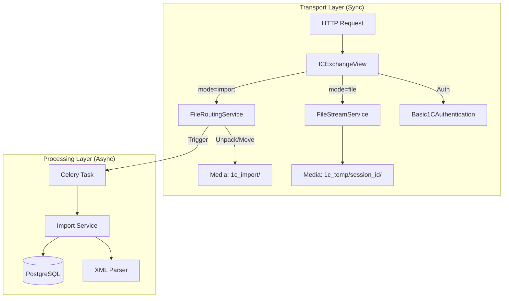
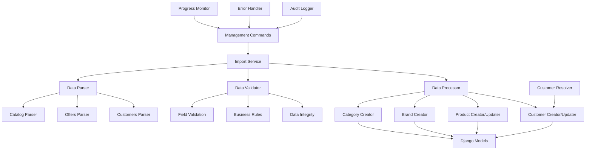
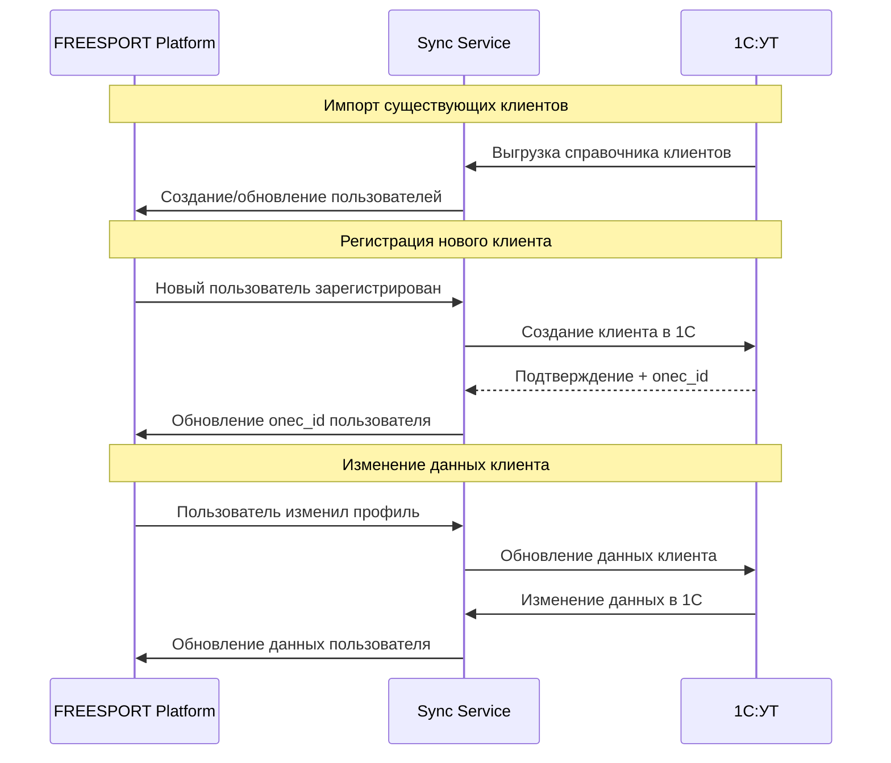

# Архитектура интеграции с 1С для FREESPORT Platform

## Оглавление

1. [Обзор интеграции](#1-обзор-интеграции)
2. [Архитектурные принципы](#2-архитектурные-принципы)
3. [Форматы данных и протоколы](#3-форматы-данных-и-протоколы)
4. [Схемы маппинга данных](#4-схемы-маппинга-данных)
5. [Компоненты системы интеграции](#5-компоненты-системы-интеграции)
6. [Процессы синхронизации](#6-процессы-синхронизации)
7. [Синхронизация покупателей](#7-синхронизация-покупателей)
8. [Обработка ошибок и мониторинг](#8-обработка-ошибок-и-мониторинг)
9. [Безопасность и производительность](#9-безопасность-и-производительность)
10. [Техническое задание для разработки](#10-техническое-задание-для-разработки)
11. [Приложение А: Анализ структуры данных CommerceML](#приложение-а-анализ-структуры-данных-commerceml)

---

## 1. Обзор интеграции

### 1.1 Бизнес-требования

**FREESPORT Platform** интегрируется с **1С:Управление торговлей** для обеспечения:

- **Синхронизации товаров:** Загрузка каталога, цен, характеристик
- **Управления остатками:** Актуальная информация о наличии товаров  
- **Синхронизации покупателей:** Двусторонняя синхронизация клиентской базы
- **Обработки заказов:** Экспорт заказов из веб-платформы в 1С
- **Синхронизации статусов:** Обновление статусов заказов из 1С

### 1.2 Архитектурная схема интеграции

```mermaid
graph TD
    subgraph "1С: Выгрузка CommerceML"
        A[groups.xml]
        B[goods.xml]
        C[offers.xml]
        D[prices.xml]
        E[rests.xml]
        F[propertiesGoods.xml]
    end

    subgraph "FREESPORT: Процесс импорта"
        K[Import Orchestrator]

        K -- 1. Категории --> G[Парсер groups.xml]
        G --> H[Создание/обновление: Category]
        
        K -- 2. Базовые товары --> I[Парсер goods.xml]
        I --> J[Создание/обновление: Product (частичное)]
        
        K -- 3. SKU, Цены, Остатки --> L[Парсер offers.xml, prices.xml, rests.xml]
        L --> M[Поиск Product по parent_onec_id]
        M --> N[Обновление: Product (цены, остатки, sku)]
    end

    subgraph "FREESPORT: Модель данных"
        H
        J
        N
    end
```

### 1.3 Трехсторонняя синхронизация

**Импорт в FREESPORT (1С → Platform):**

- Товары и номенклатура
- Остатки и цены
- Справочник существующих клиентов
- Статусы заказов

**Экспорт из FREESPORT (Platform → 1С):**

- Заказы клиентов
- Новые покупатели
- Обновления данных клиентов

**Двусторонняя синхронизация клиентов:**

- Загрузка существующих клиентов из 1С
- Передача новых регистраций с сайта в 1С
- Синхронизация изменений клиентских данных

---

## 2. Архитектурные принципы

### 2.1 Принципы проектирования

  1. **Idempotency:** Повторная обработка данных не должна нарушать целостность
  2. **Fault Tolerance:** Система устойчива к временным сбоям интеграции
  3. **Data Consistency:** Приоритет целостности данных над скоростью синхронизации
  4. **Incremental Sync:** Поддержка инкрементальных обновлений
  5. **Audit Trail:** Полное логирование всех операций импорта/экспорта
  6. **Customer Identity Resolution:** Надежное сопоставление клиентов между системами

### 2.2 Уточненные архитектурные решения (от 19.09.2025)

На основе архитектурного ревью были приняты следующие дополнительные принципы:

  1. **Использование "Сессий импорта"**:

   **Задача:**
  
   Гарантировать атомарность и целостность данных при массовом импорте из XML-файлов.

  **Реализация:** Каждая операция импорта будет обернута в "сессию" (модель `ImportSession`). Все созданные или измененные в ходе импорта данные будут привязаны к этой сессии. В случае сбоя это позволит полностью откатить изменения, избегая появления неконсистентных данных в основной базе.

  1. **Абстрагирование сервисного слоя**:

     **Задача:** Обеспечить гибкость архитектуры для будущего перехода с файлового обмена на интеграцию через API.
     **Реализация:** Логика интеграции будет разделена на два уровня:
      - **Слой Парсинга (Parser):** Отвечает за чтение источника (XML-файла) и преобразование данных в единый внутренний формат (например, Python `dict`).
      - **Слой Обработки (Processor):** Принимает данные в этом едином формате и отвечает за их валидацию и сохранение в моделях Django.
    - Такой подход позволит в будущем заменить только `Парсер` для работы с API, не затрагивая основную бизнес-логику в `Процессоре`.

### 2.3 Выбор технологий

**Формат данных:** **CommerceML 3.1** (XML)
**Протокол передачи:** **HTTP Exchange** (Стандартный протокол обмена с сайтом 1С-Битрикс)
**Обработка данных:**
- **Transport Layer:** Django View (`ICExchangeView`) + Streaming Upload (`FileStreamService`)
- **Import Layer:** Celery Tasks (`import_products`, `import_orders`)
**Хранение состояния:**
- **Sessions:** Django Session (хранение состояния обмена)
- **Data:** PostgreSQL + JSONB (хранение сырых данных)
**Мониторинг:** Structured logging + Django Admin interface

---

## 3. Форматы данных и протоколы

На основе анализа (см. [Приложение А](#приложение-а-анализ-структуры-данных-commerceml)) определены следующие форматы и структура данных.

### 3.1 Формат данных: CommerceML 3.1

Интеграция основана на стандарте **CommerceML 3.1**, представляющем собой набор XML-файлов с четко определенной структурой.

### 3.2 Структура выгрузки данных

Данные выгружаются в виде набора файлов, организованных в следующей директорийной структуре:

- `goods/goods.xml`: Базовые товары (продукты).
- `groups/groups.xml`: Иерархия категорий.
- `offers/offers.xml`: Торговые предложения (SKU), связанные с базовыми товарами.
- `prices/prices.xml`: Цены для каждого SKU.
- `rests/rests.xml`: Остатки SKU на складах.
- `propertiesGoods/`: Справочники свойств товаров.
- `propertiesOffers/`: Справочники свойств SKU.
- `priceLists/priceLists.xml`: Справочник типов цен.
- `storages/storages.xml`: Справочник складов.
- `units/units.xml`: Справочник единиц измерения.
- `contragents/contragents.xml`: Справочник контрагентов.

    goods_*.xml
    contragents_*.xml
    groups_*.xml
    offers_*.xml
    priceLists_*.xml
    prices_*.xml
    propertiesGoods_*.xml
    propertiesOffers_*.xml
    rests_*.xml
    storages_*.xml
    units_*.xml

### 3.3 Метод передачи данных

Используется стандартный **HTTP протокол обмена** (по спецификации 1С-Битрикс), обеспечивающий надежную передачу больших объемов данных через чанкирование.

**Этапы передачи:**
1.  **CheckAuth**: Аутентификация и старт сессии (Basic Auth -> Session Cookie).
2.  **Init**: Запрос параметров сервера (zip support, file limit).
3.  **File**: Потоковая загрузка файлов (поддержка чанков и ZIP-архивов).
4.  **Import**: Триггер обработки загруженных файлов.

> **Подробнее:** См. [Техническую спецификацию транспортного уровня](transport-layer.md).

---

## 4. Схемы маппинга данных

На основе анализа (см. [Приложение А](#приложение-а-анализ-структуры-данных-commerceml)) определены следующие схемы маппинга.

### 4.1 Маппинг в единую модель `Product`

Данные из `goods.xml` и `offers.xml` агрегируются в одну модель `Product`. Каждая запись в `Product` представляет собой уникальное торговое предложение (SKU).

**Шаг 1: Частичное создание `Product` из `goods.xml`**

| Поле в `goods.xml` (`<Товар>`) | Поле в модели `Product` (FREESPORT) | Примечание |
| :--- | :--- | :--- |
| `<Ид>` | `parent_onec_id` | Временно сохраняется для последующей связи. |
| `<Наименование>` | `name` | Временное базовое имя. Будет перезаписано. |
| `<Описание>` | `description` | HTML-описание. |
| `<Группы><Ид>` | `category_id` | Связь с `Category.onec_id`. |
| `<ЗначенияСвойств>` | `specifications` | Базовые свойства. Будут объединены со свойствами SKU. |

**Шаг 2: Финальное обновление `Product` из `offers.xml`**

| Поле в `offers.xml` (`<Предложение>`) | Поле в модели `Product` (FREESPORT) | Примечание |
| :--- | :--- | :--- |
| `<Ид>` (вида `uuid#uuid`) | `onec_id`, `parent_onec_id` | `parent_onec_id` используется для поиска записи, созданной на Шаге 1. `onec_id` становится основным ID. |
| `<Наименование>` | `name` | **Перезаписывает** базовое имя. |
| `<Артикул>` | `sku` | Записывается как основной артикул. |
| `<ХарактеристикиТовара>` | `specifications` | **Объединяется** с базовыми свойствами. |
| `prices.xml` -> `<Цены>` | `retail_price`, `opt1_price` и т.д. | Цены мапятся на соответствующие поля. |
| `rests.xml` -> `<Количество>` | `stock_quantity` | Остатки суммируются и записываются. |


### 4.2 Маппинг справочников

| Файл-справочник | Модель в FREESPORT | Назначение |
| :--- | :--- | :--- |
| `groups.xml` | `Category` | Создание иерархии категорий. |
| `priceLists.xml` | `PriceType` | Маппинг типов цен 1С на роли пользователей. |
| `storages.xml` | `(не используется)` | Остатки агрегируются, детальная информация по складам игнорируется. |
| `units.xml` | `Unit` | Единицы измерения. |
| `propertiesGoods/` | `Attribute`, `AttributeValue`, `Attribute1CMapping`, `AttributeValue1CMapping`, `Brand` | Создание атрибутов с дедупликацией и **определение бренда** (если он задан как свойство). |
| `propertiesOffers/` | `Attribute`, `AttributeValue`, `Attribute1CMapping`, `AttributeValue1CMapping` | Создание атрибутов для SKU с дедупликацией. |

> **Дедупликация атрибутов (Story 14.3):**  
> При импорте атрибутов из 1С применяется нормализация названий (lowercase, удаление пробелов).  
> Атрибуты с одинаковыми `normalized_name` объединяются в единую master-сущность.  
> Все оригинальные `onec_id` сохраняются в таблице маппингов (`Attribute1CMapping`, `AttributeValue1CMapping`). |

### 4.3 Маппинг покупателей (`contragents.xml`)

| Поле в `contragents.xml` (`<Контрагент>`) | Поле в модели `User` (FREESPORT) | Примечание |
| :--- | :--- | :--- |
| `<Ид>` | `onec_id` | Первичный ключ для связи. |
| `<Наименование>` | `company_name` / `first_name`, `last_name` | Парсится в зависимости от типа контрагента (юр/физ лицо). |
| `<ОфициальноеНаименование>` | `company_name` | Для юридических лиц. |
| `<Роль>` | `role` | Мапится на роли в системе (retail, wholesale_level1 и т.д.). |
| `<Контакты>` -> `<Контакт>` | `email`, `phone` | Парсинг контактной информации. Тип контакта (email/телефон) определяется в `<Тип>`. |
| `<АдресРегистрации>` | `legal_address` | Юридический адрес. |
| `<Реквизиты>` -> `<ИНН>` | `tax_id` | ИНН для B2B пользователей. |

---

## 5. Компоненты системы интеграции

### 5.1 Архитектура компонентов

Система разделена на два основных слоя: **Transport Layer** (Прием данных) и **Processing Layer** (Обработка данных).



**Ключевые компоненты Transport Layer:**
- **ICExchangeView**: Единая точка входа, маршрутизация по `mode`.
- **FileStreamService**: Обработка потоковой загрузки, сборка чанков в файлы.
- **FileRoutingService**: Маршрутизация файлов (goods, offers, images) в целевые папки.

> **Важные решения (ADR):**
> - [ADR-008](../../decisions/ADR-008-1c-sessid-session-key-not-csrf.md): Использование Django Session Key как `sessid`.
> - [ADR-009](../../decisions/ADR-009-csrf-exemption-1c-protocol.md): Отключение CSRF для эндпоинтов обмена.

### 5.2 (Legacy) Структура Management Commands
*(Сохраняется для ручного запуска и отладки)*



### 5.2 Структура Management Commands

```python
# apps/products/management/commands/
class ImportFrom1CCommand(BaseCommand):
    """Базовая команда для импорта из 1С"""
    
    def add_arguments(self, parser):
        parser.add_argument('--file', required=True, help='Путь к файлу данных')
        parser.add_argument('--type', choices=['catalog', 'offers', 'customers'], required=True)
        parser.add_argument('--dry-run', action='store_true')
        parser.add_argument('--chunk-size', type=int, default=100)

class ImportCustomersCommand(ImportFrom1CCommand):
    """Импорт справочника клиентов из 1С"""
    help = "Импорт клиентов из 1С (customers)"

class SyncCustomersCommand(BaseCommand):
    """Двусторонняя синхронизация клиентов"""
    help = "Синхронизация клиентов между платформой и 1С"

class ExportNewCustomersCommand(BaseCommand):
    """Экспорт новых клиентов в 1С"""
    help = "Экспорт новых регистраций с платформы в 1С"
```

### 5.3 Модели для интеграции с клиентами

```python
# apps/users/models.py
class User(AbstractUser):
    # ... существующие поля
    
    # Добавить поля для интеграции с 1С
    onec_id = models.CharField('ID в 1С', max_length=100, blank=True, null=True, unique=True)
    sync_status = models.CharField(
        'Статус синхронизации',
        max_length=20,
        choices=[
            ('pending', 'Ожидает синхронизации'),
            ('synced', 'Синхронизирован'),
            ('error', 'Ошибка синхронизации'),
            ('conflict', 'Конфликт данных'),
        ],
        default='pending'
    )
    sync_error_message = models.TextField('Ошибка синхронизации', blank=True)
    last_sync_at = models.DateTimeField('Последняя синхронизация', null=True, blank=True)
    
    # Флаги источника данных
    created_in_1c = models.BooleanField('Создан в 1С', default=False)
    needs_1c_export = models.BooleanField('Требует экспорта в 1С', default=False)

class CustomerSyncLog(models.Model):
    """Лог синхронизации клиентов"""
    
    OPERATION_TYPES = [
        ('import_from_1c', 'Импорт из 1С'),
        ('export_to_1c', 'Экспорт в 1С'),
        ('sync_changes', 'Синхронизация изменений'),
    ]
    
    operation_type = models.CharField('Тип операции', max_length=20, choices=OPERATION_TYPES)
    customer = models.ForeignKey(User, on_delete=models.CASCADE, null=True, blank=True)
    customer_email = models.EmailField('Email клиента', blank=True)
    
    status = models.CharField('Статус', max_length=20, choices=[
        ('success', 'Успешно'),
        ('error', 'Ошибка'),
        ('skipped', 'Пропущено'),
    ])
    
    details = models.JSONField('Детали операции', default=dict)
    error_message = models.TextField('Сообщение об ошибке', blank=True)
    
    created_at = models.DateTimeField('Дата операции', auto_now_add=True)
    
    class Meta:
        verbose_name = 'Лог синхронизации клиентов'
        verbose_name_plural = 'Логи синхронизации клиентов'
        db_table = 'customer_sync_logs'
        ordering = ['-created_at']
```

---

## 6. Процессы синхронизации

Процесс импорта основан на **двухэтапной обработке** данных: сначала создаются "заготовки" товаров из `goods.xml`, а затем они обогащаются и финализируются данными из `offers.xml`.

### 6.1 Воркфлоу импорта каталога

```python
def unified_import_workflow(import_directory):
    """
    Воркфлоу импорта с агрегацией данных в единую модель Product.
    """
    # Шаг 1: Импорт справочников (категории, бренды и т.д.)
    import_reference_data(import_directory)

    # Шаг 2: Предварительное создание товаров из goods.xml
    # Создаются "заготовки" с базовой информацией.
    create_product_placeholders('goods/goods.xml')
    
    # Шаг 3: Обогащение и финализация товаров из offers.xml
    # Заполняются цены, остатки, артикулы и перезаписываются наименования.
    enrich_products_from_offers(
        files=[
            'offers.xml',
            'prices.xml',
            'rests.xml'
        ]
    )
    
    # Шаг 4: Деактивация отсутствующих товаров
    deactivate_stale_products(import_session_id)
    
    # Шаг 5: Генерация отчета
    generate_import_report(import_session_id)
```

### 6.2 Детализация шагов

#### Шаг 1: `import_reference_data`

- Парсит `groups.xml` и справочники свойств.
- Создает/обновляет `Category` и `Brand`.

#### Шаг 2: `create_product_placeholders`

- Парсит `goods.xml`.
- Для каждого `<Товар>`:
  - Создает новую запись `Product`.
  - Заполняет `name` (временно), `description`, `category`, `brand`.
  - **Важно:** Сохраняет ID товара в поле `parent_onec_id`.
  - `is_active` по умолчанию `False`.

#### Шаг 3: `enrich_products_from_offers`

- Последовательно парсит `offers.xml`, `prices.xml`, `rests.xml`.
- Для каждого `<Предложение>` в `offers.xml`:
  - Извлекает `parent_onec_id` из составного ID (`uuid#uuid`).
  - Находит `Product` по `parent_onec_id`.
  - Если найден:
    - **Обновляет** запись:
      - `name` перезаписывается именем из предложения.
      - `sku` устанавливается из артикула предложения.
      - `onec_id` устанавливается из ID предложения.
      - `specifications` объединяются.
      - Цены и остатки (из `prices.xml` и `rests.xml`) добавляются к записи.
      - `is_active` устанавливается в `True`.
  - Если не найден, логгирует ошибку (SKU без базового товара).

---

### 6.3 Специализированный воркфлоу обновления остатков

Для обеспечения максимальной актуальности данных об остатках на складе предусматривается отдельный, легковесный процесс, который может запускаться значительно чаще, чем полный импорт каталога (например, каждые 15-30 минут).

**Команда:** `load_product_stocks`
**Источник:** `rests.xml`

#### Воркфлоу `load_product_stocks`

```python
def update_stocks_workflow(import_directory):
    """
    Воркфлоу для быстрого обновления только остатков товаров.
    """
    # Шаг 1: Начало сессии импорта (для атомарности)
    session = ImportSession.objects.create(type='stocks')
    
    # Шаг 2: Парсинг файла с остатками
    stock_data = parse_stock_file('rests.xml')
    
    # Шаг 3: Массовое обновление остатков
    # Используется bulk_update для максимальной производительности
    update_stock_quantities(stock_data, session)
    
    # Шаг 4: Завершение сессии
    session.status = 'completed'
    session.save()
    
    # Шаг 5: Генерация краткого отчета
    generate_stock_update_report(session)
```

**Ключевые моменты:**

- **Атомарность:** Процесс обернут в `ImportSession`, что гарантирует целостность данных.
- **Производительность:** Используются массовые операции (`bulk_update`) для минимизации нагрузки на базу данных.
- **Изолированность:** Этот процесс затрагивает только поля, связанные с остатками (`stock_quantity`), и не влияет на другую информацию о товаре.

## 7. Синхронизация покупателей

### 7.1 Архитектура синхронизации клиентов



### 7.2 Стратегии разрешения конфликтов

**Принцип:** 1C как единственный источник истины. Все конфликты разрешаются автоматически.

```python
class CustomerConflictResolver:
    """Упрощенная система разрешения конфликтов: 1C как источник истины"""
    
    def resolve_conflict(self, existing_customer, onec_data, conflict_source):
        """
        Единственная стратегия: onec_wins
        
        Args:
            existing_customer: Существующий клиент в БД
            onec_data: Данные из 1С
            conflict_source: 'portal_registration' или 'data_import'
        """
        with transaction.atomic():
            # Архивируем текущие данные
            platform_data = self._serialize_customer(existing_customer)
            
            if conflict_source == 'portal_registration':
                # Присваиваем статус, НЕ изменяя данные из 1С
                existing_customer.is_confirmed_client = True
                existing_customer.save()
            
            elif conflict_source == 'data_import':
                # Обогащаем профиль и перезаписываем конфликтующие поля
                existing_customer.onec_id = onec_data.get('onec_id')
                existing_customer.onec_guid = onec_data.get('onec_guid')
                
                # Перезаписываем все конфликтующие поля данными из 1С
                for field in self.CONFLICTING_FIELDS:
                    if new_value := onec_data.get(field):
                        setattr(existing_customer, field, new_value)
                
                existing_customer.last_sync_from_1c = timezone.now()
                existing_customer.save()
            
            # Создаем запись в SyncConflict для аудита
            self._create_sync_conflict_record(
                existing_customer, platform_data, onec_data, conflict_source
            )
            
            # Отправляем email уведомление администратору
            self._send_notification(
                existing_customer, platform_data, onec_data, conflict_source
            )
```

### 7.3 Workflow синхронизации клиентов

```python
def sync_customers_workflow():
    """Полный цикл синхронизации клиентов"""
    
    # Шаг 1: Импорт новых клиентов из 1С
    new_1c_customers = import_customers_from_1c()
    for customer_data in new_1c_customers:
        create_or_update_platform_customer(customer_data)
    
    # Шаг 2: Экспорт новых регистраций в 1С
    new_platform_customers = get_customers_needing_export()
    for customer in new_platform_customers:
        export_customer_to_1c(customer)
    
    # Шаг 3: Синхронизация изменений
    updated_customers = get_updated_customers_since_last_sync()
    for customer in updated_customers:
        sync_customer_changes(customer)
    
    # Шаг 4: Разрешение конфликтов
    conflicts = detect_customer_conflicts()
    resolve_customer_conflicts(conflicts)
    
    # Шаг 5: Отчет о синхронизации
    generate_customer_sync_report()

def create_or_update_platform_customer(customer_data_from_1c):
    """Создание или обновление клиента на платформе"""
    
    # Поиск существующего клиента
    existing_customer = find_customer_by_identifiers(
        email=customer_data_from_1c.get('email'),
        onec_id=customer_data_from_1c.get('onec_id'),
        phone=customer_data_from_1c.get('phone')
    )
    
    if existing_customer:
        # Обновляем данные существующего клиента
        update_customer_from_1c_data(existing_customer, customer_data_from_1c)
    else:
        # Создаем нового клиента
        create_customer_from_1c_data(customer_data_from_1c)

def export_customer_to_1c(platform_customer):
    """Экспорт клиента с платформы в 1С"""
    
    # Подготовка данных для экспорта
    export_data = prepare_customer_export_data(platform_customer)
    
    # Отправка в 1С
    result = send_customer_to_1c(export_data)
    
    if result.success:
        # Обновляем onec_id и статус синхронизации
        platform_customer.onec_id = result.onec_id
        platform_customer.sync_status = 'synced'
        platform_customer.needs_1c_export = False
        platform_customer.last_sync_at = timezone.now()
        platform_customer.save()
        
        # Логируем успех
        CustomerSyncLog.objects.create(
            operation_type='export_to_1c',
            customer=platform_customer,
            status='success',
            details={'onec_id': result.onec_id}
        )
    else:
        # Обрабатываем ошибку
        handle_customer_export_error(platform_customer, result.error)
```

### 7.4 Сервисы идентификации клиентов

```python
class CustomerIdentityResolver:
    """Сервис для идентификации клиентов между системами"""
    
    def find_customer_by_identifiers(self, **identifiers):
        """Поиск клиента по множественным идентификаторам"""
        
        # Приоритет поиска: onec_id > email > phone + name
        if identifiers.get('onec_id'):
            customer = User.objects.filter(onec_id=identifiers['onec_id']).first()
            if customer:
                return customer
        
        if identifiers.get('email'):
            customer = User.objects.filter(email=identifiers['email']).first()
            if customer:
                return customer
        
        # Поиск по телефону + ФИО (для надежности)
        if identifiers.get('phone') and identifiers.get('full_name'):
            # Сложная логика поиска по нескольким полям
            return self.fuzzy_search_customer(identifiers)
        
        return None
    
    def fuzzy_search_customer(self, identifiers):
        """Нечеткий поиск клиента по частичным данным"""
        # Реализация алгоритма нечеткого поиска
        pass

class CustomerDataMapper:
    """Маппинг данных клиентов между форматами 1С и платформы"""
    
    def map_1c_to_platform(self, customer_data_1c):
        """Маппинг данных клиента из 1С в формат платформы"""
        return {
            'email': customer_data_1c.get('email'),
            'first_name': customer_data_1c.get('first_name'),
            'last_name': customer_data_1c.get('last_name'),
            'phone': customer_data_1c.get('phone'),
            'company_name': customer_data_1c.get('company_name'),
            'tax_id': customer_data_1c.get('inn'),
            'role': self.map_1c_customer_type_to_platform_role(
                customer_data_1c.get('customer_type')
            ),
            'is_verified': customer_data_1c.get('is_verified', False),
            'onec_id': customer_data_1c.get('id'),
            'created_in_1c': True,
            'sync_status': 'synced',
        }
    
    def map_platform_to_1c(self, platform_customer):
        """Маппинг данных клиента из платформы в формат 1С"""
        customer_type = 'individual' if not platform_customer.company_name else 'legal_entity'
        
        base_data = {
            'email': platform_customer.email,
            'phone': platform_customer.phone,
            'customer_type': customer_type,
            'platform_id': platform_customer.id,
        }
        
        if customer_type == 'individual':
            base_data.update({
                'first_name': platform_customer.first_name,
                'last_name': platform_customer.last_name,
            })
        else:
            base_data.update({
                'company_name': platform_customer.company_name,
                'tax_id': platform_customer.tax_id,
                'contact_person': f"{platform_customer.first_name} {platform_customer.last_name}",
            })
        
        return base_data
```

---

## 8. Обработка ошибок и мониторинг

### 8.1 Стратегии обработки ошибок

```python
class IntegrationErrorHandler:
    """Обработчик ошибок интеграции"""
    
    ERROR_STRATEGIES = {
        'validation_error': 'skip_and_log',
        'database_error': 'retry_with_backoff',
        'file_parse_error': 'stop_and_report',
        'customer_conflict': 'auto_resolve_onec_wins',
        'duplicate_customer': 'auto_resolve_onec_wins',
        '1c_api_error': 'retry_with_exponential_backoff',
    }
    
    def handle_customer_sync_error(self, error_type, error_data, context):
        """Специализированная обработка ошибок синхронизации клиентов"""
        
        if error_type in ('customer_conflict', 'duplicate_customer'):
            # Автоматическое разрешение: 1C всегда имеет приоритет
            return self.auto_resolve_conflict(error_data, context)
        else:
            return self.handle_generic_error(error_type, error_data, context)

class CustomerSyncMonitor:
    """Мониторинг синхронизации клиентов"""
    
    def generate_sync_dashboard_data(self):
        """Генерация данных для дашборда синхронизации"""
        
        return {
            'customers_synced_today': self.get_customers_synced_today(),
            'auto_resolved_conflicts_today': self.get_auto_resolved_conflicts_count(),
            'sync_errors_last_24h': self.get_recent_errors(),
            'export_queue_size': self.get_export_queue_size(),
            'last_successful_import': self.get_last_successful_import(),
        }
```

### 8.2 Система логирования

```python
class CustomerSyncLogger:
    """Специализированное логирование синхронизации клиентов"""
    
    def log_customer_import(self, customer_data, result):
        """Логирование импорта клиента"""
        CustomerSyncLog.objects.create(
            operation_type='import_from_1c',
            customer_email=customer_data.get('email'),
            customer=result.customer if result.success else None,
            status='success' if result.success else 'error',
            details={
                '1c_customer_id': customer_data.get('id'),
                'import_timestamp': timezone.now().isoformat(),
                'data_source': '1c_export'
            },
            error_message=result.error_message if not result.success else ''
        )
    
    def log_customer_export(self, platform_customer, result):
        """Логирование экспорта клиента"""
        CustomerSyncLog.objects.create(
            operation_type='export_to_1c',
            customer=platform_customer,
            customer_email=platform_customer.email,
            status='success' if result.success else 'error',
            details={
                'platform_customer_id': platform_customer.id,
                'export_timestamp': timezone.now().isoformat(),
                '1c_response': result.response_data
            },
            error_message=result.error_message if not result.success else ''
        )
```

---

## 9. Безопасность и производительность

### 9.1 Безопасность синхронизации клиентов

```python
class CustomerDataSecurity:
    """Обеспечение безопасности данных клиентов"""
    
    SENSITIVE_FIELDS = ['phone', 'tax_id', 'passport_data', 'birth_date']
    
    def sanitize_customer_data(self, customer_data):
        """Санитизация данных клиента перед обработкой"""
        
        sanitized = {}
        for field, value in customer_data.items():
            if field in self.SENSITIVE_FIELDS:
                # Валидация и очистка чувствительных данных
                sanitized[field] = self.validate_sensitive_field(field, value)
            else:
                sanitized[field] = self.clean_general_field(field, value)
        
        return sanitized
    
    def validate_sensitive_field(self, field_name, value):
        """Валидация чувствительных полей"""
        if field_name == 'phone':
            return self.validate_phone_number(value)
        elif field_name == 'tax_id':
            return self.validate_tax_id(value)
        # ... другие поля
        return value

class CustomerDataEncryption:
    """Шифрование чувствительных данных клиентов"""
    
    def encrypt_customer_export_data(self, customer_data):
        """Шифрование данных для экспорта"""
        # Шифрование чувствительных полей перед передачей в 1С
        pass
```

### 9.2 Оптимизация производительности

```python
class CustomerSyncOptimizer:
    """Оптимизация производительности синхронизации"""
    
    def bulk_import_customers(self, customers_data):
        """Массовый импорт клиентов"""
        
        # Группировка операций для оптимизации
        new_customers = []
        existing_customers_updates = []
        
        for customer_data in customers_data:
            if self.customer_exists(customer_data):
                existing_customers_updates.append(customer_data)
            else:
                new_customers.append(customer_data)
        
        # Bulk операции
        if new_customers:
            self.bulk_create_customers(new_customers)
        
        if existing_customers_updates:
            self.bulk_update_customers(existing_customers_updates)
    
    def optimize_customer_queries(self):
        """Оптимизация запросов для поиска клиентов"""
        # Создание индексов для быстрого поиска
        # Кэширование часто используемых запросов
        pass
```

---

## 10. Техническое задание для разработки

### 10.1 Story 3.1: Анализ требований к интеграции с 1С ✅

**Статус:** Завершено  
**Deliverables:**

- ✅ Документ архитектуры интеграции с 1С (данный документ)
- ✅ Запрос к программисту 1С с детальными вопросами
- ✅ Архитектура синхронизации покупателей
- ⏳ Схемы маппинга данных (ожидаем ответ от 1С)

---

### 10.2 Story 3.2: Разработка структуры для импорта данных из 1С

**Техническое задание для Dev Agent (James):**

#### **Создать Django management commands:**

```python
# apps/products/management/commands/import_catalog_from_1c.py
class Command(BaseCommand):
    help = "Импорт каталога товаров из файла 1С"
    
    def add_arguments(self, parser):
        parser.add_argument('--file', required=True, help='Путь к файлу данных')
        parser.add_argument('--dry-run', action='store_true', help='Тестовый запуск')
        parser.add_argument('--chunk-size', type=int, default=100, help='Размер пакета')

# apps/products/management/commands/import_offers_from_1c.py
class Command(BaseCommand):
    help = "Импорт цен и остатков из файла 1С"

# apps/users/management/commands/import_customers_from_1c.py  
class Command(BaseCommand):
    help = "Импорт справочника клиентов из 1С"

# apps/users/management/commands/sync_customers_with_1c.py
class Command(BaseCommand):
    help = "Двусторонняя синхронизация клиентов с 1С"
```

#### **Создать сервисы обработки данных:**

```python
# apps/products/services/data_parser.py
class DataParser:
    """Базовый класс для парсинга данных из 1С"""
    
# apps/users/services/customer_sync_service.py
class CustomerSyncService:
    """Сервис синхронизации клиентов"""
    
# apps/common/services/import_validator.py
class ImportDataValidator:
    """Валидатор импортируемых данных"""
```

#### **Обновить модели:**

```python
# Добавить поля в User model для интеграции с 1С
onec_id = models.CharField('ID в 1С', max_length=100, blank=True, null=True, unique=True)
sync_status = models.CharField('Статус синхронизации', ...)
created_in_1c = models.BooleanField('Создан в 1С', default=False)
needs_1c_export = models.BooleanField('Требует экспорта в 1С', default=False)

# Создать модель CustomerSyncLog для логирования
```

---

### 10.3 Acceptance Criteria для всех Stories

**Story 3.2 - Разработка структуры:**

- [ ] Создана команда `import_catalog_from_1c`
- [ ] Создана команда `import_customers_from_1c`
- [ ] Реализован базовый парсер данных (будет доработан после ответа 1С)
- [ ] Добавлена валидация импортируемых данных
- [ ] Настроено логирование процесса импорта
- [ ] Обновлены модели User и Product для интеграции с 1С
- [ ] Создана модель CustomerSyncLog
- [ ] Созданы unit тесты для базовых компонентов

**Story 3.3 - Создание скриптов:**

- [ ] Создана команда `load_test_catalog`
- [ ] Создана команда `sync_customers_with_1c`
- [ ] Реализована загрузка категорий и брендов
- [ ] Добавлена обработка связей между сущностями
- [ ] Созданы скрипты backup/restore данных
- [ ] Добавлена поддержка batch операций

**Story 3.4 - Тестовая загрузка каталога:**

- [ ] Загружено минимум 500 товаров
- [ ] Установлены цены для всех 7 ролей пользователей
- [ ] Созданы категории с иерархией
- [ ] Проверена корректность связей
- [ ] Запущены тесты на загруженных данных

**Story 3.5 - Загрузка остатков:**

- [ ] Создана команда `load_product_stocks`
- [ ] Загружены остатки для всех товаров
- [ ] Протестирована логика `is_in_stock`
- [ ] Проверена работа `can_be_ordered`
- [ ] API возвращает корректные данные о наличии

---

## Заключение

Данная архитектурная документация предоставляет полную спецификацию для реализации интеграции с 1С в рамках Epic 3, включая критически важный компонент **синхронизации покупателей**.

**Ключевые особенности архитектуры:**

✅ **Трехсторонняя синхронизация:** товары + клиенты + заказы  
✅ **Разрешение конфликтов:** автоматическое + ручная модерация  
✅ **Identity Resolution:** надежная идентификация клиентов между системами  
✅ **Audit Trail:** полное логирование всех операций синхронизации  
✅ **Performance:** batch операции и оптимизированные запросы  
✅ **Security:** валидация и защита чувствительных данных клиентов  

**Следующие шаги:**

1. **Отправить запрос программисту 1С**

    - получить ответы на технические вопросы

2. **Доработать разделы 3-4**

    - форматы данных и схемы маппинга

3. **Передать Dev Agent (James)**

    - для реализации Stories 3.2-3.5

**Готово к передаче для разработки! 🚀*

---

## Приложение А: Анализ структуры данных CommerceML

Этот раздел содержит детальный анализ структуры данных, полученных из 1С в формате CommerceML 3.1, на основе анализа файлов в директории `data\import_1c`.

### А.1 Общая архитектура выгрузки

Выгрузка имеет модульную структуру. Данные не содержатся в одном файле, а разделены по разным директориям и файлам, каждый из которых является справочником или содержит определенный тип информации.

**Ключевые директории и файлы:**

- `goods/goods.xml`: Основная информация о товарах (продуктах).
- `groups/groups.xml`: Иерархия категорий товаров.
- `offers/offers.xml`: Торговые предложения (SKU), вариации товаров.
- `prices/prices.xml`: Цены для каждого SKU.
- `rests/rests.xml`: Остатки SKU на складах.
- `propertiesGoods/`: Справочники свойств товаров и их значений.
- `propertiesOffers/`: Справочники свойств предложений (SKU).
- `priceLists/priceLists.xml`: Справочник типов цен.
- `storages/storages.xml`: Справочник складов.
- `units/units.xml`: Справочник единиц измерения.
- `contragents/contragents.xml`: Справочник контрагентов (клиентов).

### А.2 Детальный анализ файлов

#### А.2.1 `goods/goods.xml` - Товары (Продукты)

- **Назначение**: Центральный файл, описывающий базовые товары.
- **Структура**: `<Каталог>` -> `<Товары>` -> `<Товар>`
- **Ключевые поля узла `<Товар>`**:
  - `<Артикул>`: Артикул товара.
  - `<Наименование>`: Базовое наименование товара.
  - `<БазоваяЕдиница>`: ID единицы измерения из `units.xml`.
  - `<Группы>`: Содержит `<Ид>` категории из `groups.xml`.
  - `<Описание>`: HTML-описание товара.
  - `<Картинка>`: Путь к файлу изображения. Может быть несколько.
  - `<ЗначенияСвойств>`: Блок со ссылками на значения свойств из справочников в `propertiesGoods/`.
  - `<ЗначенияРеквизитов>`: Дополнительные, неструктурированные реквизиты, такие как "ВидНоменклатуры", "ТипНоменклатуры", "Полное наименование".

#### А.2.2 `groups/groups.xml` - Категории

- **Назначение**: Описание иерархии каталога.
- **Структура**: `<Классификатор>` -> `<Группы>` -> `<Группа>`
- **Ключевые поля узла `<Группа>`**:
  - `<Ид>`: Уникальный UUID категории.
  - `<Наименование>`: Название категории.
  - `<Группы>`: Вложенный узел для дочерних категорий, что формирует дерево.

#### А.2.3 `offers/offers.xml` - Торговые предложения (SKU)

- **Назначение**: Описание конкретных вариаций товаров.
- **Структура**: `<ПакетПредложений>` -> `<Предложения>` -> `<Предложение>`
- **Ключевые поля узла `<Предложение>`**:
  - `<Ид>`: Составной идентификатор вида `[ИдТовара]#[ИдХарактеристики]`. Позволяет связать SKU с базовым товаром из `goods.xml`.
  - `<Наименование>`: Полное наименование SKU (например, с указанием цвета и размера).
  - `<ХарактеристикиТовара>`: Список характеристик, определяющих данный SKU (например, "Длина коробки", "Вес").
  - `<ЗначенияСвойств>`: Ссылки на ID свойств из `propertiesOffers/`.

#### А.2.4 `prices/prices.xml` - Цены

- **Назначение**: Указание цен для товаров и их предложений.
- **Структура**: `<ПакетПредложений>` -> `<Предложения>` -> `<Предложение>`
- **Ключевые поля узла `<Предложение>`**:
  - `<Ид>`: ID товара или SKU, к которому относится цена.
  - `<Цены>` -> `<Цена>`:
    - `<ИдТипаЦены>`: UUID типа цены из `priceLists.xml`.
    - `<ЦенаЗаЕдиницу>`: Числовое значение цены.
    - `<Валюта>`: Валюта (например, `руб`).

#### А.2.5 `rests/rests.xml` - Остатки

- **Назначение**: Указание количества товара на складах.
- **Структура**: `<ПакетПредложений>` -> `<Предложения>` -> `<Предложение>`
- **Ключевые поля узла `<Предложение>`**:
  - `<Ид>`: ID товара или SKU.
  - `<Остатки>` -> `<Остаток>`:
    - `<Склад>`:
      - `<Ид>`: UUID склада из `storages.xml`.
      - `<Количество>`: Числовое значение остатка.

#### А.2.6 Справочники

- **`priceLists/priceLists.xml`**: Справочник типов цен. Содержит ID и наименования (например, "РРЦ", "Опт 1").
- **`storages/storages.xml`**: Справочник складов. Содержит ID и наименования складов.
- **`units/units.xml`**: Справочник единиц измерения (шт, кг, м и т.д.).
- **`propertiesGoods/` и `propertiesOffers/`**: Директории с XML-файлами, описывающими свойства и их возможные значения (`<ВариантыЗначений>`). Например, свойство "Цвет" и его варианты "Красный", "Синий".
- **`contragents/contragents.xml`**: Справочник клиентов (покупателей) с их реквизитами. На данном этапе для парсинга каталога не используется, но важен для будущей интеграции заказов.

### А.3 Схема взаимодействия данных

1. **Категории (`groups.xml`)** образуют древовидную структуру.
2. **Товары (`goods.xml`)** привязываются к категориям через `<Группы>`.
3. **Предложения/SKU (`offers.xml`)** привязываются к товарам через составной `<Ид>`.
4. **Цены (`prices.xml`)** и **Остатки (`rests.xml`)** привязываются к товарам или SKU по их `<Ид>`.
5. Все идентификаторы (типы цен, склады, единицы измерения, свойства) расшифровываются с помощью соответствующих файлов-справочников.

Эта структура требует последовательного парсинга, начиная со справочников и категорий, и заканчивая обновлением товаров ценами и остатками.

### А.4 Анализ файлов-справочников

#### А.4.1 `priceLists/priceLists.xml` - Справочник типов цен

- **Назначение:** Определяет соответствие между UUID типа цены и его коммерческим названием. Крайне важен для маппинга цен на роли пользователей в FREESPORT.
- **Структура:** `<ТипыЦен>` -> `<ТипЦены>`
- **Ключевые поля узла `<ТипЦены>`:**
  - `<Ид>`: Уникальный UUID типа цены. **Пример:** `90d2c899-b3f2-11ea-81c3-00155d3cae02`.
  - `<Наименование>`: Человекочитаемое название типа цены. **Пример:** `Опт 1 (300-600 тыс.руб в квартал)`.
  - `<Валюта>`: Валюта цены, как правило, `RUB`.
  - `<Налог>`: Информация о налогах, обычно НДС.

#### А.4.2 `propertiesGoods/` и `propertiesOffers/` - Справочники свойств

- **Назначение:** Описывают все возможные характеристики товаров (например, "Бренд", "Цвет", "Материал") и их значения.
- **Структура:** Каждый файл в директории описывает одно свойство. `<Классификатор>` -> `<Свойства>` -> `<Свойство>`
- **Ключевые поля узла `<Свойство>`:**
  - `<Ид>`: Уникальный UUID свойства.
  - `<Наименование>`: Название свойства. **Пример:** `Бренд`.
  - `<ВариантыЗначений>`: Перечень возможных значений этого свойства.
  - `<Справочник>`:
    - `<ИдЗначения>`: UUID конкретного значения.
    - `<Значение>`: Текстовое представление значения. **Пример:** `Nike`.

#### А.4.3 `units/units.xml` - Справочник единиц измерения

- **Назначение:** Определяет единицы, в которых измеряется товар (штуки, килограммы, упаковки и т.д.).
- **Структура:** `<ЕдиницыИзмерения>` -> `<ЕдиницаИзмерения>`
- **Ключевые поля узла `<ЕдиницаИзмерения>`:**
  - `<Ид>`: Кодовый идентификатор единицы. **Пример:** `796`.
  - `<НаименованиеКраткое>`: Краткое обозначение. **Пример:** `шт`.
  - `<НаименованиеПолное>`: Полное наименование. **Пример:** `штук`.

#### А.4.4 `storages/storages.xml` - Справочник складов

- **Назначение:** Перечень складов, с которых могут отгружаться товары.
- **Структура:** `<Склады>` -> `<Склад>`
- **Ключевые поля узла `<Склад>`:**
  - `<Ид>`: Уникальный UUID склада.
  - `<Наименование>`: Название склада. **Пример:** `1 СДВ склад`.
