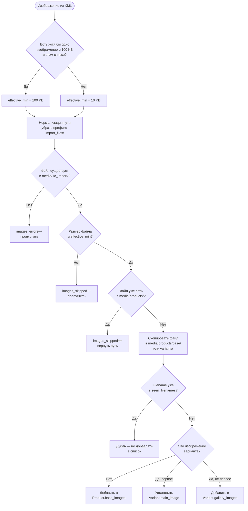

# Подробное описание процесса импорта из 1С (CommerceML 3.1)

В данном документе описана техническая реализация обмена данными между 1С:Предприятие и платформой FREESPORT.

## 1. Общий рабочий процесс (Protocol Flow)

Обмен происходит по стандартному протоколу 1С-Битрикс, адаптированному под архитектуру Django. Основная точка входа — `apps.integrations.onec_exchange.views.ICExchangeView`.

### Шаги сессии:

1.  **`mode=checkauth`**: Авторизация 1С. Сервер создает сессию Django, возвращает `cookie_name` и `session_id`.
2.  **`mode=init`**: Согласование параметров. Сервер сообщает лимиты файлов и поддержку ZIP. На этом этапе сервер проверяет наличие флага завершения `.exchange_complete` в `media/1c_temp/<session_id>/`. Если флаг есть — папка сессии очищается. Если нет — новые файлы дописываются к старым.
3.  **`mode=file`**: Передача файлов.
    - Файлы передаются бинарным потоком (binary stream).
    - Реализована дозапись (append mode) для передачи больших файлов по частям.
    - Файлы сохраняются в `media/1c_temp/<session_id>/`.
    - **Накопление**: Файлы остаются в каталоге `temp` до триггера `mode=import` или `mode=complete`.
4.  **`mode=import`**: Сигнал о передаче конкретного файла.
    - Запускается `ImportOrchestratorService`: переносит файлы из `media/1c_temp/<session_id>/` в `media/1c_import/`, распаковывает ZIP и маршрутизирует содержимое.
    - После переноса запускается Celery-задача `process_1c_import_task`.
5.  **`mode=complete`**: Технический сигнал завершения всей сессии обмена.
    - Аналогично `mode=import` выполняется перенос и распаковка, затем запускается Celery-задача.
    - **Флаг завершения**: После успешного приема команды выставляется маркер `.exchange_complete` в `media/1c_temp/<session_id>/`, он используется при следующем запуске (`mode=init`).
    - **Отладка (Dry Run)**: Чтобы проверить передачу файлов без запуска самого импорта в базу (например, при тестировании с реальной 1С), можно использовать один из двух способов:
      1.  Создать пустой файл-флаг `.dry_run` в директории `/app/media/1c_import/` (рекомендуемый способ).
      2.  Передать параметр `&dry_run=1` в URL запроса `complete` (если 1С это позволяет).
          В этом режиме архивы будут распакованы в папку импорта для визуальной проверки, но задача в Celery запущена не будет.

## 2. Архитектура фоновой обработки (Celery)

Задача `process_1c_import_task` выполняет следующие действия:

1.  **Распаковка**: Если были переданы ZIP-архивы, они распаковываются в общую директорию `media/1c_import/`.
2.  **Подготовка**: Проверяется наличие всех необходимых подпапок (`goods`, `offers`, `prices` и т.д.), чтобы избежать ошибок валидации.
3.  **Запуск команды**: Вызывается management-команда `python manage.py import_products_from_1c`.
4.  **Логирование**: Все этапы пишутся в `ImportSession.report`.

## 3. Логика импорта (Management Command)

Команда `import_products_from_1c` использует `VariantImportProcessor` для пакетной обработки данных.

### Очередность обработки:

1.  **Категории (`groups.xml`)**: Создание дерева категорий.
2.  **Бренды (`propertiesGoods.xml`)**: Извлечение брендов из справочников 1С.
3.  **Типы цен (`priceLists.xml`)**: Маппинг типов цен 1С на роли пользователей (Розничная, Опт, Тренер).
4.  **Товары (`goods.xml`)**: Создание базовых карточек `Product`, загрузка основных изображений и сохранение ставки НДС в `Product.vat_rate`.
5.  **Варианты (`offers.xml`)**: Создание `ProductVariant` (размеры, цвета). Если вариантов нет, создается `default variant`. Если ставка НДС пришла только в `goods.xml`, `ProductVariant.vat_rate` синхронизируется из `Product.vat_rate`.
6.  **Цены (`prices.xml`)**: Привязка цен к конкретным вариантам.
7.  **Остатки (`rests_*.xml`)**: Обновление остатков по складам для вариантов. Помимо `stock_quantity`, при каждом цикле обработки остатков `VariantImportProcessor` определяет основной склад варианта (по максимальному суммарному остатку) и обновляет `warehouse_id`, `warehouse_name` и `vat_rate` (ставка НДС берётся из `settings.ONEC_EXCHANGE["WAREHOUSE_RULES"]`).

## 4. Ключевые особенности реализации

- **Variant-Centric**: Разделение на `Product` (картинка, описание) и `ProductVariant` (артикул, цена, остаток, характеристика).
- **VAT fallback для раздельного импорта**: `Product.vat_rate` хранит ставку из `goods.xml`, чтобы `offers.xml` мог корректно заполнить `ProductVariant.vat_rate`, даже если файлы обрабатываются разными задачами.
- **Order split для 1С**: при создании заказа позиции группируются по `(resolved_vat_rate, variant.warehouse_name)`. `OrderItem.vat_rate` сохраняется snapshot-ом ставки на момент заказа. Подробности: [VAT-split и складской routing заказов для 1С](./order-vat-warehouse-routing.md).
- **Идентификация по GUID**: Вся синхронизация идет по уникальным идентификаторам 1С.
- **Пакетная атомарность**: Транзакции фиксируются пачками (по 500 объектов), что предотвращает блокировки базы и перерасход оперативной памяти.
- **Lazy Expiration**: Сессии импорта, «зависшие» в статусе `IN_PROGRESS` более 2 часов, автоматически помечаются как `FAILED`.

## 5. Директории данных

- `media/1c_temp/<session_id>/`: Временное хранилище (файлы лежат здесь до `mode=import`/`mode=complete`). Содержит флаг `.exchange_complete`.
- `media/1c_import/`: Рабочая директория, куда файлы переносятся и распаковываются. Может содержать флаг `.dry_run` для режима проверки.
- `media/products/base/`: Конечная папка для базовых изображений товаров (из `goods.xml`).
- `media/products/variants/`: Конечная папка для изображений вариантов (из `offers.xml`).

---

## 6. Алгоритм импорта изображений

Реализован в `VariantImportProcessor` (`apps/products/services/variant_import.py`).

### 6.1 Гибридная стратегия хранения

Изображения разделены между двумя моделями:

| Модель | Поле | Источник | Папка назначения |
|---|---|---|---|
| `Product` | `base_images` (JSON-массив путей) | `goods.xml` | `media/products/base/` |
| `ProductVariant` | `main_image` (первое изображение) | `offers.xml` | `media/products/variants/` |
| `ProductVariant` | `gallery_images` (JSON-массив остальных) | `offers.xml` | `media/products/variants/` |

Если у варианта нет собственных изображений, фронтенд отображает `Product.base_images` как резервные.

### 6.2 Алгоритм выбора порога размера файла

Перед обработкой каждого списка изображений (`_get_effective_min_size`) выполняется предварительное сканирование всех файлов из XML:

- Если **хотя бы одно** изображение ≥ **100 KB** — используется стандартный порог **100 KB**
- Если **ни одного** изображения ≥ 100 KB нет — используется резервный порог **10 KB**

Это позволяет не оставлять товар или вариант полностью без изображений в ситуациях, когда 1С выгружает только миниатюры.

```
MIN_IMAGE_SIZE_BYTES     = 100 * 1024   # 100 KB — стандартный порог
FALLBACK_MIN_IMAGE_SIZE_BYTES = 10 * 1024    #  10 KB — резервный порог
```

### 6.3 Схема принятия решений для одного изображения



### 6.4 Дедупликация

На каждом проходе ведётся два множества для защиты от дублей:

- `seen_filenames` — имена файлов (защита от одного файла с разными путями)
- `seen_paths` — полные пути (защита от повторного добавления того же пути)

Дедупликация применяется и к уже существующим записям в БД (из предыдущих импортов) перед добавлением новых.

### 6.5 Нормализация путей

XML из 1С может содержать путь с префиксом `import_files/`:

```
import_files/картинки/товар.jpg  →  картинки/товар.jpg
```

Функция `normalize_image_path()` снимает этот префикс, обеспечивая единый формат путей независимо от источника (XML-импорт или загрузка через админку).

### 6.6 Счётчики статистики

После завершения импорта `VariantImportProcessor.stats` содержит:

| Ключ | Описание |
|---|---|
| `images_copied` | Файлы успешно скопированы в `media/products/` |
| `images_skipped` | Пропущены (слишком малы, уже существуют или дубль) |
| `images_errors` | Ошибки (файл не найден или ошибка копирования) |
