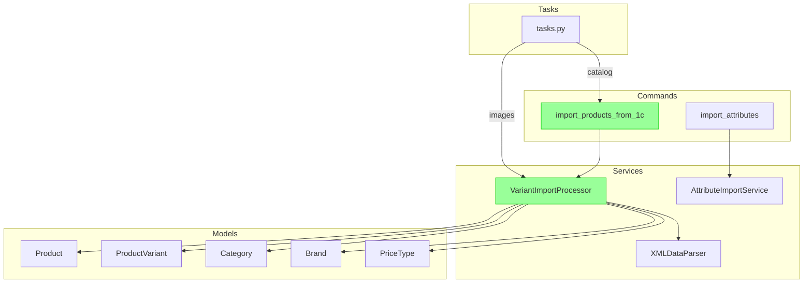

# 1C Import Architecture

## Overview

The import system is responsible for synchronizing the product catalog, prices, and stock levels from the ERP system (1С:Enterprise) to the FREESPORT platform. It uses a **Variant-Centric** approach, where products can have multiple variants (SKUs) with different characteristics (size, color).

## Architecture Diagram

## Key Components

### 1. Management Commands

- **`import_products_from_1c`**: The primary entry point for catalog import. It orchestrates the parsing and processing of XML files.
  - Supports selective import via `--file-type` (all, goods, prices, rests).
  - Handles dataset directories via `--data-dir`.

### 2. Services

- **`VariantImportProcessor`** (`apps/products/services/variant_import.py`):
  - The core logic for processing imported data.
  - Implements the "Hybrid" image import strategy (Base images in Product, Variant images in ProductVariant).
  - Handles the creation and update of `Product`, `ProductVariant`, `Category`, and `Brand`.

- **`XMLDataParser`** (`apps/products/services/parser.py`):
  - Responsibile for parsing raw XML files (CommerceML format) into Python dictionaries.
  - Decoupled from database logic.

### 3. Data Flow

1. **Categories & Brands**: Loaded from `groups.xml` and `propertiesGoods.xml`.
2. **Products**: Created from `goods.xml`. Base images are imported here.
3. **Variants**: Created from `offers.xml`. SKU, characteristics (Size, Color), and variant-specific images are processed.
4. **Prices**: Updated from `prices.xml`. Linked to specific variants.
5. **Stock**: Updated from `rests.xml`. Linked to specific variants.

## Usage

See `README.md` or `CLAUDE.md` for quick start commands.
