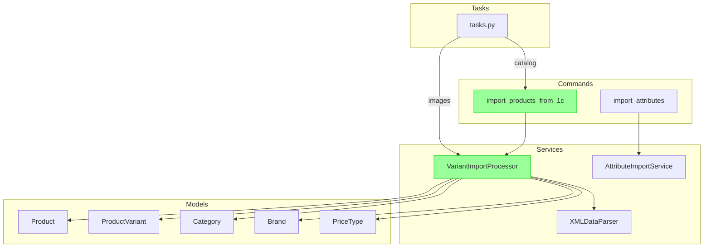

# 1C Import Architecture

## Overview

The import system is responsible for synchronizing the product catalog, prices, and stock levels from the ERP system (1С:Enterprise) to the FREESPORT platform. It uses a **Variant-Centric** approach, where products can have multiple variants (SKUs) with different characteristics (size, color).

## Architecture Diagram

```mermaid

flowchart TD
    subgraph Commands
        CMD2[import_products_from_1c]
        CMD3[import_attributes]
    end

    subgraph Services
        VIP[VariantImportProcessor]
        AIS[AttributeImportService]
        PARSER[XMLDataParser]
    end

    subgraph Tasks
        CELERY[tasks.py]
    end

    subgraph Models
        Product
        ProductVariant
        Category
        Brand
        PriceType
    end

    CMD2 --> VIP
    CMD3 --> AIS
    CELERY -->|"catalog"| CMD2
    CELERY -->|"images"| VIP
    VIP --> PARSER
    VIP --> Product
    VIP --> ProductVariant
    VIP --> Category
    VIP --> Brand
    VIP --> PriceType

    style VIP fill:#9f9,stroke:#0c0
    style CMD2 fill:#9f9,stroke:#0c0

```

## Key Components

### 1. Management Commands

- **`import_products_from_1c`**: The primary entry point for catalog import. It orchestrates the parsing and processing of XML files.
  - Supports selective import via `--file-type` (all, goods, prices, rests).
  - Handles dataset directories via `--data-dir`.

### 2. Services

- **`VariantImportProcessor`** (`apps/products/services/variant_import.py`):
  - The core logic for processing imported data.
  - Implements the "Hybrid" image import strategy (Base images in Product, Variant images in ProductVariant).
  - Handles the creation and update of `Product`, `ProductVariant`, `Category`, and `Brand`.
  - During `goods.xml` processing, stores VAT on `Product.vat_rate` and synchronizes it to existing variants.
  - During `offers.xml` processing, copies VAT from the `goods.xml` cache or `Product.vat_rate` into `ProductVariant.vat_rate`.
  - During stock processing (`rests_*.xml`), determines the primary warehouse and VAT rate per variant:
    - `_select_primary_warehouse_id` — returns the warehouse GUID with the highest cumulative stock (current warehouse is preferred on tie).
    - `_resolve_warehouse_name` — maps GUID → human-readable name via `settings.ONEC_EXCHANGE["WAREHOUSE_NAME_BY_ID"]`.
    - `_get_vat_rate_by_warehouse_name` — looks up `vat_rate` in `settings.ONEC_EXCHANGE["WAREHOUSE_RULES"]` by warehouse name.

- **`XMLDataParser`** (`apps/products/services/parser.py`):
  - Responsibile for parsing raw XML files (CommerceML format) into Python dictionaries.
  - Decoupled from database logic.

### 3. Data Flow

1. **Categories & Brands**: Loaded from `groups.xml` and `propertiesGoods.xml`.
2. **Products**: Created from `goods.xml`. Base images and `Product.vat_rate` are imported here.
3. **Variants**: Created from `offers.xml`. SKU, characteristics (Size, Color), variant-specific images, and `ProductVariant.vat_rate` are processed. If VAT was received only in `goods.xml`, the variant inherits it from `Product.vat_rate`.
4. **Prices**: Updated from `prices.xml`. Linked to specific variants.
5. **Stock**: Updated from `rests_*.xml`. Linked to specific variants. In addition to `stock_quantity`, the processor determines the **primary warehouse** (highest total stock) and updates `warehouse_id`, `warehouse_name`, and `vat_rate` on each `ProductVariant` via `ONEC_EXCHANGE` settings.

Order creation and CommerceML export use the VAT and warehouse data imported here. The current split rule is documented in [VAT-split и складской routing заказов для 1С](./order-vat-warehouse-routing.md): sub-orders are grouped by `(vat_rate, warehouse_name)`, not only by VAT.

## Usage

See `README.md` or `CLAUDE.md` for quick start commands.
