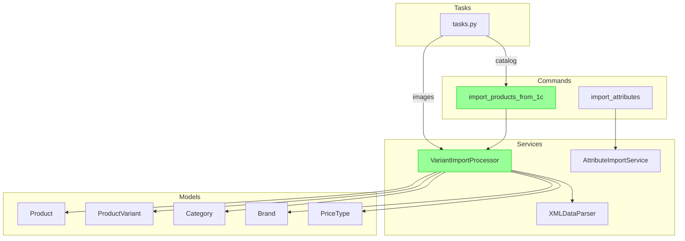

# 1C Import Architecture

## Overview

The import system is responsible for synchronizing the product catalog, prices, and stock levels from the ERP system (1С:Enterprise) to the FREESPORT platform. It uses a **Variant-Centric** approach, where products can have multiple variants (SKUs) with different characteristics (size, color).

## Architecture Diagram


```mermaid

flowchart TD
    subgraph Commands
        CMD2[import_products_from_1c]
        CMD3[import_attributes]
    end

    subgraph Services
        VIP[VariantImportProcessor]
        AIS[AttributeImportService]
        PARSER[XMLDataParser]
    end

    subgraph Tasks
        CELERY[tasks.py]
    end

    subgraph Models
        Product
        ProductVariant
        Category
        Brand
        PriceType
    end

    CMD2 --> VIP
    CMD3 --> AIS
    CELERY -->|"catalog"| CMD2
    CELERY -->|"images"| VIP
    VIP --> PARSER
    VIP --> Product
    VIP --> ProductVariant
    VIP --> Category
    VIP --> Brand
    VIP --> PriceType

    style VIP fill:#9f9,stroke:#0c0
    style CMD2 fill:#9f9,stroke:#0c0

```

## Key Components

### 1. Management Commands

- **`import_products_from_1c`**: The primary entry point for catalog import. It orchestrates the parsing and processing of XML files.
  - Supports selective import via `--file-type` (all, goods, prices, rests).
  - Handles dataset directories via `--data-dir`.

### 2. Services

- **`VariantImportProcessor`** (`apps/products/services/variant_import.py`):
  - The core logic for processing imported data.
  - Implements the "Hybrid" image import strategy (Base images in Product, Variant images in ProductVariant).
  - Handles the creation and update of `Product`, `ProductVariant`, `Category`, and `Brand`.
  - During `goods.xml` processing, stores VAT on `Product.vat_rate` and synchronizes it to existing variants.
  - During `offers.xml` processing, copies VAT from the `goods.xml` cache or `Product.vat_rate` into `ProductVariant.vat_rate`.
  - During stock processing (`rests_*.xml`), determines the primary warehouse and VAT rate per variant:
    - `_select_primary_warehouse_id` — returns the warehouse GUID with the highest cumulative stock (current warehouse is preferred on tie).
    - `_resolve_warehouse_name` — maps GUID → human-readable name via `settings.ONEC_EXCHANGE["WAREHOUSE_NAME_BY_ID"]`.
    - `_get_vat_rate_by_warehouse_name` — looks up `vat_rate` in `settings.ONEC_EXCHANGE["WAREHOUSE_RULES"]` by warehouse name.

- **`XMLDataParser`** (`apps/products/services/parser.py`):
  - Responsibile for parsing raw XML files (CommerceML format) into Python dictionaries.
  - Decoupled from database logic.

### 3. Data Flow

1. **Categories & Brands**: Loaded from `groups.xml` and `propertiesGoods.xml`.
2. **Products**: Created from `goods.xml`. Base images and `Product.vat_rate` are imported here.
3. **Variants**: Created from `offers.xml`. SKU, characteristics (Size, Color), variant-specific images, and `ProductVariant.vat_rate` are processed. If VAT was received only in `goods.xml`, the variant inherits it from `Product.vat_rate`.
4. **Prices**: Updated from `prices.xml`. Linked to specific variants.
5. **Stock**: Updated from `rests_*.xml`. Linked to specific variants. In addition to `stock_quantity`, the processor determines the **primary warehouse** (highest total stock) and updates `warehouse_id`, `warehouse_name`, and `vat_rate` on each `ProductVariant` via `ONEC_EXCHANGE` settings.

Order creation and CommerceML export use the VAT and warehouse data imported here. The current split rule is documented in [VAT-split и складской routing заказов для 1С](./order-vat-warehouse-routing.md): sub-orders are grouped by `(vat_rate, warehouse_name)`, not only by VAT.

## Раскладка каталога обмена

Каталог обмена **изолирован по сессии**:

```
ONEC_EXCHANGE["IMPORT_DIR"]/
├── <sessid>/                 ← каталог обмена одной сессии
│   ├── goods/  offers/  prices/  rests/  priceLists/  contragents/ …
│   └── *.zip                 ← архивы этой сессии до распаковки
├── import_files/             ← ОБЩИЕ картинки: <xx>/<file>.jpg
├── goods/import_files/       ← легаси-раскладка картинок (переходное окно выката)
└── .dry_run                  ← флаг режима, общий на весь обмен
```

`session_key` уникален для каждого файла (1С не держит cookie-сессию между
запросами), поэтому каталог на сессию = каталог на файл: пересечься физически
невозможно. Временный каталог (`TEMP_DIR/<sessid>/`) был сессионным и раньше.

**Почему так.** Общий каталог давал TOCTOU на уровне сессий: прогон без
обещанных имён (`mode=complete`) собирал по маске свежий файл соседа, читал его и
законно удалял как обработанный, а сегмент, отстоявший очередь за локом, падал
«не найден в каталоге обмена». Замер прода 28.08.2026, окно 7 дней: 110 упавших
сессий, из них 85 с этой ошибкой — и все 85 ровно те, что ждали лока (100 %
корреляция). Три guard-а по активным сессиям дефект не закрывали: каждый —
проверка в один момент времени, после которой конкурент появляется.

**Почему картинки остались общими.** 1С присылает изображения отдельным обменом
со своим `sessid`, и связи «архив картинок ↔ XML-сессия» протокол не даёт.
Изолируй их — и `goods.xml` перестанет находить свои фото. Маршрут `import_files`
— единственное исключение из изоляции (`FileRoutingService._route_root`).

**Фолбэк на легаси-раскладку.** До изоляции картинки лежали в
`IMPORT_DIR/goods/import_files/`. `goods.xml`, приехавший сразу после выката, может
ссылаться на картинку, доставленную до него, поэтому источник ищется
**пофайлово**: сперва общий `import_files`, затем легаси
(`VariantImportProcessor._resolve_image_source`, список задаёт
`Command._images_base_dir`). Покаталожный выбор здесь не годится: при **частичном**
разрешении `_import_base_images(mirror_composition=True)` зеркалирует состав по
разрешённым и молча обрезает фото товара.

**Уборка.** `cleanup_import_dir` работает строго в каталоге своей сессии; сама
папка удаляется после обмена (`remove_session_dirs`) — независимо от того, есть
ли в этот момент другие `IN_PROGRESS`-сессии. Исторический guard по активным
сессиям остался только для ручного прогона по общему каталогу, где `data_dir` у
всех один: 1С шлёт сессии непрерывно, активная соседка есть практически всегда, и
guard на изолированной раскладке означал бы «не удалять никогда».

Осиротевшее при падении воркера подбирает `cleanup_stale_exchange_dirs` —
периодическая задача с порогом **24 часа**. Каталог она удаляет, только если
выполнены все три условия: его имя не принадлежит сессии в `PENDING`/`STARTED`/
`IN_PROGRESS`, внутри нет ни одного файла свежее порога (возраст корня о
содержимом не говорит — `shutil.move` кладёт XML внутрь), и имя не занято общим
каталогом обмена. Удаление идёт в два шага — изъятие переименованием в
`.stale-<name>-<hex>`, пересверка возраста, `rmtree`, — чтобы файл, приехавший
между проверкой и удалением, не пропал вместе с каталогом.

**Картинки общего каталога убираются по ссылочности, а не по возрасту.** Связи
«обмен изображениями ↔ будущий XML» протокол не задаёт, поэтому картинка старше
суток остаётся законным источником для `goods.xml`, который приедет завтра, и
порога времени здесь нет вовсе. Признак «файл больше не нужен» один: копия
подтверждена в хранилище.

Работает это в два слоя:

1. **Команда импорта** удаляет исходники, которые сама перенесла
   (`VariantImportProcessor.consumed_image_sources` → `Command._cleanup_consumed_images`).
   Область строго ограничена `ONEC_EXCHANGE["IMPORT_DIR"]` — ручной корпус
   `ONEC_DATA_DIR` (`data/import_1c/`) не трогается никогда, это входные данные.
2. **Периодическая задача** (`_prune_imported_exchange_images`) — страховка для
   прогонов, упавших между переносом и уборкой: удаляет файл, только если копия
   лежит в `products/base/<xx>/<name>` либо `products/variants/<xx>/<name>`.

Безопасность держится на `_save_image_if_not_exists`: при отсутствии исходника он
берёт подтверждённую копию из хранилища, поэтому `mirror_composition=True`
зеркалирует полный состав фото и повторный `goods.xml` его не обрезает.

Превью ниже порога `MIN_IMAGE_SIZE_BYTES` импорт сознательно не сохраняет, копии
у них не появляется, и ссылочный критерий их не удаляет. Класс ограничен — имена
файлов 1С детерминированы, повторная выгрузка их перезаписывает, — но задача
логирует их число и объём (`Exchange images kept (no stored copy)`); см. tech-debt п. 27.

Задача обязана быть объявлена в
`CELERY_BEAT_SCHEDULE` в `settings/base.py`: расписание задаётся дважды (там и в
`freesport/celery.py`), и замер в контейнере 28.08.2026 показал, что **побеждает
словарь из настроек** — `app.conf` ленив, присваивание в `celery.py` идёт до
финализации конфига, и загруженные из настроек значения ложатся поверх.

## Concurrency contract

Изоляция каталога **не отменяет** правил ниже: очередь за локом остаётся
легитимной, cleanup остаётся точечным, а обещанный сегмент — обязательным к
прочтению.

### 1. Один импорт на каталог одновременно

`process_1c_import_task` берёт распределённый лок на каталог обмена **до** начала
работы: `cache.add("onec:import:lock:<ключ>", <task_id>, ONEC_IMPORT_LOCK_TTL)`
(атомарный `SETNX` в Redis). Ключ считается от **общего корня обмена**, а не от
сессионного `data_dir` (`_import_lock_key`): ключ от сессионного каталога дал бы
каждой задаче собственный лок и снял бы сериализацию целиком и молча. Ручной
прогон по `ONEC_DATA_DIR` и тесты ключуются по своему каталогу, как раньше. Если лок занят — задача уходит в `self.retry()` и
возвращается в брокер, а не ждёт блокирующе: воркер prefork держит `nproc`
процессов, и блокирующее ожидание съедало бы слот пула.

| Настройка | Умолчание | Смысл |
|---|---|---|
| `ONEC_IMPORT_LOCK_TTL` | 1800 с | Переживает полный импорт каталога; истекает сам, чтобы упавший воркер не заблокировал обмен навсегда |
| `ONEC_IMPORT_LOCK_RETRY_COUNTDOWN` | 10 с | Пауза между попытками (1С отдаёт сегмент каждые ~6,5 с) |
| `ONEC_IMPORT_LOCK_MAX_RETRIES` | 180 | 30 минут ожидания; исчерпание переводит сессию в `failed` с внятным текстом |

Лок снимается в `finally` и **только владельцем** (сверка значения с `task_id`).
Механизм не зависит от `--concurrency` воркера: рост числа процессов не возвращает гонку.

Если переотправить задачу не удалось — брокер недоступен и `self.retry()` падает
не `MaxRetriesExceededError`, а, например, `kombu.exceptions.OperationalError`, —
сессия переводится в `failed` с текстом ошибки. Оставлять её в `in_progress`
нельзя: до порога `cleanup_stale_import_sessions` (2 часа) она выглядела бы живой
и блокировала бы `cleanup_import_dir` соседям.

Отказ самого бэкенда лока трактуется так же. Если `cache.add` бросил исключение
(Redis недоступен), импорт **не** запускается — работа без лока вернула бы гонку, —
но сессия переводится в `failed` с текстом ошибки. Молчаливое падение задачи
оставляло бы сессию `in_progress` на те же 2 часа.

### 2. Cleanup удаляет только прочитанное

`import_products_from_1c._cleanup_files` удаляет **исключительно те XML, которые
этот прогон реально распарсил** (`self._processed_files`, путь добавляется после
успешного парсинга, а не после сбора списка). Удаление по маске `glob` запрещено:
`glob("rests/rests*.xml")` сносил файлы соседних задач раньше, чем те успевали их
прочитать — выгрузка 25.08.2026 потеряла 6 из 16 сегментов остатков (~18 000 строк),
причём две сессии отчитались `completed` с нулём записей.

Файлы, которых прогон не читал, — не его дело: их уберёт
`FileRoutingService.cleanup_import_dir`, когда активных сессий не останется
(guard по `IN_PROGRESS` в `tasks.py` и `views.handle_init`).

Больше того: чужой файл прогон не только не удаляет, но и **не читает**. При
переданном `source_filename` сбор списка сужается до обещанного файла на **всех**
шагах прогона (`_restrict_to_expected`). Без сужения лок лишь превращал гонку в
очередь: пока одна задача держит лок, 1С успевает положить в каталог следующие
файлы, и прогон забирал весь накопившийся backlog — данные доезжали, но
собственные задачи этих файлов затем падали `failed` («сегмент не найден»).

Сужение обязано действовать на все шаги, а не только на шаг своего типа: сегмент
`offers_….xml` запускает ещё и шаги цен и остатков
(`file_type in ["all", "prices", "offers"]`) и без сужения съедал бы уже
ожидающие `prices_*`/`rests_*`. Справочники (`groups.xml`, `propertiesGoods.xml`,
`priceLists.xml`) приходят своими файлами и обрабатываются своими сессиями.

Контракт — **один присланный файл обрабатывает ровно одна задача, та, которой его
обещали**. Ручной общий импорт и `mode=complete` имени не обещают и по-прежнему
забирают каталог целиком.

Перед удалением сверяется отпечаток файла — `(st_dev, st_ino, st_mtime_ns, st_size)`,
снятый в момент парсинга. Пути мало: 1С переиспользует имена, когда не сегментирует
выгрузку, и под тем же путём к моменту cleanup может лежать уже чужой файл. При
несовпадении отпечатка удаление пропускается с предупреждением.

Исчезнувший файл больше не валит импорт целиком: `FileNotFoundError` на конкретном
файле — предупреждение в лог и в `report`, цикл продолжается. Если исчезли **все**
файлы непустого списка, сессия завершается `failed` с их перечнем, а не `completed`
с нулём записей.

### 3. Тип сегмента доезжает до задачи

Оба места диспатча (`_dispatch_import` и `_dispatch_or_dryrun`) передают
`source_filename` в `process_1c_import_task` — имя файла, а для архива список
«имя архива + распакованный из него XML» (см. п. 4). Задача определяет шаг
импорта через общий `apps/integrations/onec_exchange/file_type_detection.detect_file_type`
— единственную копию логики (раньше их было две, и они разошлись). Без этого каждый
сегмент остатков запускал полный импорт каталога, расширяя окно гонки на
`goods`/`offers`/`prices`.

### 4. Обещанный сегмент обязан быть прочитан

Когда `detect_file_type` дал конкретный тип, задача передаёт имя файла дальше в
команду — `call_command(..., source_filename="rests_1_12_….xml")`. Команда обязана
этот файл прочитать; если к моменту `_collect_xml_files` его в каталоге уже нет
(увёл сосед) или он исчез до парсинга — прогон завершается `CommandError`, сессия
получает `failed`. Тихий `completed` с нулём записей — это и есть потеря данных:
1С такой сегмент не повторит.

Тип по имени знают только те файлы, которые команда действительно читает:
`goods` / `import` / `groups` / `propertiesGoods`, `offers`, `prices` /
`priceLists`, `rests`, `contragents`. `units`, `storages`, `propertiesOffers` и
произвольные имена намеренно остаются `all`: команда их не собирает, и обещание
«этот файл обязан быть прочитан» утопило бы такие сессии в `failed`. Обратная
сторона — на них сужение не действует, `all` по определению сгребает каталог
целиком.

Обещанием считается только имя XML-файла. `detect_file_type("import_files.zip")`
даёт `goods`, но команда собирает XML и файла с таким именем не найдёт никогда —
поэтому имя архива в команду не передаётся, иначе штатная выгрузка изображений
уходила бы в `failed`.

**Архив обещает то, что из него распаковано.** Само по себе «имя архива — не
обещание» ещё не закрывает дыру: без обещания сбор не сужается, и задача архива
сгребала весь ожидающий backlog соседних `goods*.xml`. Связь установлена явно —
обещание архива это XML, который он принёс:

- `mode=import` распаковывает архив **в HTTP-обработчике** (`_unpack_zips` внутри
  `ImportOrchestratorService.execute`), поэтому к старту задачи архива на диске
  уже нет. Имена передаёт оркестратор: `source_filename=[<имя архива>, <его XML>…]`
  (`_promised_names`).
- Архивы, накопившиеся в каталоге, распаковывает сама задача — тогда имена берутся
  из её собственной распаковки.

Тип сегмента для архива определяется по его содержимому, а не по имени: архив с
`rests_1_1_….xml` даёт `file_type=rests`, разнотипный — `all` (сужение при этом
остаётся). Архив, не принёсший ни одного XML (только изображения либо он уже
распакован соседом), **не запускает импорт каталога вовсе**: своего сегмента у
него нет, а чужие ему не принадлежат. Изображения остаются в общем
`import_files/` и достаются задаче своего `goods`-сегмента; cleanup команды
при этом не выполняется и картинки не стираются.

### 5. Прогон без обещания уступает дорогу активным сессиям

Прогон, которому конкретных файлов не обещали (`mode=complete`, `units.xml` и
прочие имена без распознанного типа, ручной запуск), сгребает каталог целиком —
и потому **не запускается, пока есть другие сессии в `IN_PROGRESS`**. Их файлы
уже обещаны собственным задачам, которые стоят в очереди за локом.

Это тот же guard, что стоит на post-import cleanup (`tasks.py`) и в
`views.handle_init`. Файлы без хозяина по-прежнему забирает `mode=complete`:
при отсутствии других активных сессий сбор идёт как раньше, поэтому сценарий
«файлы загрузили через `mode=file`, своих задач у них нет» не ломается.

Основание — прод-прогон AC9 27.08.2026: 223 сессии, 53 `failed`, и **48 из 48**
объяснённых падений имели потребителем именно `mode=complete`. 1С шлёт
`mode=import` на каждый файл и `mode=complete` следом, каждые пару секунд;
сегмент уходил в очередь («Каталог обмена занят другим импортом»), подоспевший
`complete` забирал его вместе со всем каталогом и удалял, а задача сегмента,
получив лок, падала «не найден в каталоге обмена». Данные при этом доезжали
(15 775 из 16 609 вариантов обновлены, без остатка осталось 6 против 963 в
инциденте 25.08), но выгрузка отчитывалась провалом, а пять файлов не прочитал
никто.

### 6. Прогон без обещания не сгребает чужие каталоги

После изоляции прогон без обещанных имён видит только свой каталог. Если своих
XML в нём нет, импорт каталога не запускается вовсе, а в `session.report`
попадает пометка `«В каталоге обмена этой сессии нет своих XML-файлов»`
(константа `SESSION_HAS_NO_OWN_FILES`, на неё вешается приёмочный тест). Тихий
`completed` без пометки неотличим от «данные доехали», поэтому молчать здесь
нельзя.

Guard `defer_to_active_sessions` (п. 5) **сохранён**: после изоляции он избыточен
для этого сценария, но остаётся страховкой ручных прогонов по общему каталогу.

### 7. Неоднозначное имя останавливает импорт

`_collect_xml_files` ищет сегменты регистронезависимо (`rests_*.xml`,
`Rests_*.xml`), а сравнение с обещанным именем идёт через `.lower()`. На
регистрозависимой ФС в каталоге могут оказаться оба файла — и тогда одному
обещанному имени соответствуют два физических. Взять оба значит прочитать и
удалить файл соседней сессии, взять любой — угадать. Команда завершается
`CommandError` с перечнем совпадений.

Отдельно: если отпечаток файла снять не удалось (`os.stat` упал, а парсер файл
всё же открыл), cleanup такой файл **не** удаляет. Сверять нечего, а fail-open
здесь снова означал бы удаление чужого файла под тем же именем; файл уберёт
`cleanup_import_dir`.

Строгость включается **только** при переданном имени. `mode=complete` и ручной
общий импорт (`detect_file_type` → `all`, `source_filename=None`) конкретного файла
не обещают — там пустой каталог по-прежнему штатная ситуация с предупреждением
«Файлы … не найдены».

По имени файла выбирается и сам маршрут. `detect_file_type` знает тип
`contragents`, и наличие `contragents*.xml` в общем каталоге больше **не**
отменяет импорт обещанного товарного сегмента: файл контрагентов мог остаться от
соседней сессии, а раньше он молча уводил задачу в `import_customers_from_1c`,
после чего сессия сегмента помечалась успешной. По содержимому каталога маршрут
выбирается только там, где имени не обещали (`mode=complete`, ручной прогон).

## Бэкап перед полным импортом

Шаг выполняется только для `file_type == "all"` и управляется тремя настройками:

| Настройка | Умолчание | Смысл |
|---|---|---|
| `BACKUP_DIR` | `<BASE_DIR>/backup_db` | Каталог копий. **Обязан быть абсолютным.** В проде — `/app/var/backups` на постоянном bind-mount `data/prod/backups` (владелец `1000:1000`) |
| `BACKUP_BEFORE_IMPORT` | `True` | Явный выключатель шага |
| `BACKUP_MIN_INTERVAL_SECONDS` | `3600` | Минимальный интервал между бэкапами |

**Почему путь обязан быть абсолютным.** Прежнее умолчание `backend/backup_db`
было относительным, а команда исполняется с рабочим каталогом `/app`: получался
`/app/backend/backup_db`, каталог uid 999 при процессе под `1000:1000` (`user`
в `docker-compose.prod.yml`). Каждый полный импорт получал `Permission denied`,
вызывающий код глотал это в WARNING, и прод жил без бэкапов неизвестно сколько.
Теперь `backup_db` отвергает относительный путь и недоступный на запись каталог
явной ошибкой, а не пишет молча не туда.

**Почему есть интервал.** Чинить шаг «в лоб» было нельзя. На прод-выгрузке
27.08.2026 из 172 сессий **37** пришли с `file_type=all` — это `mode=complete`,
забирающий остатки каталога, — и каждая дёргала бэкап. Тридцать семь полных
`pg_dump` базы подряд во время обмена это нагрузка, а не защита. Отметка в Redis
пропускает повторы внутри окна; ставится она на **попытку**, а не на успех,
иначе сломанный бэкап писал бы ошибку по десятку раз за выгрузку.

**Провал не останавливает импорт.** Он идёт в лог как ERROR и попадает в отчёт
сессии, видимый в админке. Останавливать обмен из-за неудавшегося бэкапа хуже:
1С присланный сегмент не повторит, и цена потери данных выше, чем цена импорта
без страховки. Осознанно отключить шаг можно `BACKUP_BEFORE_IMPORT=False`.

**Чего этот шаг не заменяет.** Бэкап перед импортом — страховка на случай плохой
выгрузки, а не регулярное резервное копирование. Отдельного расписания в
`CELERY_BEAT_SCHEDULE` нет; если оно нужно, это отдельная задача.

## Usage

See `README.md` or `CLAUDE.md` for quick start commands.
