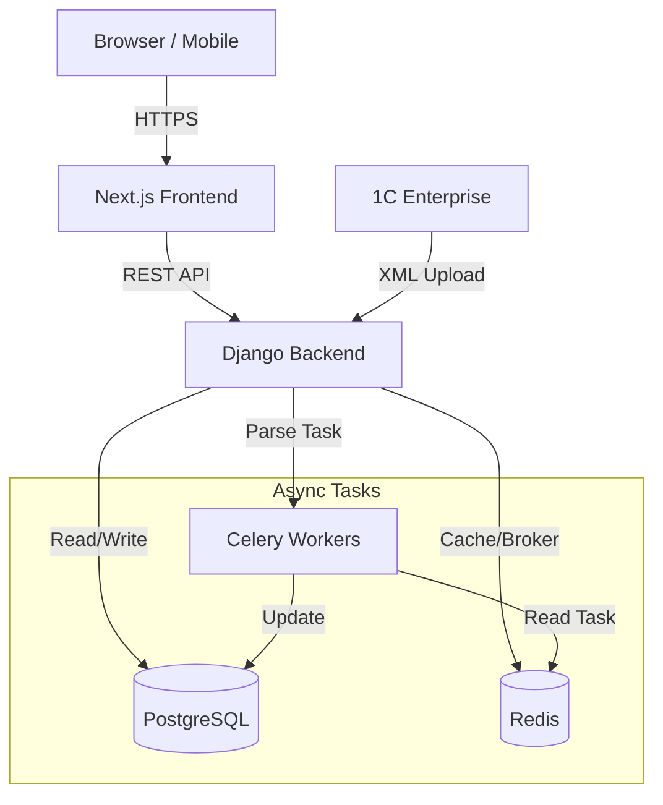

# Integration Architecture

## Client-Server Communication

The platform follows a classic **BFF (Backend for Frontend)** pattern where Next.js communicates with Django REST API.

- **Protocol**: HTTP/1.1 (REST)
- **Format**: JSON
- **Authentication**: JWT (Access + Refresh tokens)

### Key Integration Points

| Source | Target | Type | Description |
|--------|--------|------|-------------|
| Frontend | Backend API | REST | Product catalog, Cart, Checkout, User Profile |
| Backend | PostgreSQL | SQL | Persistent storage (Users, Orders, Catalog) |
| Backend | Redis | TCP | Caching, Session storage, Celery broker |
| Backend | 1C (ERP) | XML | Async import/export of products and orders |
| Backend | YuKassa | REST | Payment processing |
| Backend | CDEK/Boxberry | REST | Shipping cost calculation |

## 1C Integration Architecture

The 1C integration is **asynchronous** and **file-based** (or API-based depending on configuration).

1. **Import**: 1C uploads XML files (`goods.xml`, `offers.xml`, `rests.xml`).
2. **Processing**: Celery tasks parse XML and update DB models.
3. **Conflict Resolution**: `onec_id` is the source of truth.

## Data Flow Diagram

